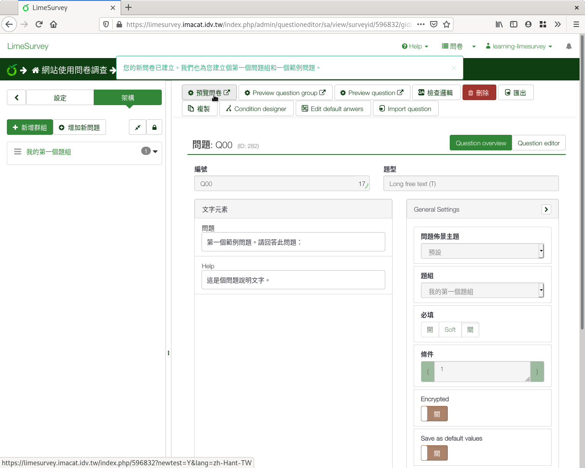
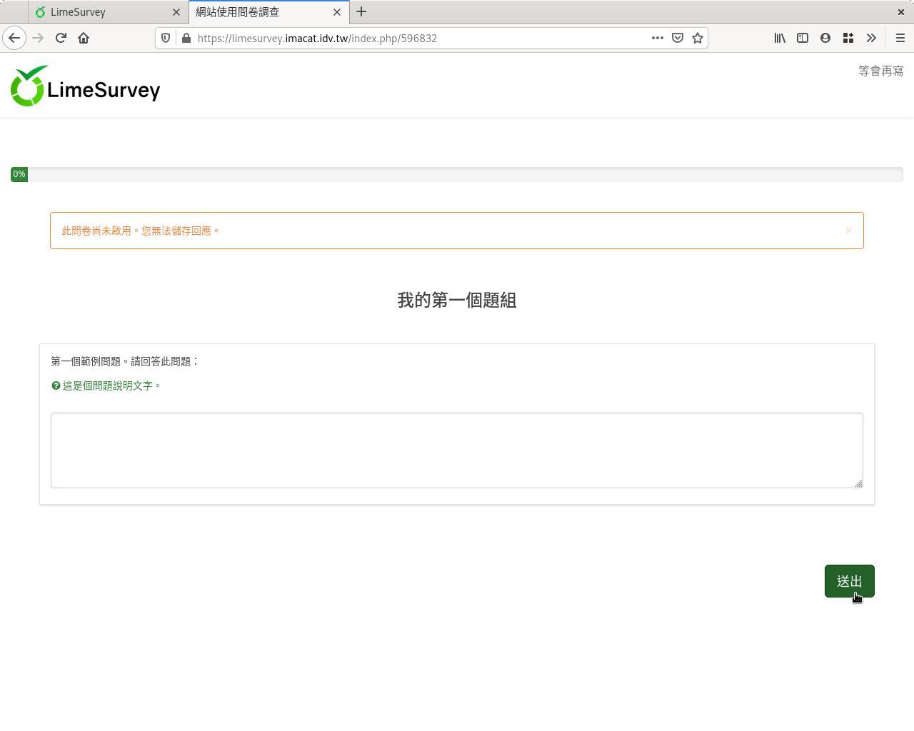

建立新問卷
----------

由問卷列表的左上方，點選「建立新問卷」，就進入建立問卷的畫面。

.. figure:: images/03-01-new-survey.png
    :alt: 建立問卷的畫面
    :scale: 48%

    建立問卷的畫面

在這裏我們填上問卷標題名稱（例如：「網站使用問卷調查」），先點選
「Create example question group and question?」建立範例題，然後點按右
上角「儲存」。這樣就建好了一份簡單的問卷。

    建立好的新問卷

從左上角「 :index:`預覽問卷 <預覽; 問卷>` 」，可以看得到問卷長什麼樣子。

    新問卷的預覽

可以看到現在問卷只有一題，就是剛才建立的範例題
「第一個範例問題。請回答此問題：」。問卷上方會以醒目提示
「此問卷尚未啟用。您無法儲存回應。」，提醒你這只是預覽而已，
答案不會存下來。
