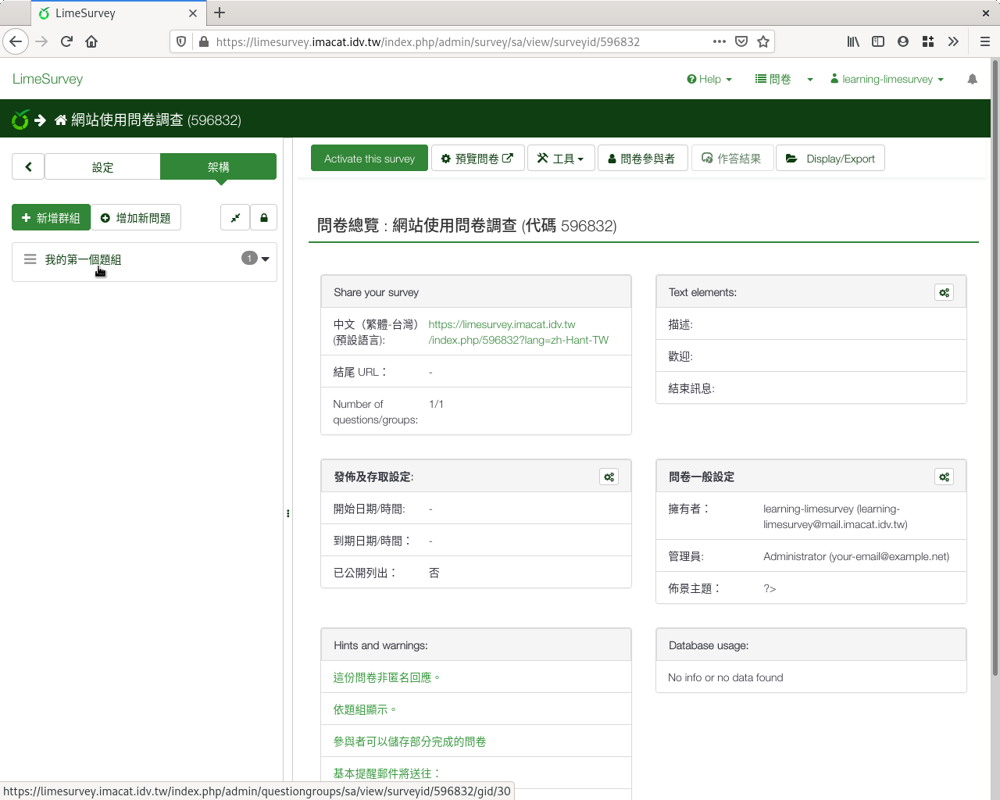
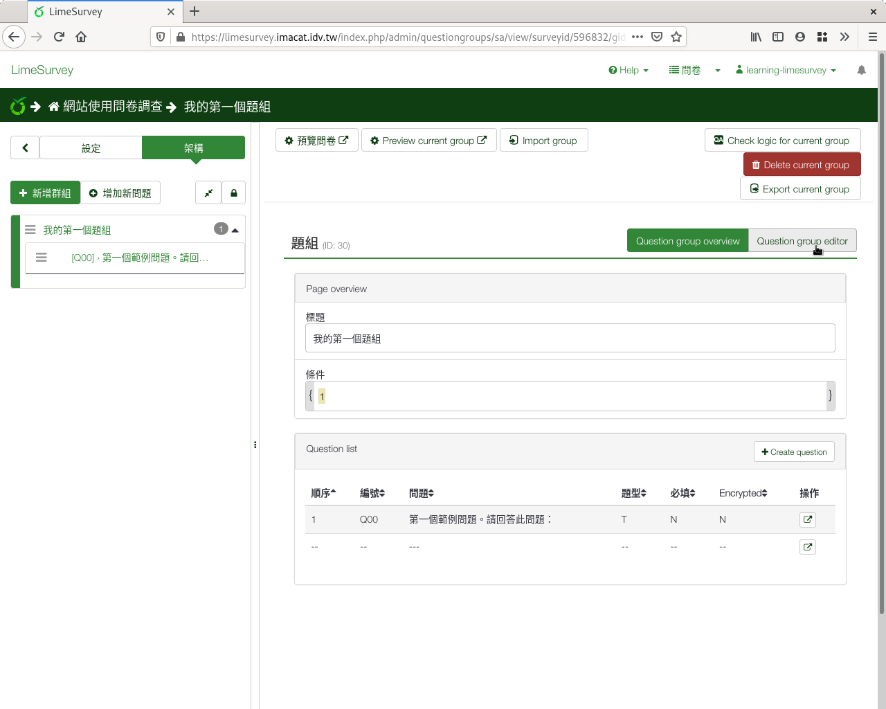
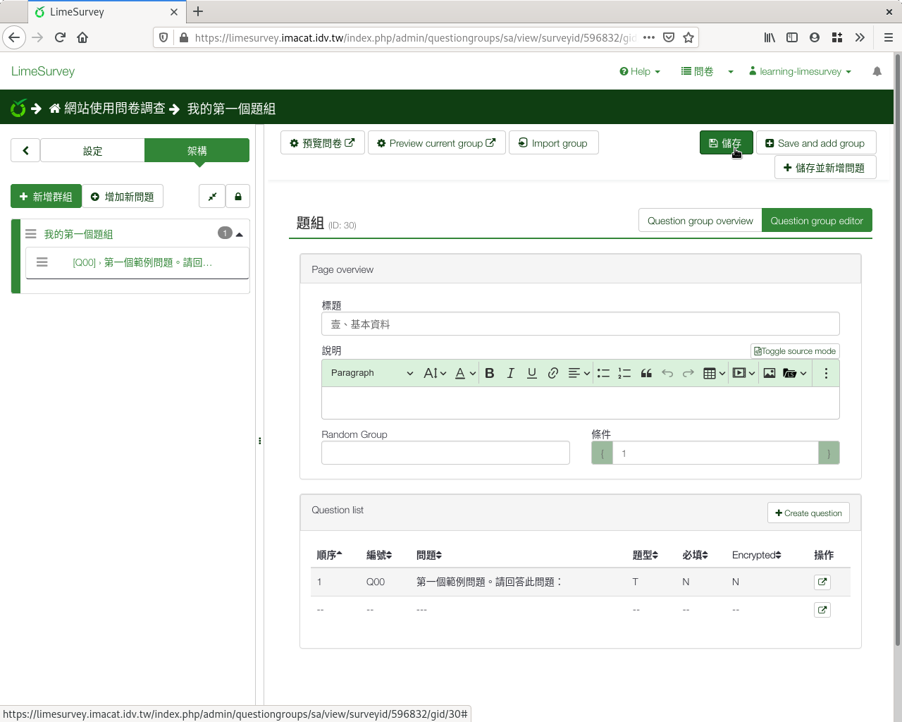

修改範例題組名稱
################

在問卷編輯頁面上，點選左側欄上方的「Structure」，在左側欄顯示問卷架構
。點選左側欄的預設範例題組「My First Question Group」，進入題組頁面。

    從左側欄的問卷架構，選擇要編輯的題組

在題組頁面中，按上方的「 :index:`編輯目前題組 <pair: 題組; 編輯>` 」
編輯。

    題組頁面，按「編輯目前題組」編輯

在標題處填上「壹、基本資料」，然後按右上角的「儲存並關閉」。你也可以在
描述的欄位裡，撰寫一些說明。

    題組編輯畫面
