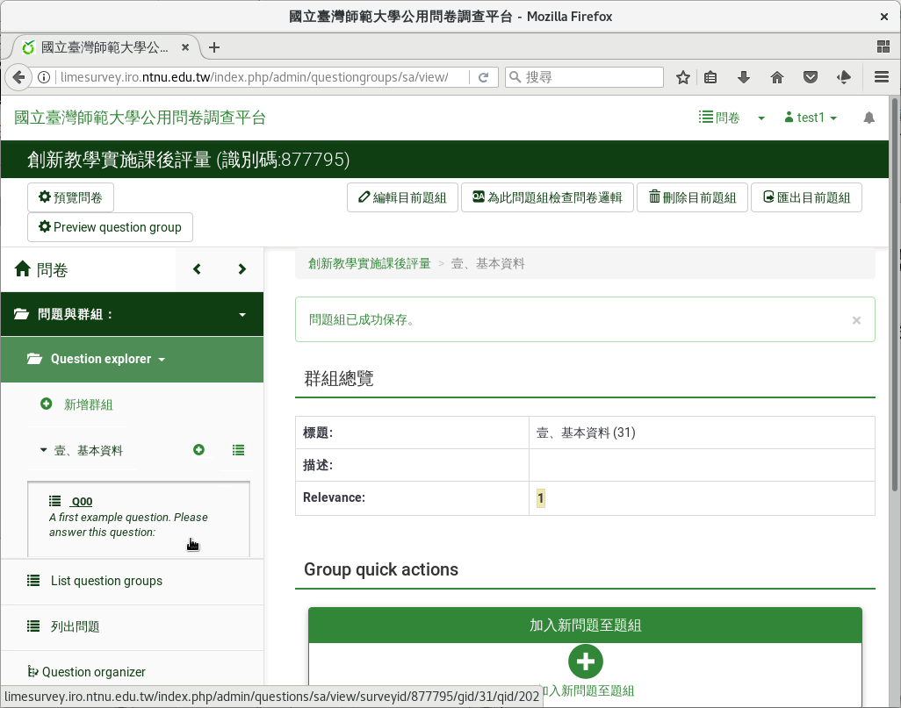

刪除範例問題
############

在建立自己的問題前，我們先刪除範例問題。在左邊點選要刪除的範例問題，
出現的頁面上，點選右上角的「刪除」刪除。

    點選左邊要刪除的範例問題

.. figure:: images/03-02-02-del-question-02.png
    :alt: 點選右上角的「刪除」刪除
    :scale: 60%

    點選右上角的「刪除」刪除

