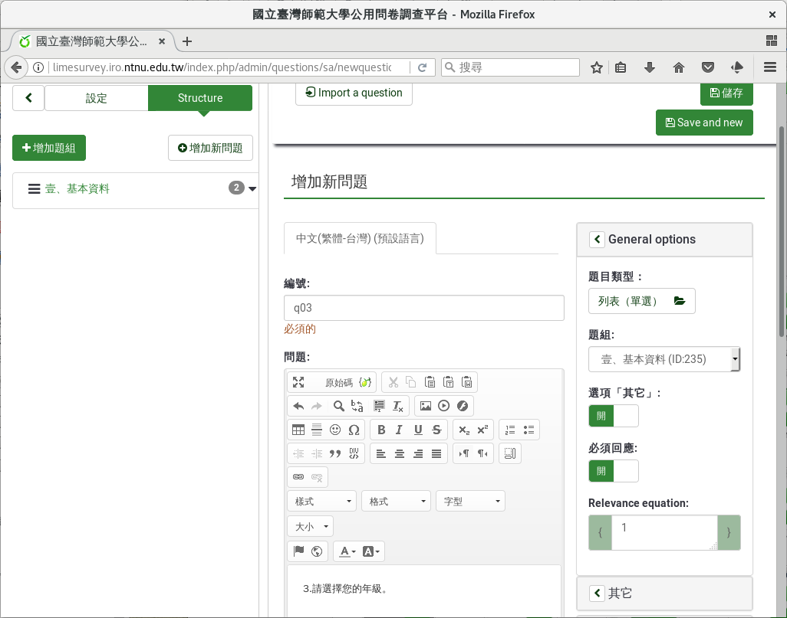
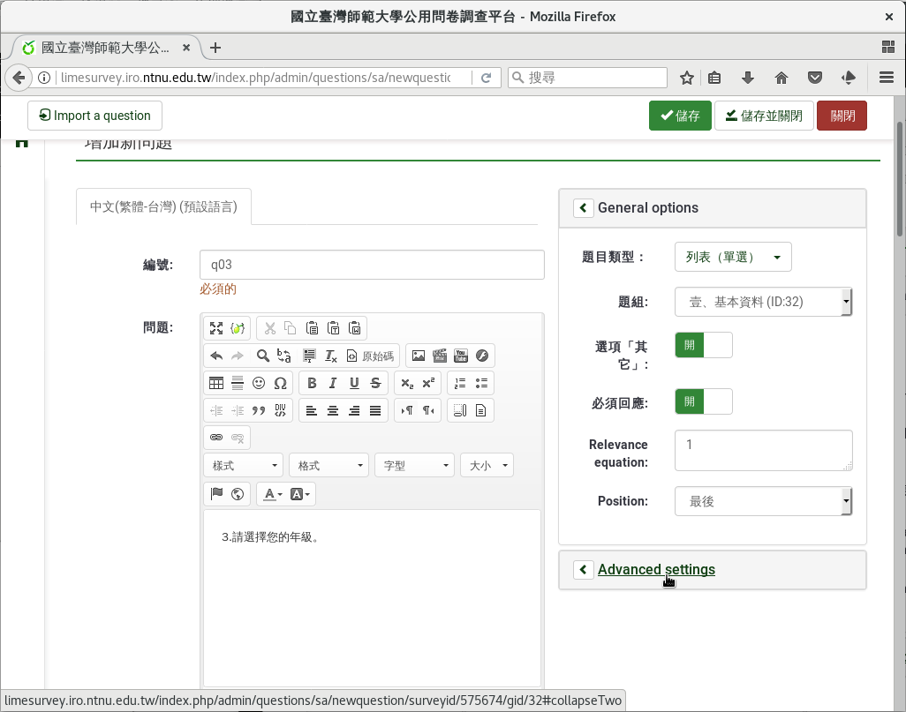
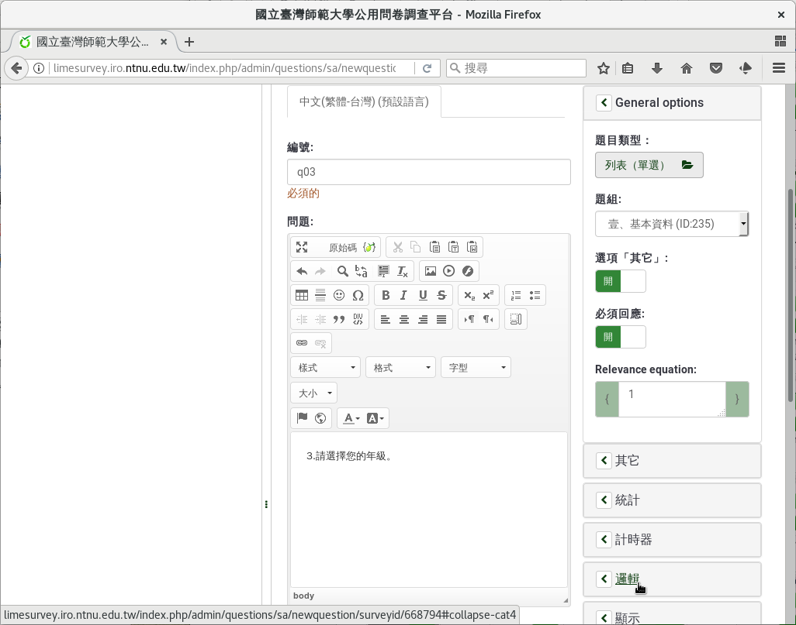
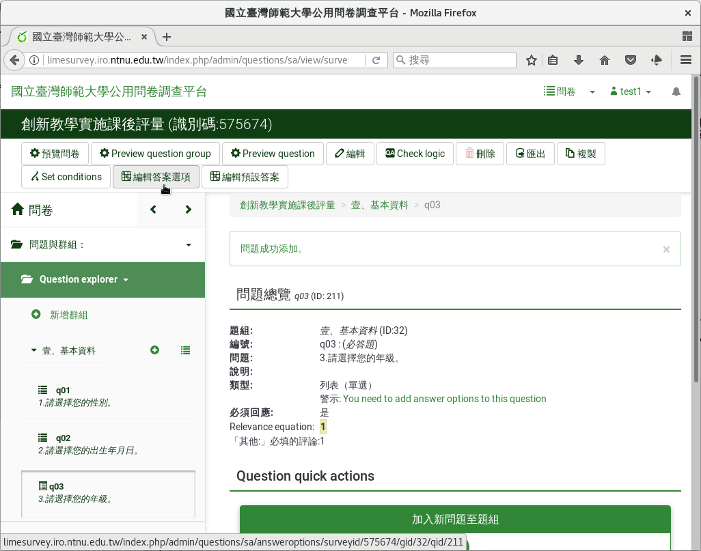
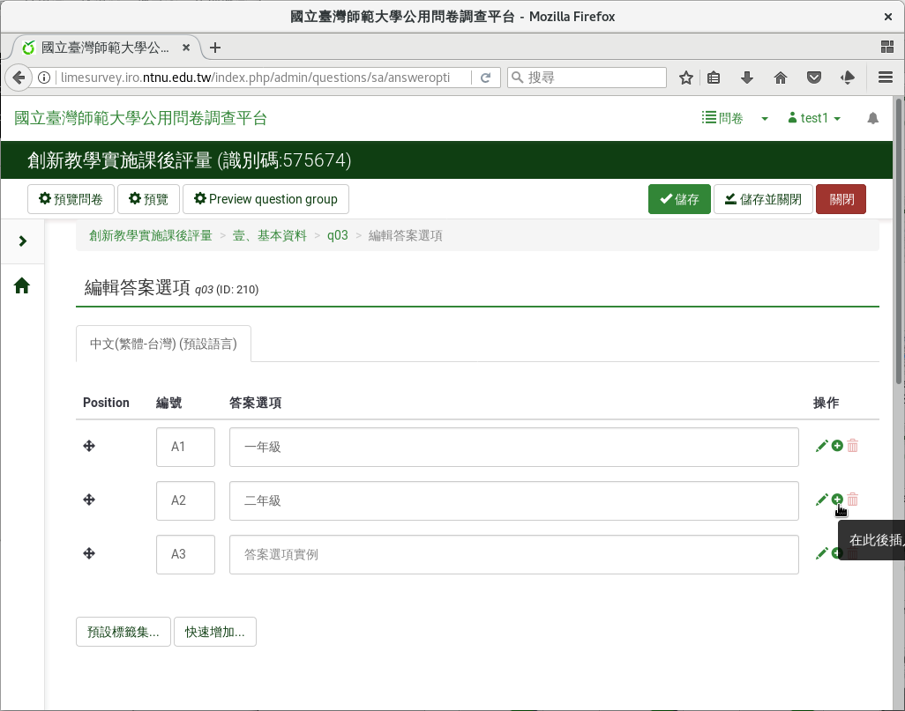
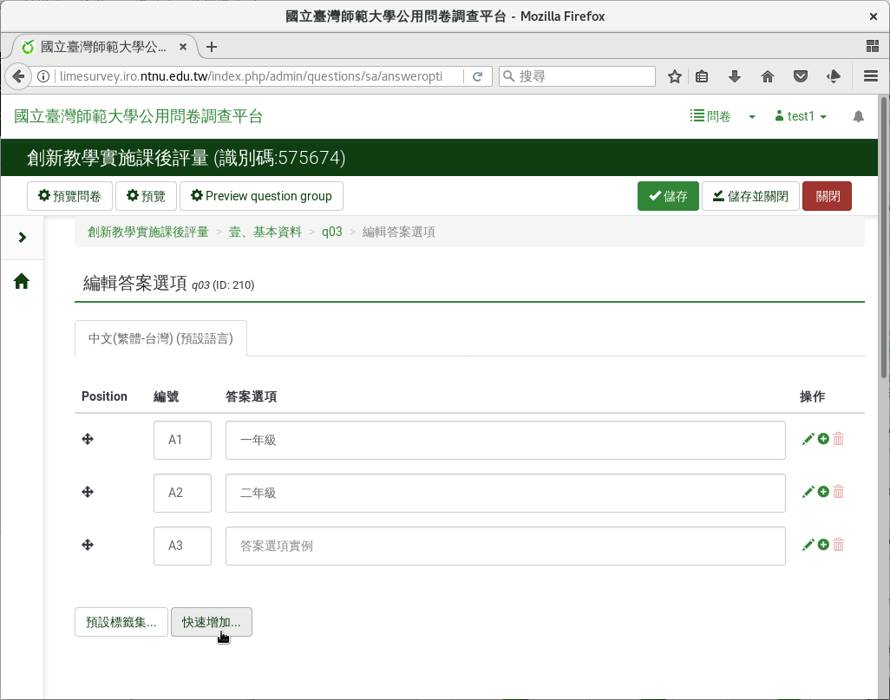
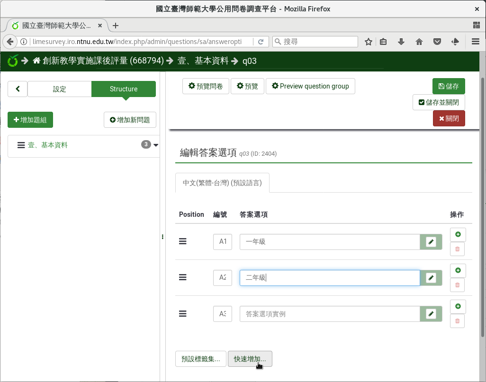
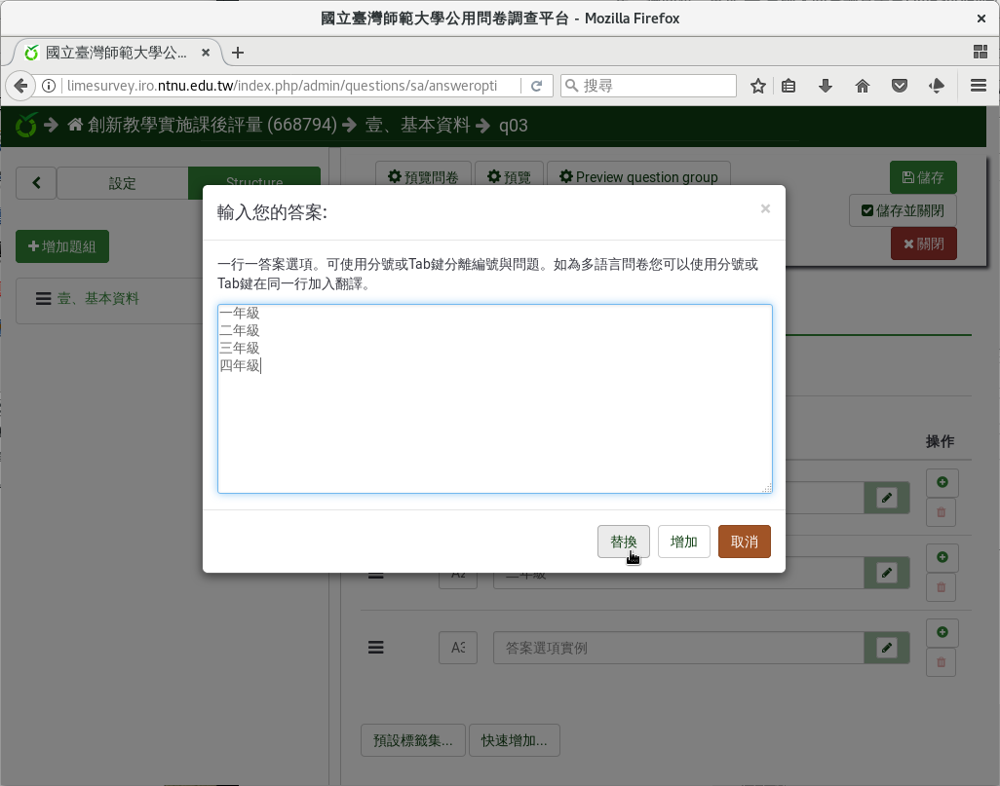
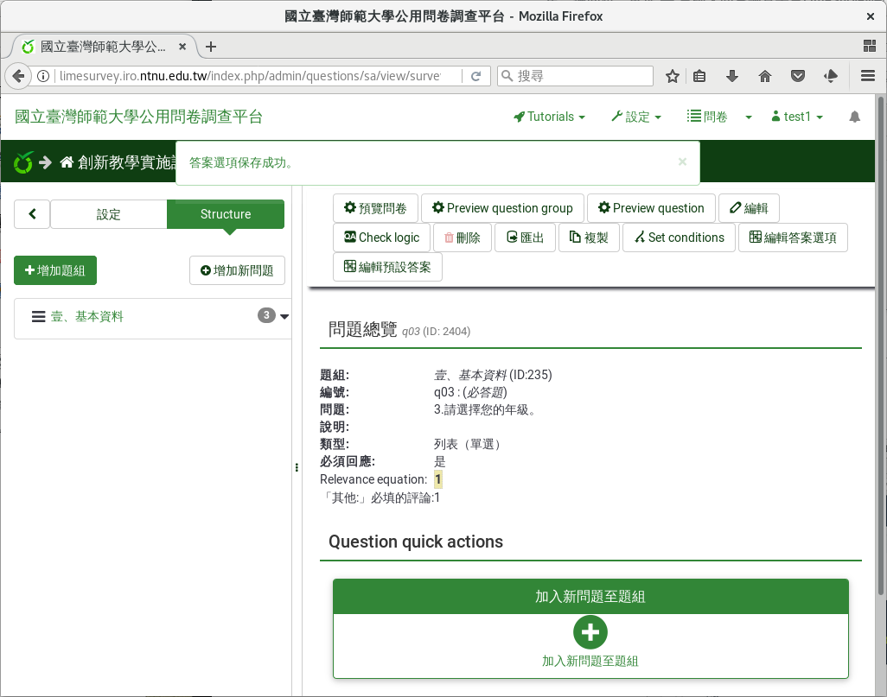

第三個問題：單選
################

第三個問題我們要問填答者的年級。

:index:`單選 <題型; 單選>` 是最常見的題型之一，用在
:index:`類別變數 <變數; 類別>` ，可以使用「列表（下拉式）」或
「列表（單選）」。

一般學生從大一到大四。不過延畢有可能大五或大六，醫學系會到大七、大八、
大九。我們提供大一到大四，四個選項，並且多一個「其他」選項讓使用者自己
填寫。

在新增問卷問題的編輯頁面上，編號填上「q03」，問題填上
「3.請選擇您的年級。」題型往下拉選「列表（單選）」，開啟
「選項『其他』」和「必須回應」。

    問題三：單選題型

按進階設定「Advanced settings」進去，往下拉找到「邏輯」下的
「『其他：』必填的評論：」點按開啟。答題選擇其他時，必須填上幾年級。

按右上角「儲存並關閉」。

    單選題型的Advanced settings

    單選題型的『其他：』必填的評論

建好問題後，會提醒你還沒輸入選項：
「You need to add answer options to this question」。可以直接點選
「You need to add answer options to this question」進入，也可由上方
「編輯答案選項」進入，輸入選項。

    建好單選題型後，輸入選項

可以一筆一筆輸入。每輸完一筆選項，按右邊的加號，新增一個選項。

    一筆一筆輸入選項

或是由下方「快速增加」一次輸入所有選項。

    按「快速增加」一次輸入所有選項

快速增加選項時，請一行填寫一個選項。可以由剪貼簿複製貼上。我們輸入一年
級到四年級，共四行::

    一年級
    二年級
    三年級
    四年級

全部選項填寫完後，按下方的「替換」使用我們填寫的選項。（如果按「增加」
，會加在現有選項後面。）

    一次輸入所有選項

完成後按「儲存並關閉」。

    填寫完選項後儲存關閉

    單選題型預覽
