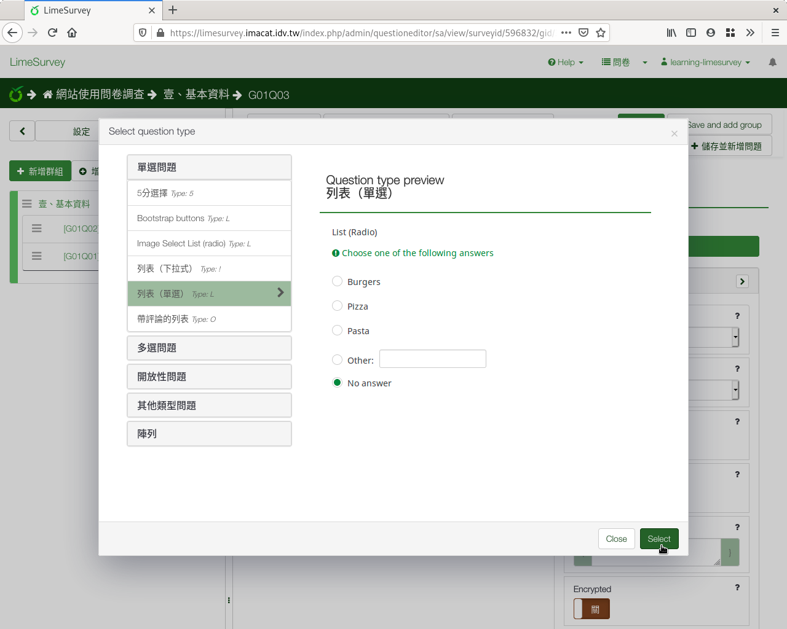

第三個問題：單選
################

第三個問題我們要問填答者的年級。

:index:`單選 <題型; 單選>` 是最常見的題型之一，用在
:index:`類別變數 <變數; 類別>` ，可以使用「列表（下拉式）」或
「列表（單選）」。

一般學生從大一到大四。不過延畢有可能大五或大六，醫學系會到大七、大八、
大九。我們提供大一到大四，四個選項，並且多一個「其他」選項讓使用者自己
填寫。

在新增問卷問題的編輯頁面上，編號填上「q03」，問題填上
「3.請選擇您的年級。」題型往下拉選「列表（單選）」，開啟
「選項『其他』」和「必須回應」。

.. figure:: images/03-02-05-single-01.png
    :alt: 問題三：單選題型
    :scale: 60%

    問題三：單選題型

按進階設定「Advanced settings」進去，往下拉找到「邏輯」下的
「『其他：』必填的評論：」點按開啟。答題選擇其他時，必須填上幾年級。

按右上角「儲存並關閉」。

    單選題型的Advanced settings

.. figure:: images/03-02-05-single-03.png
    :alt: 單選題型的『其他：』必填的評論
    :scale: 60%

    單選題型的『其他：』必填的評論

建好問題後，會提醒你還沒輸入選項：
「You need to add answer options to this question」。可以直接點選
「You need to add answer options to this question」進入，也可由上方
「編輯答案選項」進入，輸入選項。

.. figure:: images/03-02-05-single-04.png
    :alt: 建好單選題型後，輸入選項
    :scale: 60%

    建好單選題型後，輸入選項

可以一筆一筆輸入。每輸完一筆選項，按右邊的加號，新增一個選項。

.. figure:: images/03-02-05-single-05.png
    :alt: 一筆一筆輸入選項
    :scale: 60%

    一筆一筆輸入選項

或是由下方「快速增加」一次輸入所有選項。

.. figure:: images/03-02-05-single-06.png
    :alt: 按「快速增加」一次輸入所有選項
    :scale: 60%

    按「快速增加」一次輸入所有選項

快速增加選項時，請一行填寫一個選項。可以由剪貼簿複製貼上。我們輸入一年
級到四年級，共四行::

    一年級
    二年級
    三年級
    四年級

全部選項填寫完後，按下方的「替換」使用我們填寫的選項。（如果按「增加」
，會加在現有選項後面。）

.. figure:: images/03-02-05-single-07.png
    :alt: 一次輸入所有選項
    :scale: 60%

    一次輸入所有選項

完成後按「儲存並關閉」。

.. figure:: images/03-02-05-single-08.png
    :alt: 填寫完選項後儲存關閉
    :scale: 60%

    填寫完選項後儲存關閉

.. figure:: images/03-02-05-single-10.png
    :alt: 單選題型預覽
    :scale: 60%

    單選題型預覽
