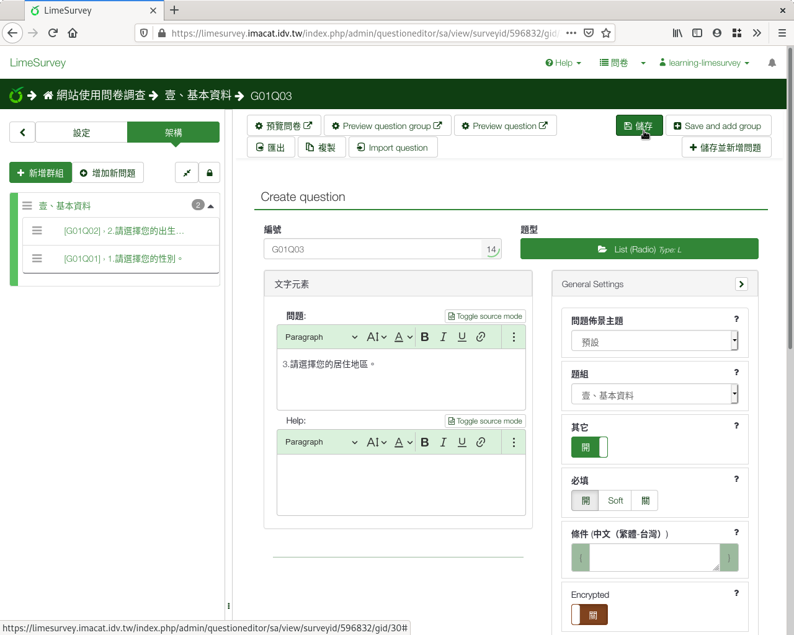
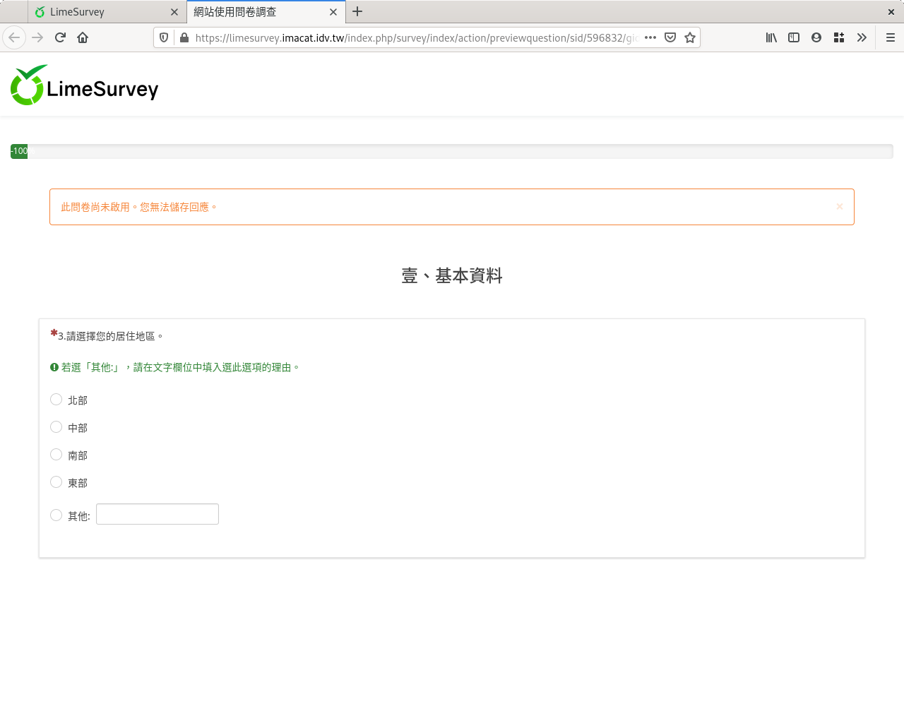

第三個問題：單選
################

第三個問題我們要問參與者的居住地區。

:index:`單選 <題型; 單選>` 是最常見的題型之一，用在
:index:`類別變數 <變數; 類別>` ，可以使用「列表（下拉式）」或
「列表（單選）」。

居住地區可以分「北部」「中部」「南部」和「東部」，不過使用者有可能人在
離島或國外。我們提供四個選項，並且多一個「其他」選項讓使用者自己填寫。

在新增問卷問題的編輯頁面上，問題填上「3.請選擇您的居住地區。」題型選擇
「單選問題」裏的「列表（單選）」，開啟「選項『其他』」和「必填」。

    問題三：單選問題

.. figure:: images/03-02-05-single-02.png
    :alt: 選擇單選題型
    :scale: 48%

    選擇單選題型

往下拉找到「答案選項」展開，輸入選項：

    展開「答案選項」設定

可以一筆一筆輸入。每輸完一筆選項，按右下方的「Add Answeroption」，
新增一個選項。

    一筆一筆輸入選項

或是由上方「Quick add」批次輸入選項。

    按「Quick add」批次輸入選項

批次輸入選項時，請一行填寫一個選項。可以由剪貼簿複製貼上。我們共輸入四行::

    北部
    中部
    南部
    東部

全部選項填寫完後，按下方的「替換」使用我們填寫的選項。（如果按「增加」
，會加在現有選項後面。）

    批次輸入選項

    選項輸入結果

同樣在下方找到「Logic」展開，點按開啟「\\'Other:\\' comment mandatory」。
答題選擇其他時，必須填上居住地區。

    展開「Logic」設定

    開啟單選題「\\'Other:\\' comment mandatory」

拉回網頁最上方，按右上角「儲存」。

    單選問題預覽
