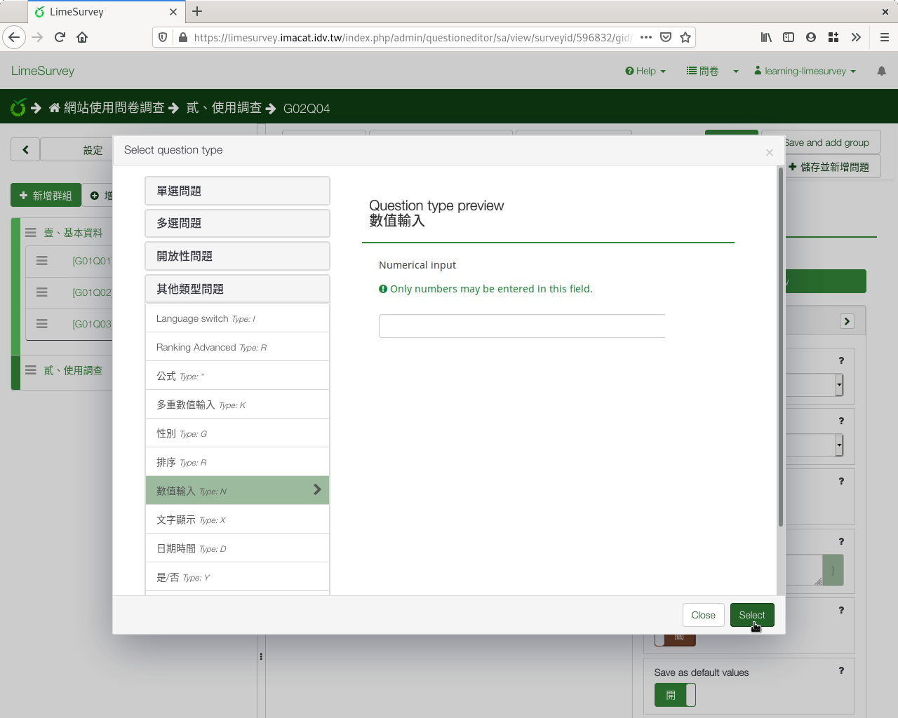

第四個問題：數值
################

接下來我們要問填答者每天回家後唸書多久，瞭解學生下課後，還付出多少時間
唸書。

:index:`數值 <題型; 數值>` 是另一種常見的題型，用在
:index:`連續變數 <變數; 連續>` 上。

唸書時間最少0小時（沒唸書），最多扣掉上課和睡覺時間，只會有十幾個小時
。為方便起見，我們當作最多24小時。

我們也可以用0–24共25個選項的單選欄位。不過有人會有3.5、2.25小時等等非
整數，所以我們還是使用數值欄位。

在新增問卷問題的編輯頁面上，編號填上「q04」，問題填上「4.請問您每天放
學後唸書幾個小時？」題型往下拉選「數值輸入」，題組選「貳、課後評量」，
開啟「必須回應」，然後按下「Advanced settings」。

    問題四：數值題型

接著往下拉到「輸入」。每天最多24小時，最少0小時，為避免填錯，可以限制
輸入值的範圍。請在最小值填上0，最大值填上24。因為可能會有3.5小時，不開
啟「只能整數」。最後按「儲存並關閉」。

    限制數值填答範圍

    數值題型預覽
