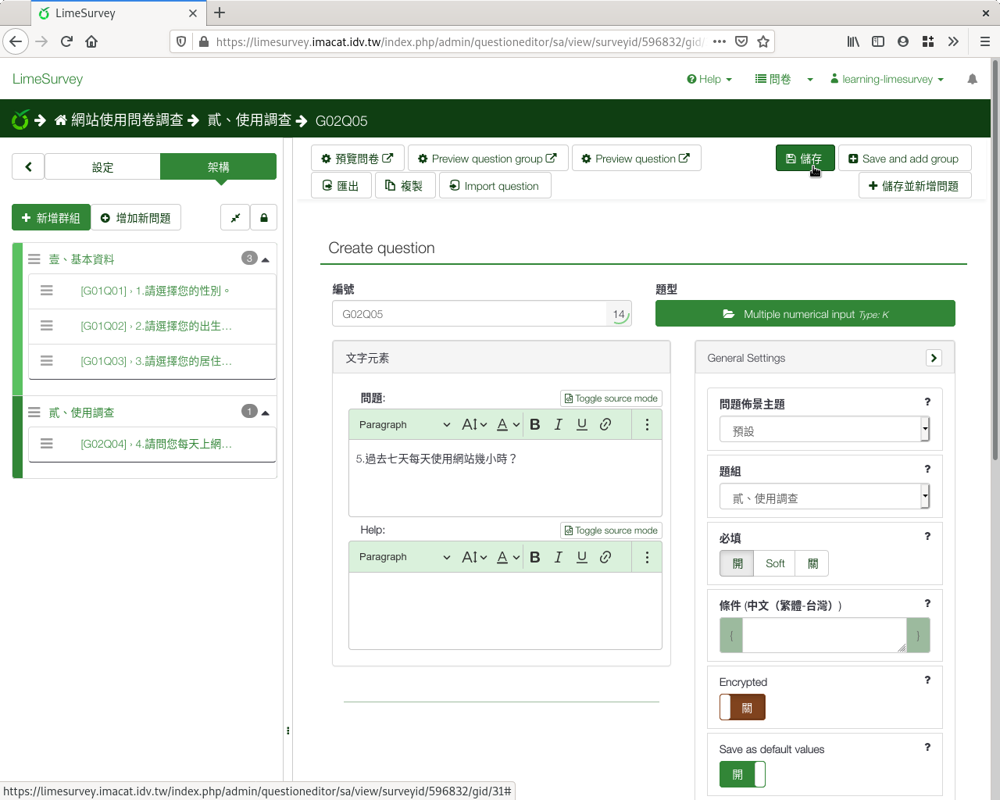
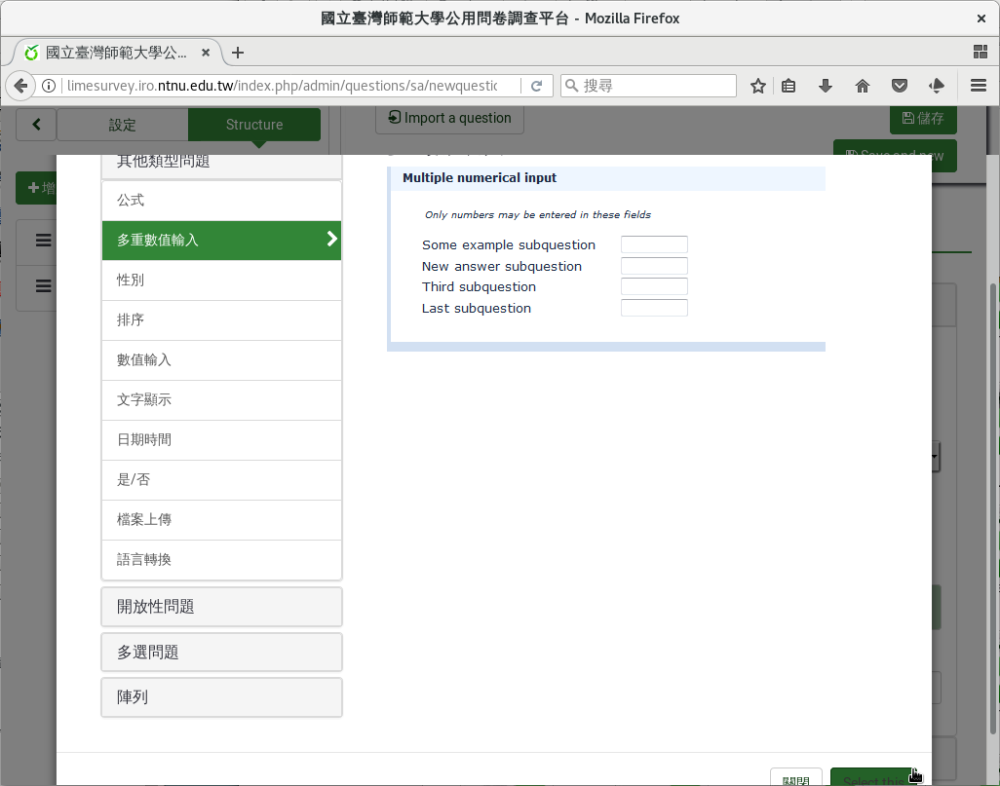
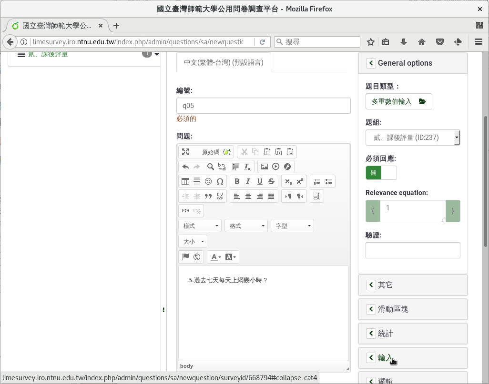
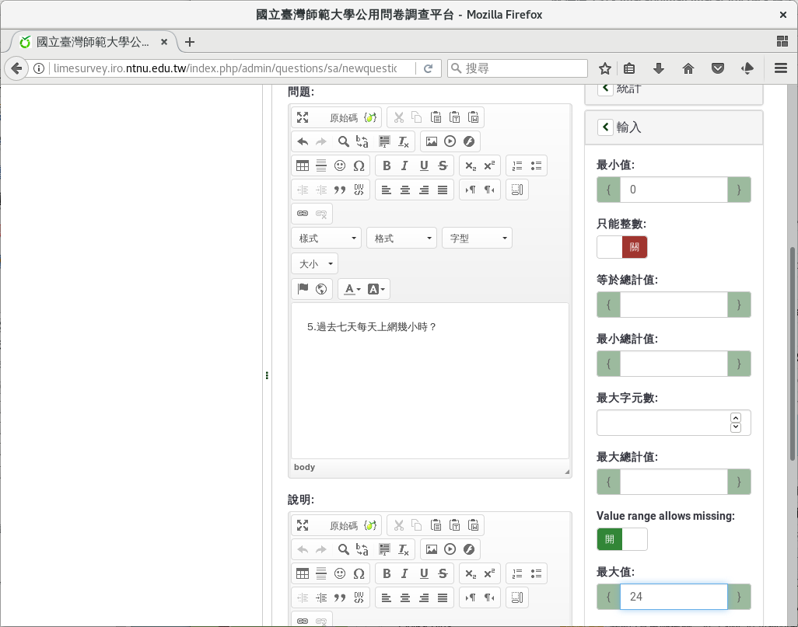
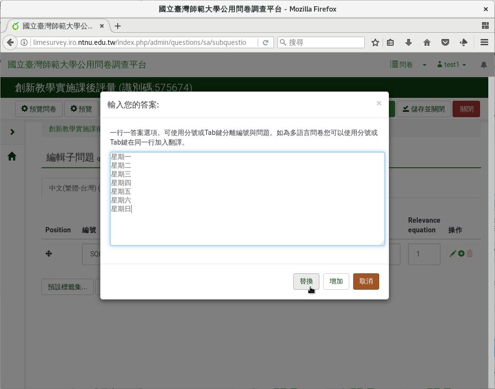
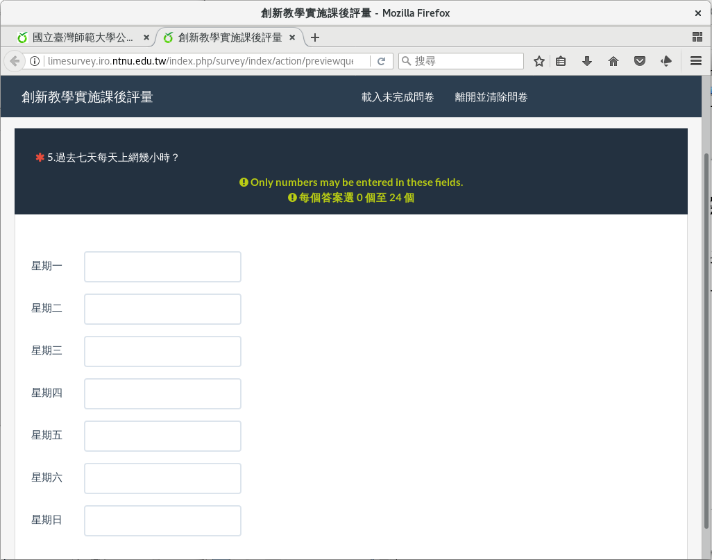

第五個問題：多重數值
####################

接下來我們想瞭解學生周間每天上網時間。

「 :index:`多重數值 <題型; 多重數值>`」欄位和「數值」欄位很像，不過可
以輸入一系列的數字，適合用在一系列同性質的數字上，例如周間每天上網時數
、每天唸書時數、每天支出…等等。

每天的上網時間最少0小時，最多24小時，同樣可以容許小數點。

在新增問卷問題的編輯頁面上，編號填上「q05」，問題填上「5.過去七天每天
上網幾小時？」題型往下拉選「多重數值輸入」，題組選「貳、課後評量」，
開啟「必須回應」，然後按下「Advanced settings」。

    問題五：多重數值題型

接著往下拉到「輸入」。請在最小值填上0，最大值填上24。因為可能會有
3.5小時，不開啟「只能整數」。最後按「儲存並關閉」。

    限制數值填答範圍

建好問題後，會提醒你還沒輸入子問題：「You need to add subquestions to
this question」。可以直接點選「You need to add subquestions to this
question」進入，也可由上方「編輯子問題」進入，輸入子問題。

    建好多重數值題型後，輸入子問題

子問題畫面和單選選項畫面一樣。我們點「快速增加」進入。輸入星期一到星期
日，共七行::

    星期一
    星期二
    星期三
    星期四
    星期五
    星期六
    星期日

然後按「替換」。按右上方「儲存並關閉」。

    按「快速增加」一次輸入所有子問題

    輸入所有子問題

    多重數值題型預覽
