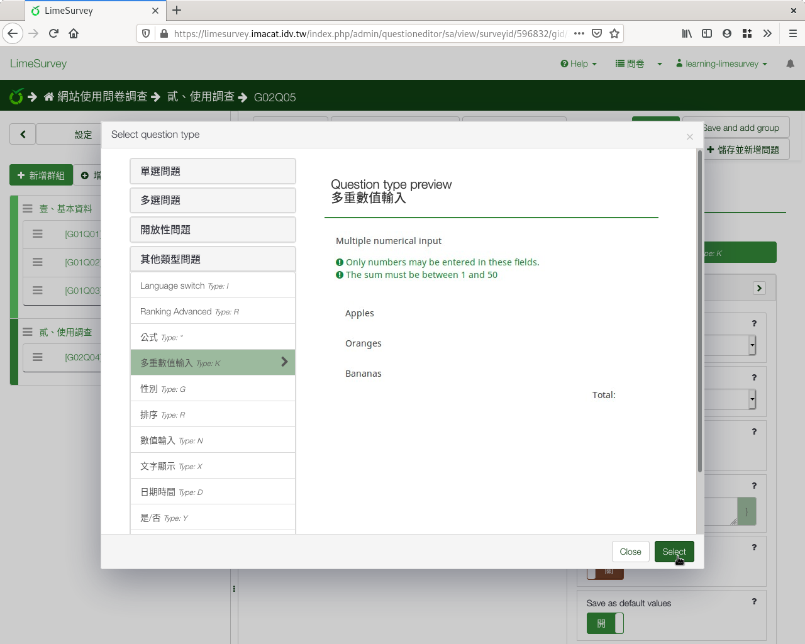
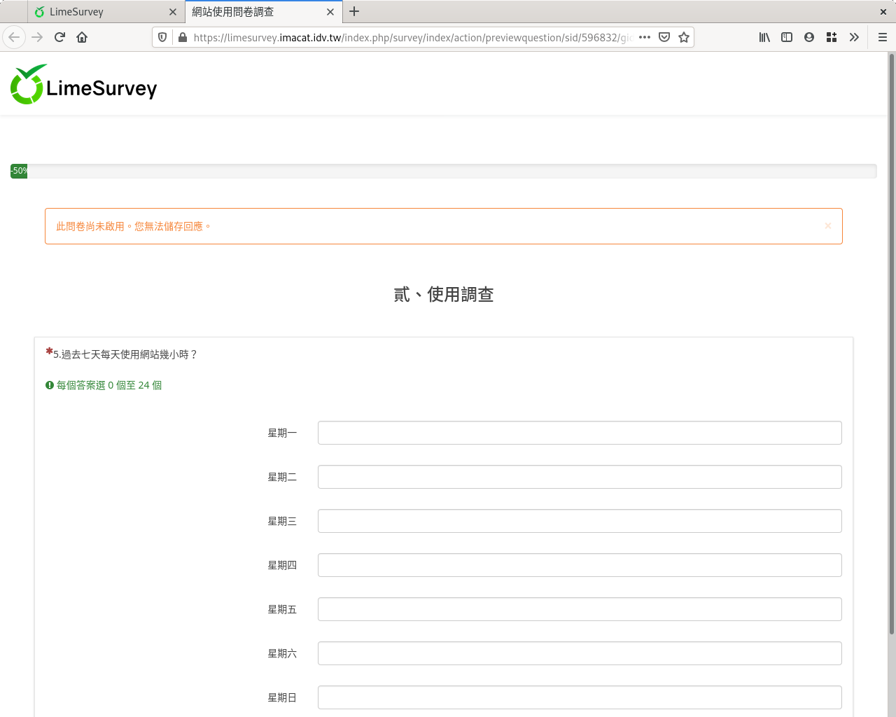

第五個問題：多重數值
####################

接下來我們想瞭解周間每天使用網站時間。

「 :index:`多重數值 <題型; 多重數值>`」欄位和「數值」欄位很像，不過可
以輸入一系列的數字，適合用在一系列同性質的數字上，例如周間每天上網時數
、每天唸書時數、每天支出…等等。

每天的使用網站時間最少0小時，最多24小時，同樣可以容許小數點。

在新增問卷問題的編輯頁面上，問題填上
「5.過去七天每天使用網站幾小時？」題型選擇「其他類型問題」裏的
「多重數值輸入」，題組選「貳、使用調查」，開啟「必填」。

    問題五：多重數值題目

    選擇多重數值題型

往下拉找到「子題」展開，輸入子題：

    展開「子題」設定

子題畫面和單選選項畫面一樣。我們點「Quick add」進入。輸入星期一到星期日，
共七行::

    星期一
    星期二
    星期三
    星期四
    星期五
    星期六
    星期日

然後按「替換」。

    按「Quick add」一次輸入所有子題

    輸入所有子題

同樣在下方找到「Input」展開。請在Minimum value填上0，Maximum value填上24。
因為可能會有3.5小時，不開啟「Integer only」。最後回到右上角按「儲存」。

    展開「Input」設定

    限制數值填答範圍

拉回網頁最上方，按右上角「儲存」。

    多重數值題目預覽
