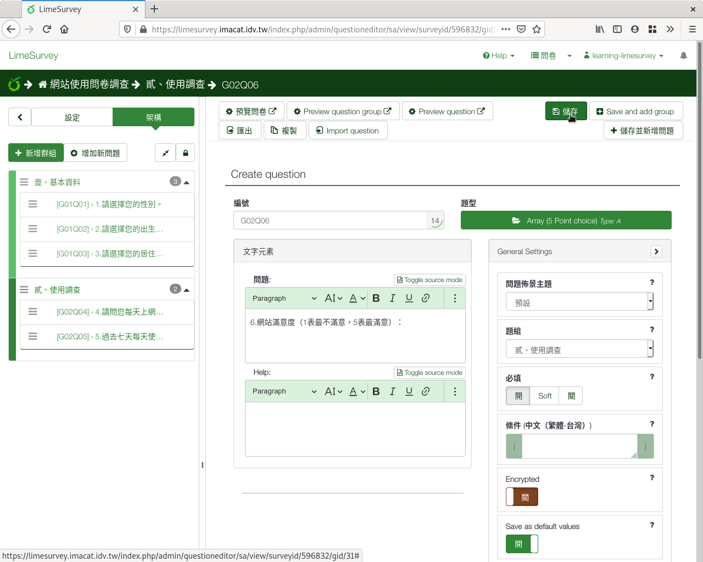
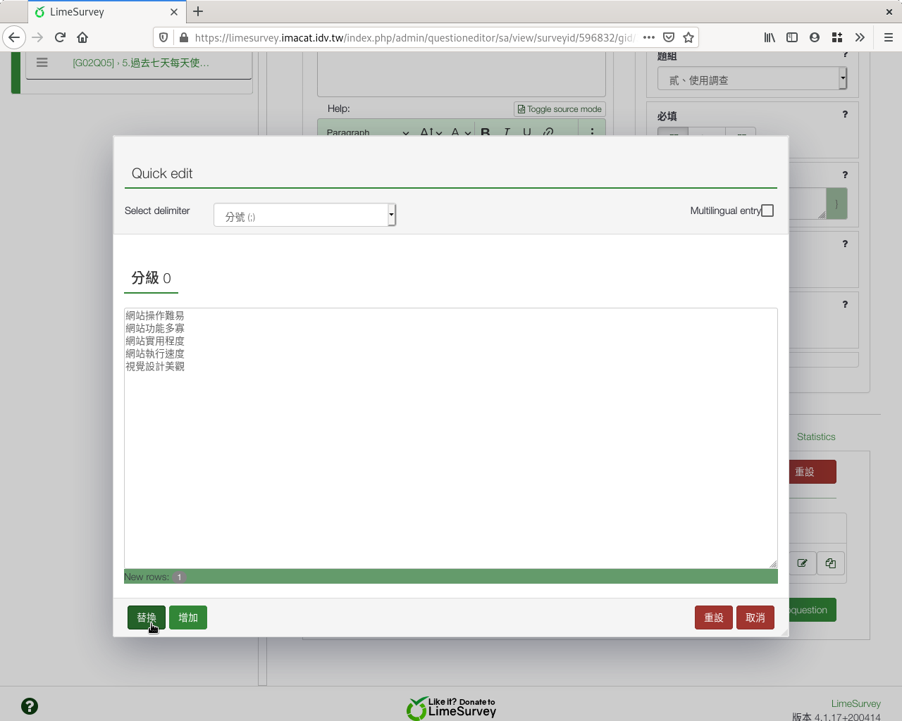

第六個問題：李克特氏五點量表
############################

接下來我們想瞭解使用者對網站各方面的滿意度。

:index:`李克特氏五點量表 (Likert scale) <題型; 李克特氏五點量表>` 是常
見的問題型式，常用於態度問卷、滿意度調查、指標設計…等等。

因為選項上的文字無法調整，所以我們在題目上寫清楚
「（1表最不滿意，5表最滿意）」。

在新增問卷問題的編輯頁面上，編號填上「q06」，問題填上
「6.網站滿意度（1表最不滿意，5表最滿意）：」題型選擇「陣列」裏的
「陣列（5分選擇）」，題組選「貳、使用調查」，開啟「必填」。

    問題六：李克特氏五點量表題目

.. figure:: images/03-03-03-likert-02.png
    :alt: 選擇李克特氏五點量表題型
    :scale: 48%

    選擇李克特氏五點量表題型

往下拉找到「子題」展開，輸入子題：

.. figure:: images/03-03-03-likert-03.png
    :alt: 展開「子題」設定
    :scale: 48%

    展開「子題」設定

加上下列子題::

    網站操作難易
    網站功能多寡
    網站實用程度
    網站執行速度
    視覺設計美觀

    輸入所有子問題

拉回網頁最上方，按右上角「儲存」。

    李克特氏五點量表題目預覽
