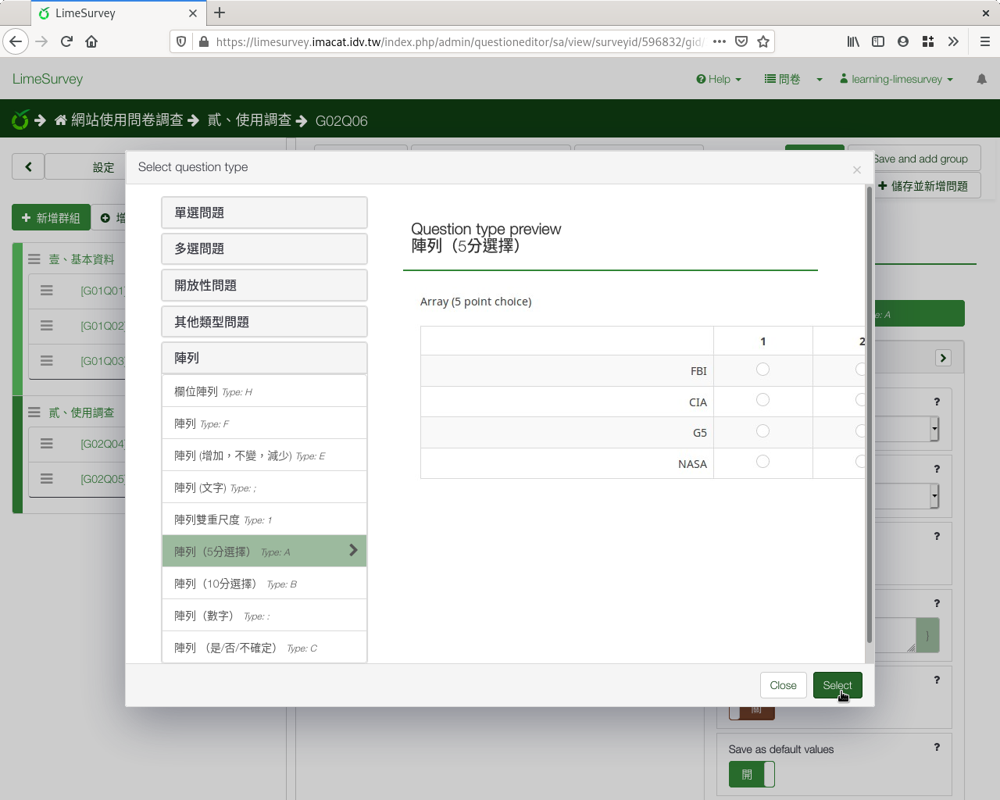

第六個問題：李克特氏五點量表
############################

接下來我們想瞭解學生對課程各方面的滿意度。

:index:`李克特氏五點量表 (Likert scale) <題型; 李克特氏五點量表>` 是常
見的問題型式，常用於態度問卷、滿意度調查等等。

因為選項上的文字無法調整，所以我們在題目上寫清楚「（1表最不滿意，5表最
滿意）」。

在新增問卷問題的編輯頁面上，編號填上「q06」，問題填上「6.課程滿意度
（1表最不滿意，5表最滿意）：」題型往下拉選「陣列（五分選擇）」，題組選
「貳、課後評量」，開啟「必須回應」，然後按「儲存並關閉」。

.. figure:: images/03-03-03-likert-01.png
    :alt: 問題六：李克特氏五點量表題型
    :scale: 60%

    問題六：李克特氏五點量表題型

建立問題後，按「編輯子問題」進入，輸入每個子問題。

    建好李克特氏五點量表題型後，輸入子問題

加上下列子問題：

- 教室場地安排
- 課程時間安排
- 教師專業素養
- 教師教學能力
- 課程內容安排

    輸入所有子問題

.. figure:: images/03-03-03-likert-04.png
    :alt: 李克特氏五點量表題型預覽
    :scale: 60%

    李克特氏五點量表題型預覽
