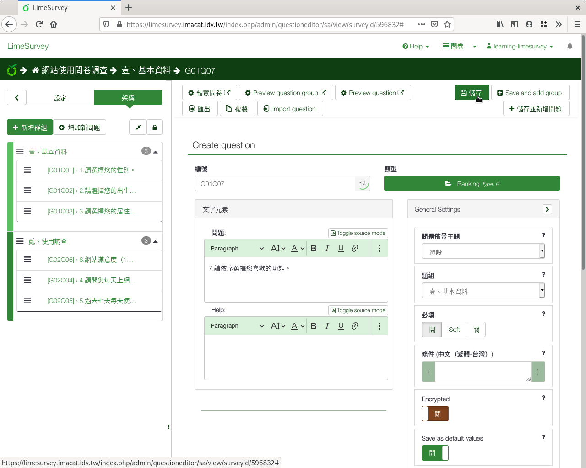
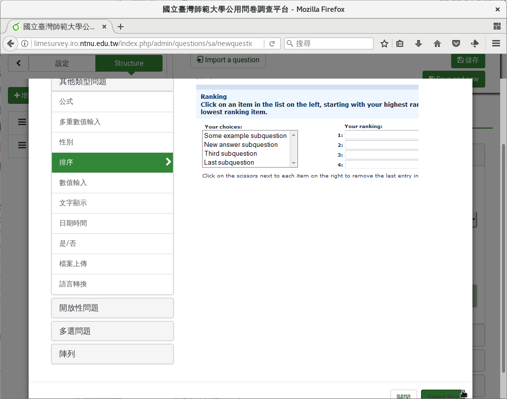
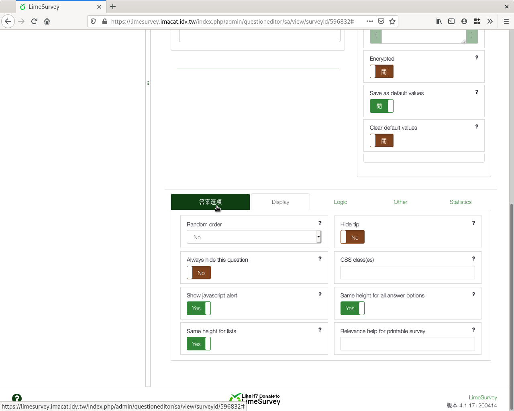
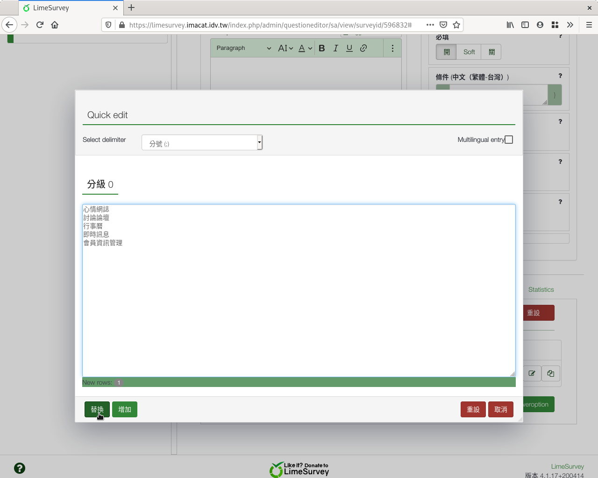
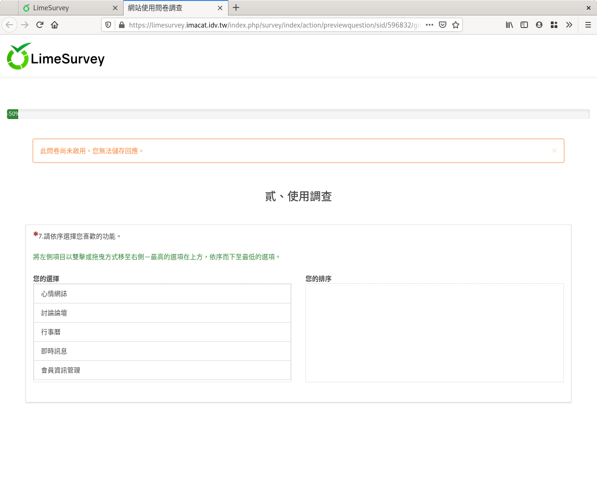

第七個問題：排序
################

我們想知道學生對課程專題的喜好順序。

:index:`排序欄位 <題型; 排序>` 有很多種用途，可以用來詢問態度喜好的順
序，也可用在社會網路分析中，詢問人際親疏的順序。

在新增問卷問題的編輯頁面上，編號填上「q07」，問題填上「7.請依序選擇您
喜歡的單元。」題型往下拉選「排序」，題組選「貳、課後評量」，開啟「必須
回應」，然後按「儲存並關閉」。

    問題七：排序題型

建立問題後，按「編輯答案選項」輸入各課程單元。

    建好排序題型後，輸入排序項目

加上下列課程單元：

- 小豆芽觀察日記
- 閃爍的星星
- 我家附近的神明
- 爺爺奶奶的故事
- 神奇機器人

    輸入所有排序項目

    排序題型預覽

左邊是現有的課程單元，右邊是排序的結果。依偏好順序，用滑鼠在左邊的課程
單元點兩下，或用滑鼠拖拉到右邊，就可以加到右邊的排序結果中。也可以用滑
鼠拖拉，調整各個課程單元的順序。

    用滑鼠拖拉調整順序
