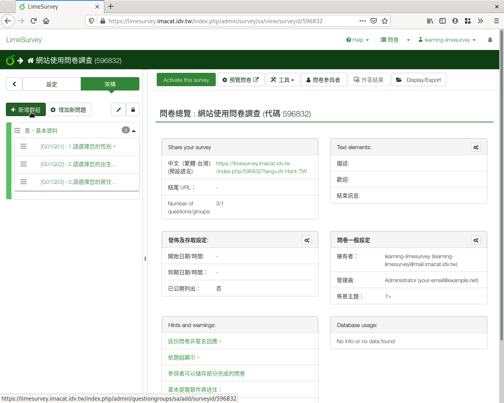
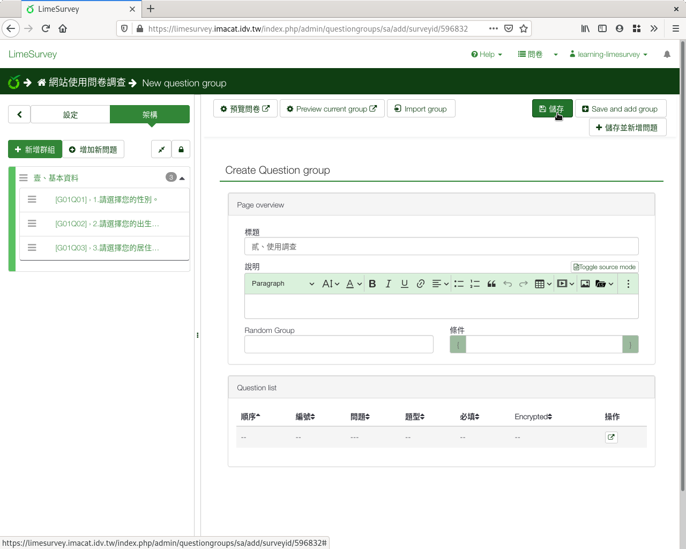

題組二：各種題型
----------------

第一個題組是參與者的基本資料，以便後續分析。接下來才是我們問卷的主文。

在第二個題組中，我們會介紹幾種不同的常用題型。

在左側欄的問卷結構中，點選上方的
「 :index:`新增群組 <pair: 題組; 建立>` 」進入。標題填上
「貳、使用調查」，然後按右上角「儲存」。

    點按新增群組

    新增群組頁面

.. toctree::

    03-03-01-number.rst
    03-03-02-multi-numbers.rst
    03-03-03-likert.rst
    03-03-04-order.rst
    03-03-05-review.rst
