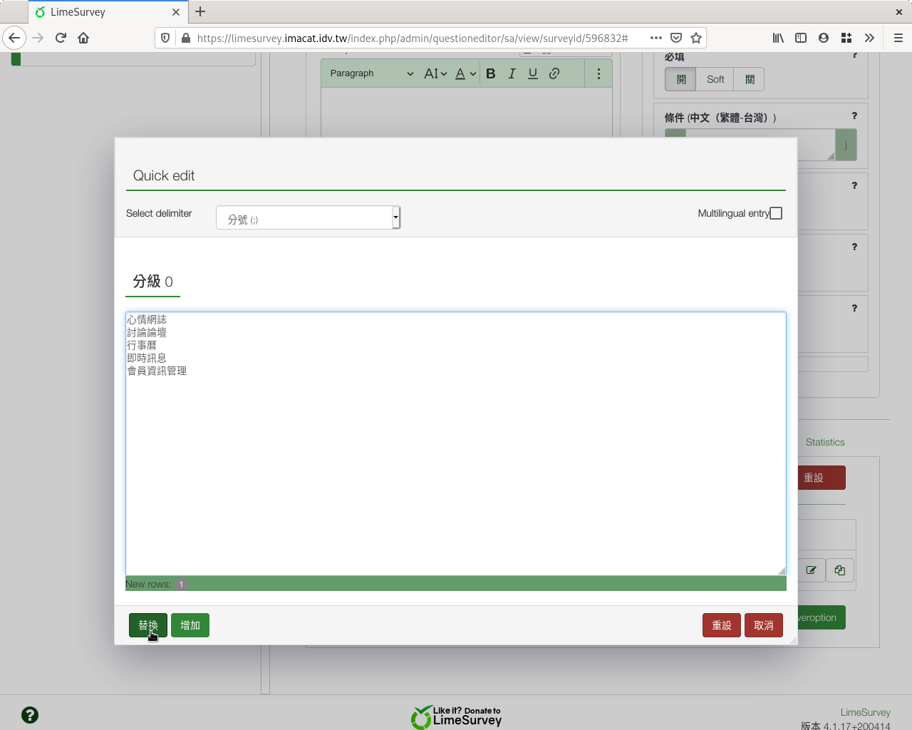

第八個問題：是／否
##################

第八個問題，要詢問答題者是否是本校學生。我們會用到
:index:`「是／否」題型 <題型; 是／否>`。

在新增問卷問題的編輯頁面上，編號填上「q08」，問題填上「8.您是不是台師
大學生？」題型往下拉選「是／否」，題組選「參、其他」，開啟「必須
回應」，然後按「儲存並關閉」。

.. figure:: images/03-03-04-order-01.png
    :alt: 問題七：排序題型
    :scale: 60%

    問題七：排序題型

    排序題型預覽
