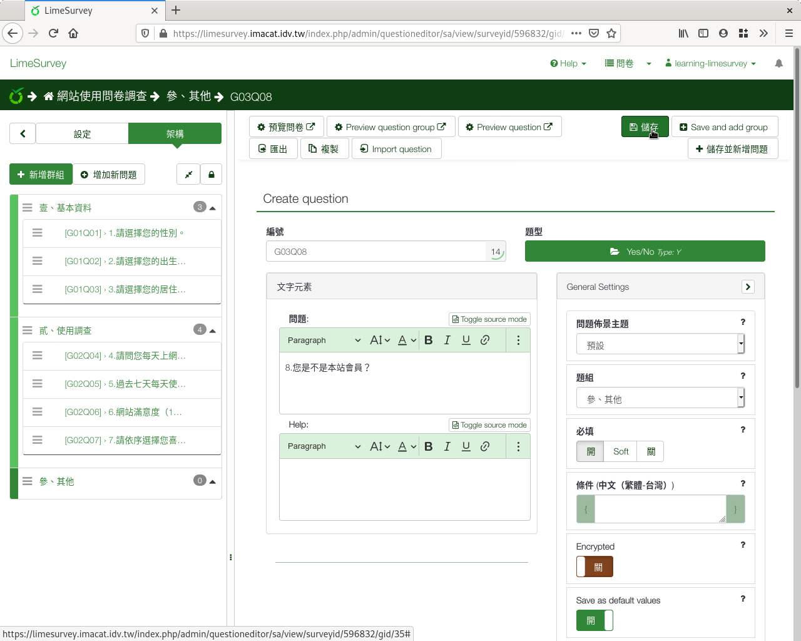
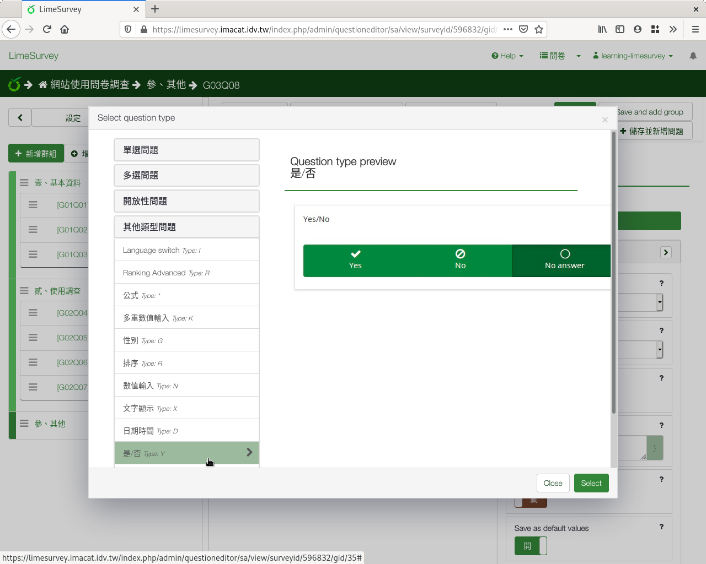

第八個問題：是／否
##################

第八個問題，要詢問答題者是否是本校學生。我們會用到
:index:`「是／否」題型 <題型; 是／否>`。

在新增問卷問題的編輯頁面上，編號填上「q08」，問題填上
「8.您是不是台師大學生？」題型往下拉選「是／否」，題組選「參、其他」，
開啟「必須回應」，然後按「儲存並關閉」。

    問題八：是否題型

    是否題型預覽
