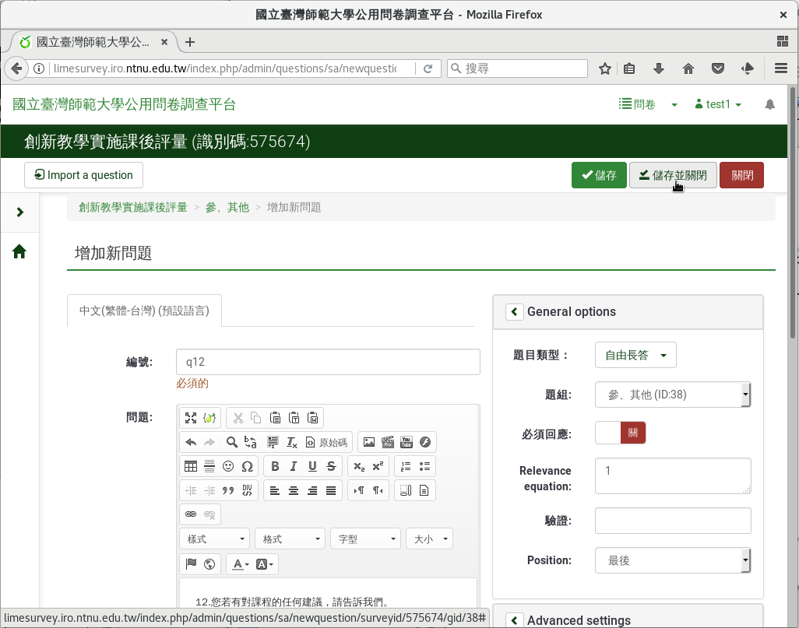

第十二個問題：自由長答
######################

問卷最後我們請填答者給我們課程的建議，告訴我們問卷沒有問到的感想。

課程建議題型使用「 :index:`自由長答 <題型; 多行文字>` 」。填答者不一定
非給建議不可，不是必答。自由長答的內文可以做質性分析。

在新增問卷問題的編輯頁面上，編號填上「q12」，問題填上
「12.您若有對課程的任何建議，請告訴我們。」題型往下拉選「自由長答」，
題組選「參、其他」，不要開啟「必須回應」，然後按「儲存並關閉」。

    問題十二：自由長答
