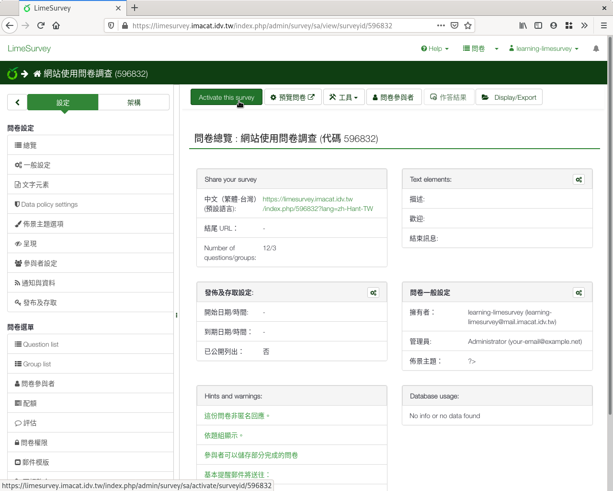
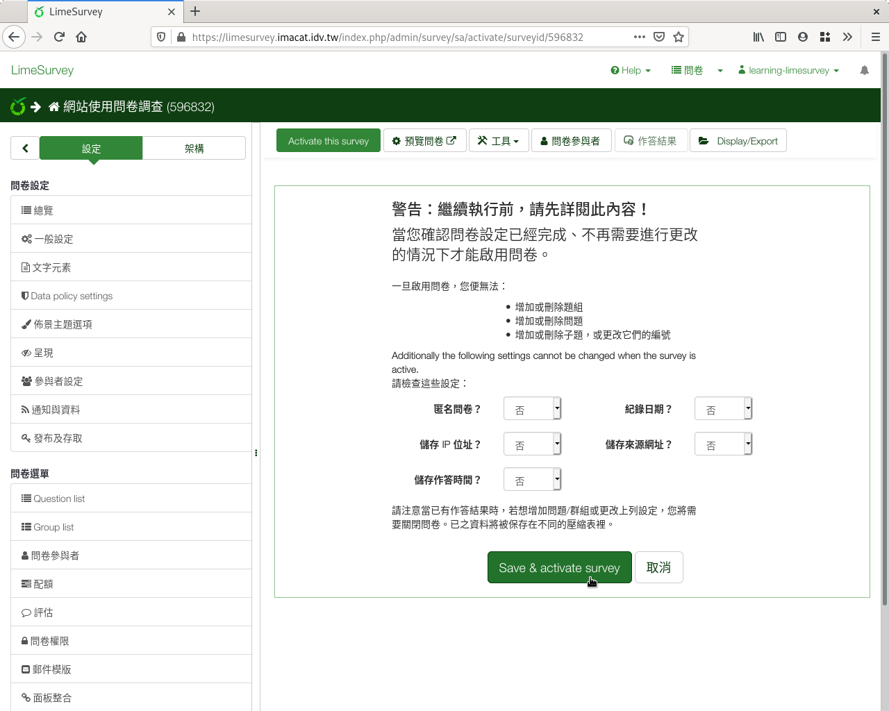
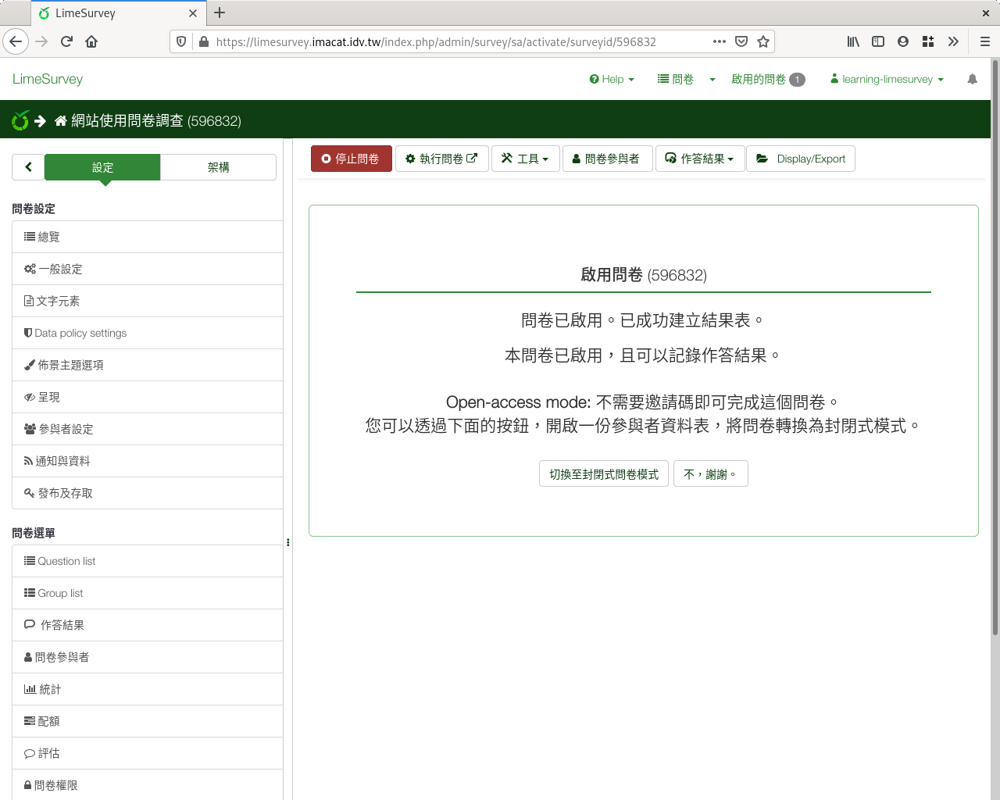

啟用問卷
--------

從問卷左上角按「Active this survey」 :index:`啟用問卷 <問卷; 施測>`
開始施測。

    按下「Active this survey」啟用問卷

提醒您： **一旦開始施測，就不能再增刪問卷題目了。** 確認要開始施測
，請按左下方的「Save & activate survey」，問卷就啟用，可以開始施測了。

    按下「Save & activate survey」確認啟用

問卷施測的方法有兩種：開放式問卷，和封閉式問卷。

    封閉式問卷或開放式問卷
