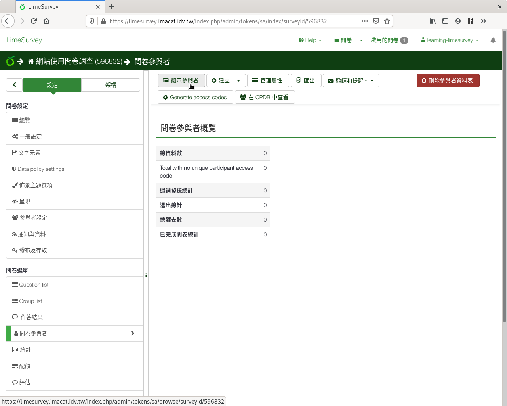
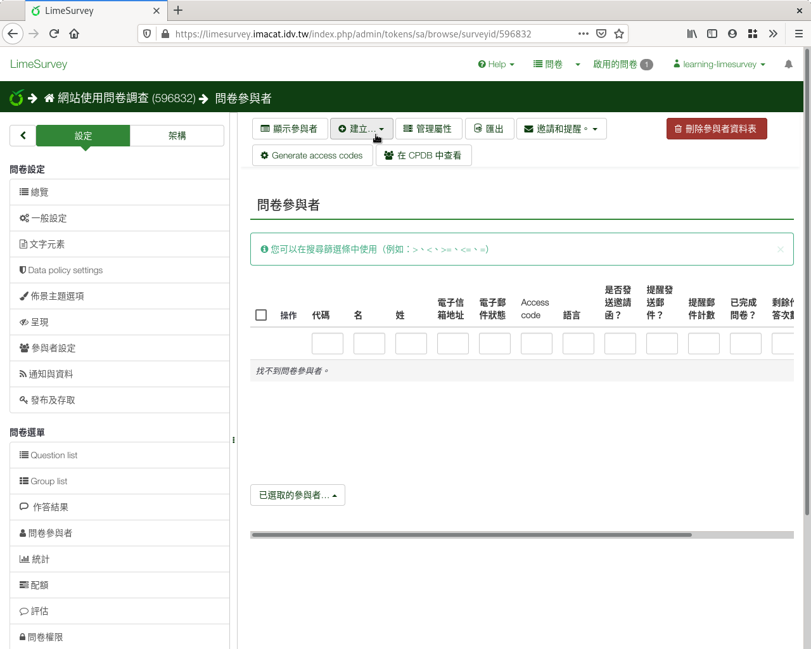
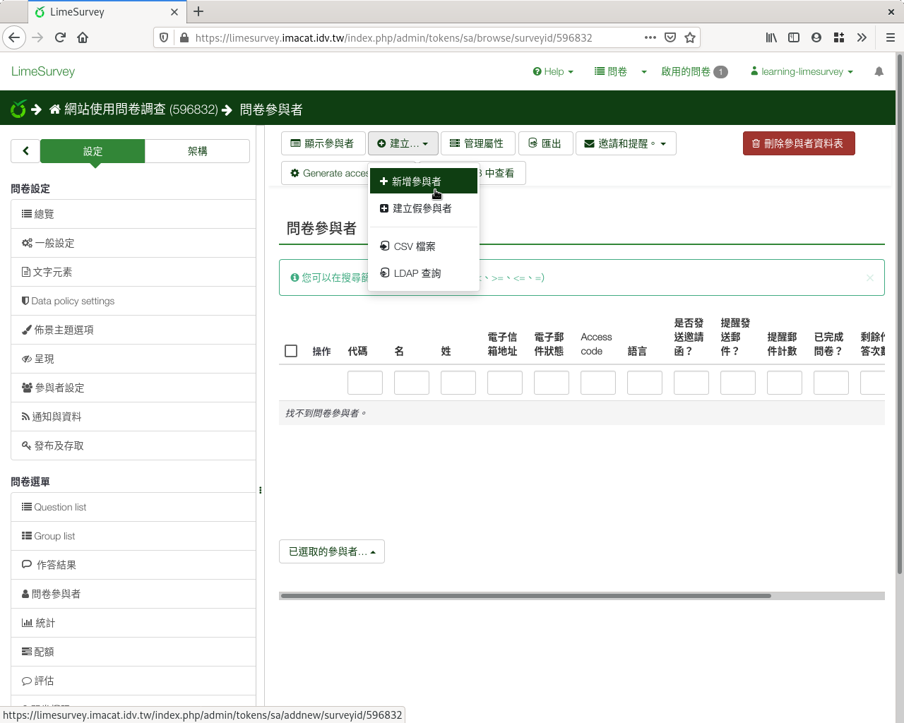
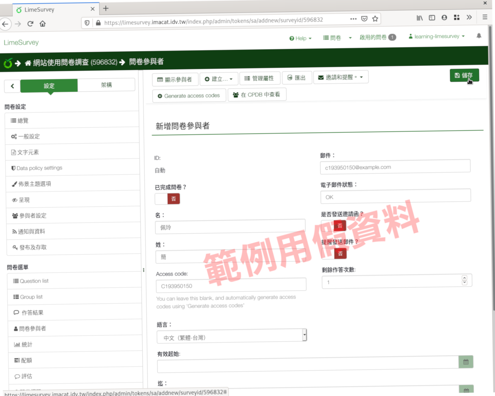
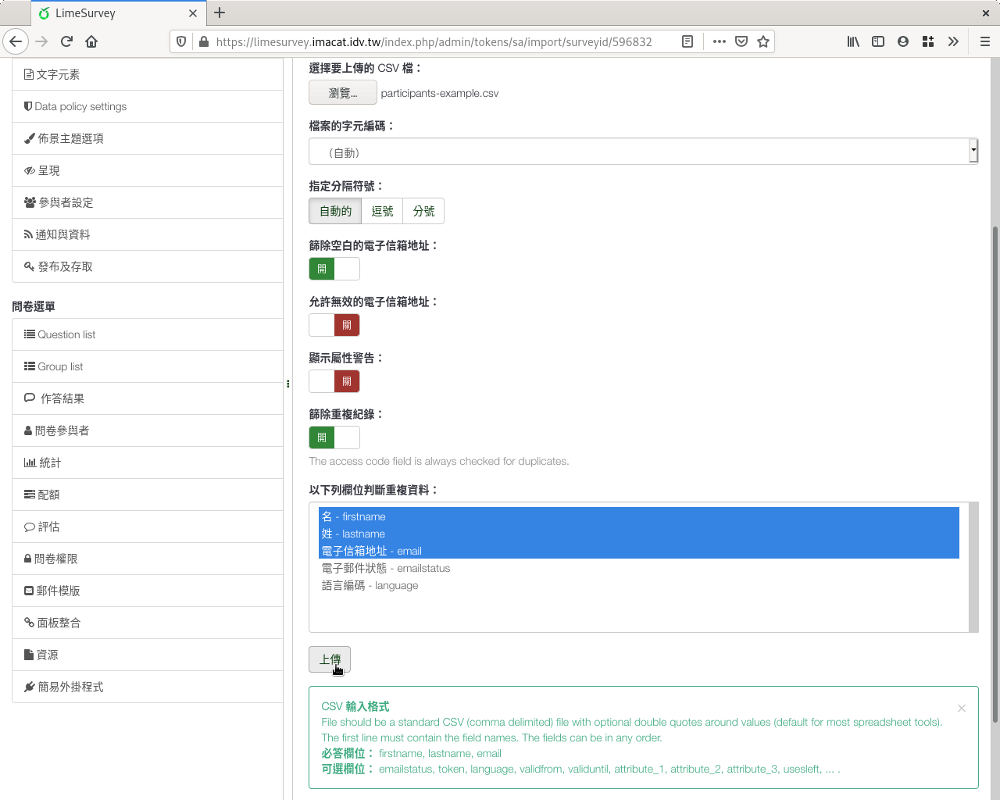

填答者名單
##########

建立封閉式問卷後，下一步要建立填答者名單。從問卷左側選單「問卷參與者」
進入後，點選上方選單「顯示參與者」。

    點選「顯示參與者」

目前名單還是空的。從左上角按下「建立」，可以增添新的填答者。

    點選「建立」加上新的填答者

選「加入參與者」，就可以一筆一筆輸入填答者資料。

    選「建立」「加入參與者」輸入填答者資料

填上First name（名）、Last name（姓）和Email郵件信箱，按右上角「儲存」
即可。Token（ :index:`邀請碼 <邀請碼; 填寫>` ）可留白，系統自動產生亂
數邀請碼。也可以使用身份證字號、學號等對方容易記憶的邀請碼，
只要不重複即可。

    輸入填答者資料

選「CSV檔案」，可從CSV檔整批匯入填答者名單。

    選「建立」「CSV檔案」從CSV檔匯入填答者名單

CSV檔欄位如下：

- firstname（名）
- lastname（姓）
- email（郵件信箱）
- （選填）token（邀請碼）

    選「建立」「CSV檔案」從CSV檔匯入填答者名單

可以參閱 `填答者CSV檔的範例 <http://limesurvey.iro.ntnu.edu.tw/learning/participants-example.csv>`_ 。

    填答者CSV檔範例
