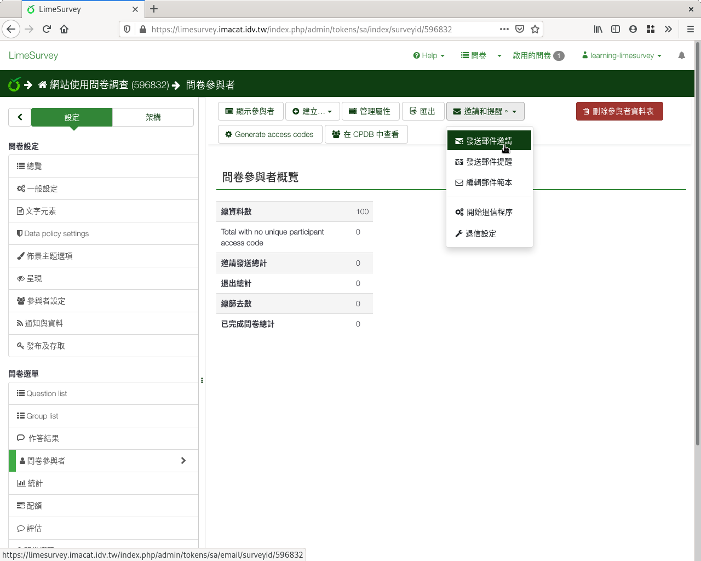
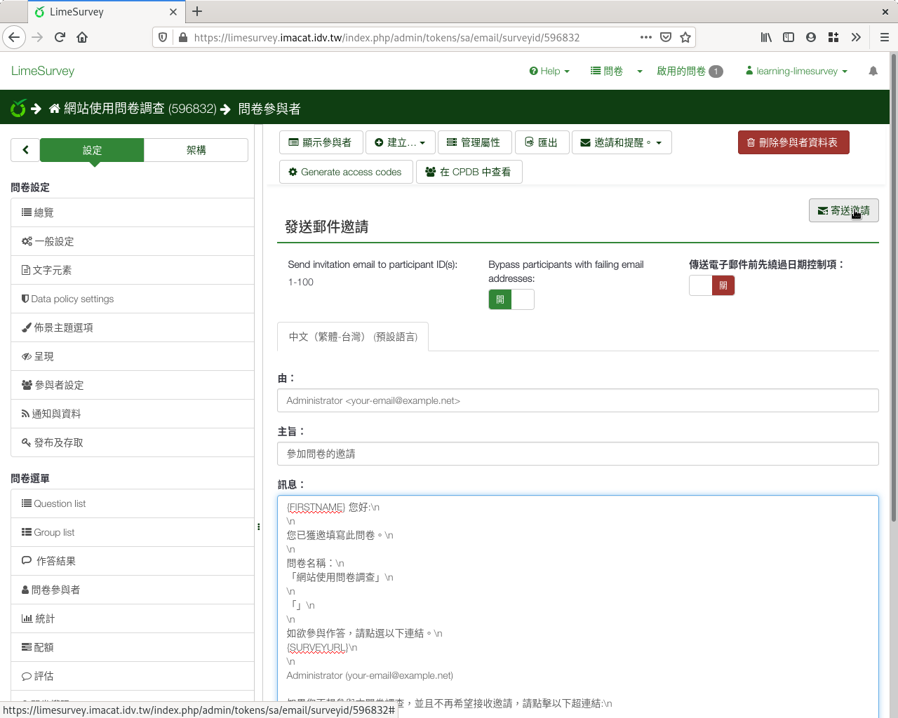
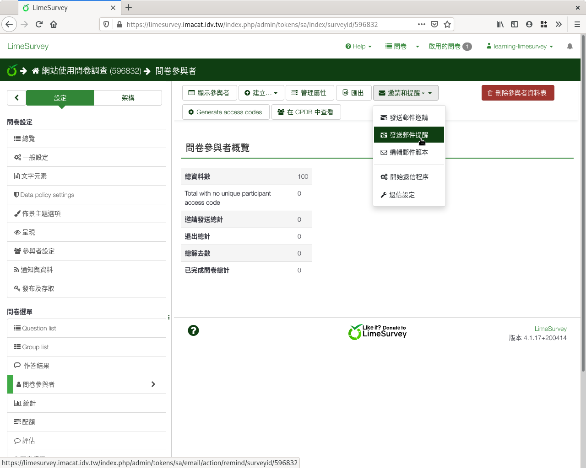
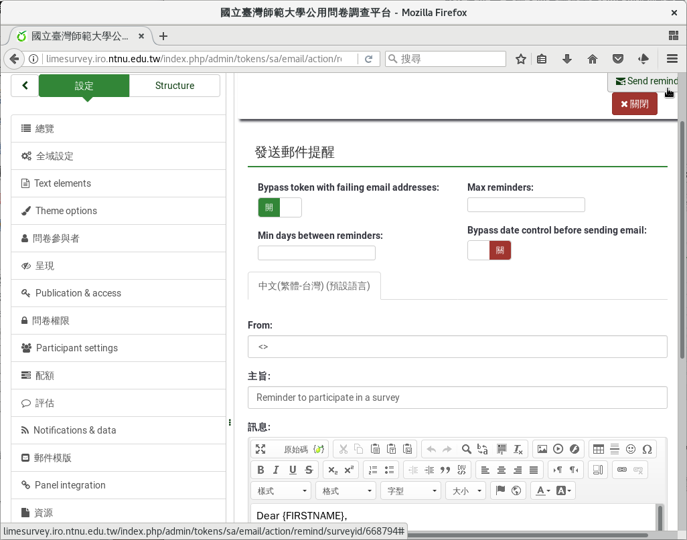

發送通知
########

建立參與者名單後，我們要發送 :index:`邀請碼 <邀請碼; 發送>` 給參與者，
請參與者上網填問卷。由左側欄設定選單的「問卷參與者」點進去，上方選單
「邀請和提醒」下的「發送郵件邀請」進入。

    點選「發送郵件邀請」

確認邀請郵件內容無誤後即可寄出。

    確認邀請郵件內容

問卷結束前，我們要提醒還沒填答的人上來填問卷。由左側欄設定選單的
「問卷參與者」點進去，上方選單「邀請和提醒」下的「發送郵件提醒」進入。

    點選「發送郵件提醒」

確認提醒郵件內容無誤後即可寄出。

    確認提醒郵件內容
