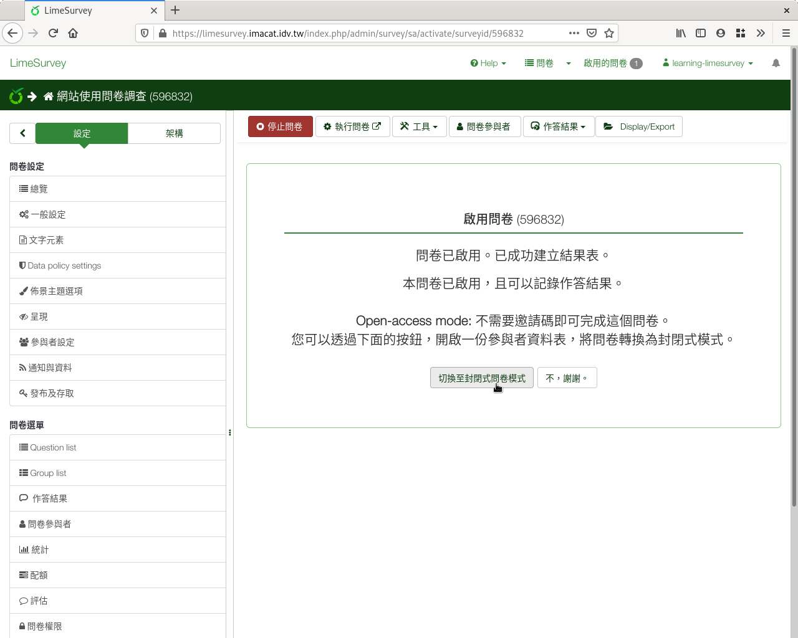
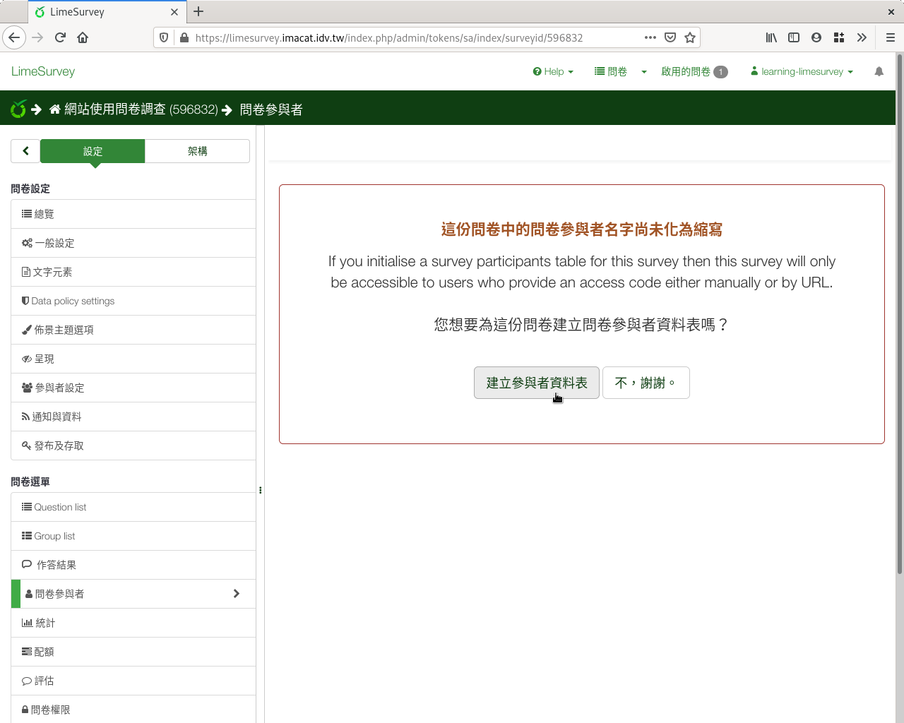

封閉式問卷
----------

:index:`封閉式問卷 <問卷; 封閉式>` ，需要有參與者的Email，
適用於施測者握有特定參與者名單時。如：

- 單位所有同仁。
- 參加活動的報名者。
- 全校教師或學生。
- …等等。

封閉式問卷需要額外設定參與者名單。名單上的參與者，需有
:index:`邀請碼 <邀請碼>` 才可填答。每個參與者的邀請碼各自不同。

啟用問卷後，詢問是否要封閉式問卷時，按左下角的「切換至封閉問卷模式」
即可。

    選擇封閉式問卷

詢問是否要建立參與者資料表時，請點選左下角「建立參與者資料表」。

    建立參與者資料表

.. toctree::

    04-03-01-participants
    04-03-02-messages
