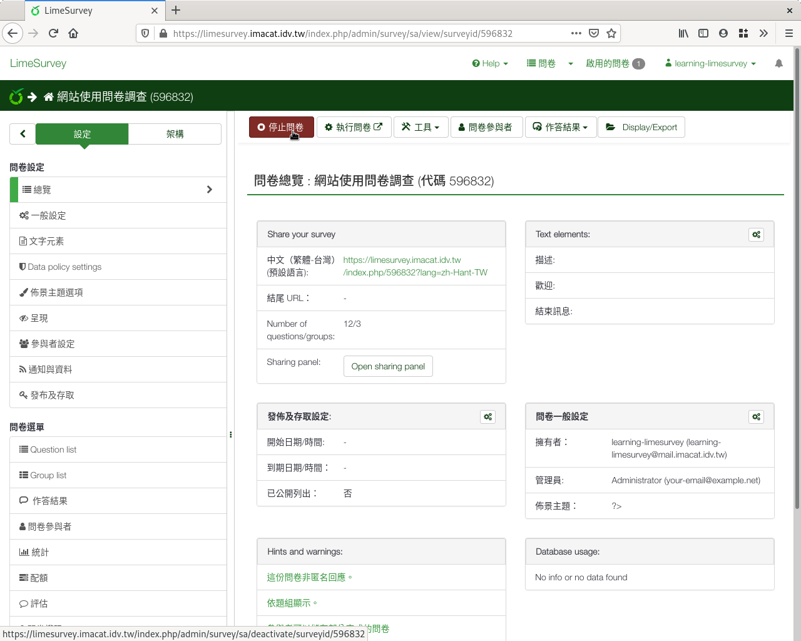
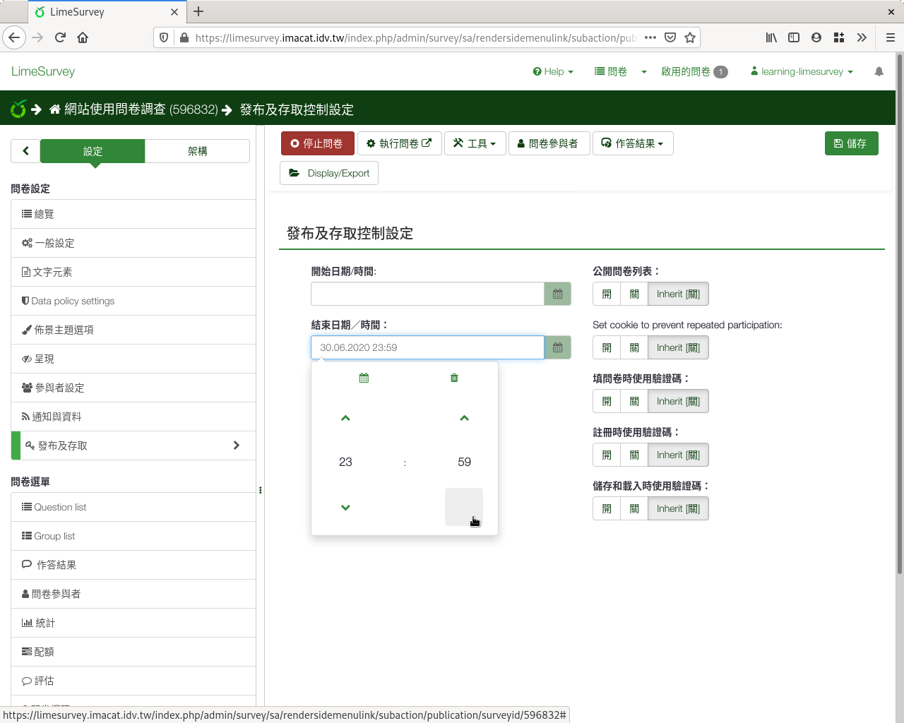
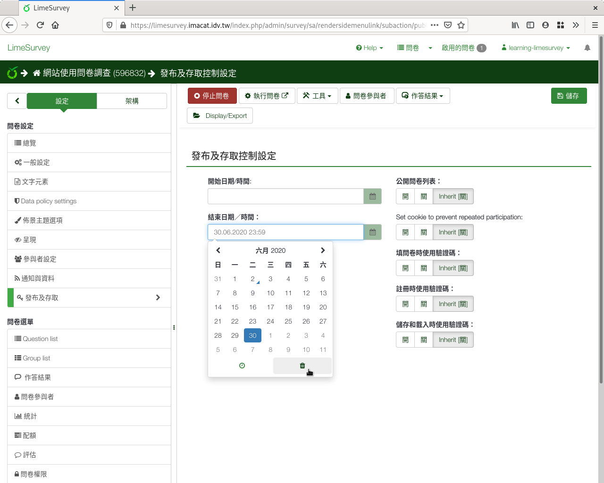

問卷結束
--------

為避免有人在施測時間外上來填答，破壞問卷的有效性，預定施測時間結束後，
我們會 :index:`停止問卷 <問卷; 停測>` 。

按上方的「停止問卷」，即可結束問卷。

    點選「停止問卷」

結束有兩種方式：「問卷到期」和「關閉問卷」。若不知道該如何選擇，選左邊
的「到期問卷」即可。

.. figure:: images/04-04-stop-02.png
    :alt: 「問卷到期」和「關閉問卷」
    :scale: 60%

    「問卷到期」和「關閉問卷」

問卷到期
########

問卷施測有開始也有結束。施測期間結束，停止填答，要開始統計分析結果時，
我們選擇 :index:`問卷到期 <問卷; 到期>` 。到期後，就不可以再填答了。
施測者可以隨時匯出填答回應，作後續統計。

我們可以事先設定施測到期日，到期自動結束。例如：選前一個月的民意調查，
在投票日前30日中止；或是期中考前的調查，在期中考前的周末中止。

從問卷左側欄「設定」分頁下，「Publication and access」進入後，即可設定
問卷施測的開始和結束時間。點選彈出月曆，設定結束日期。你也可以點選彈出
月曆左下方的時鐘圖案，設定結束時間。

    左側欄「設定」裏的「Publication and access」

    點選彈出月曆，設定結束日期

    點選彈出月曆左下方的時鐘圖案

    設定結束時間

不論是自動到期還是手動到期，到期的問卷若要重開，只要刪除結束時間即可。
點選彈出月曆的右下方垃圾筒圖案，可以刪除結束時間。

    點選彈出月曆右下方的垃圾筒圖案，刪除問卷結束時間

關閉問卷
########

如果發現問卷有錯誤，要中止施測，修正問卷重新施測時，我們選擇
:index:`關閉問卷 <問卷; 關閉>` 。關閉後，可以重新增刪題目，再重開問卷
施測。

舊的問卷填答會另外封存，無法再匯出，需要系統管理員手動取回。若需要已填
答的結果，請先匯出後，再關閉問卷。
