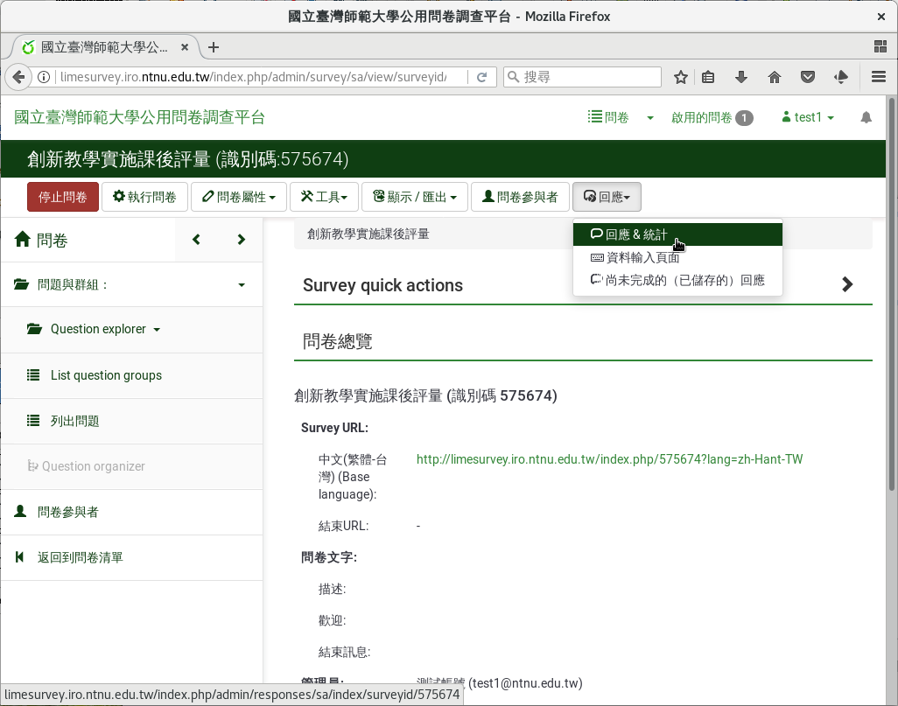
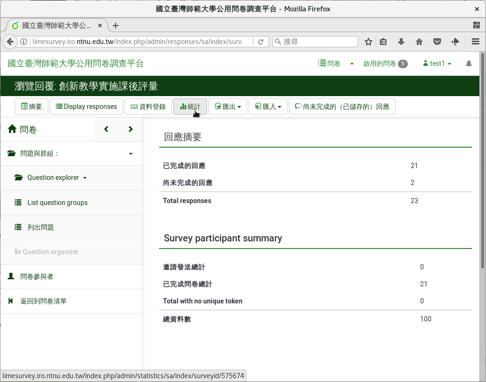
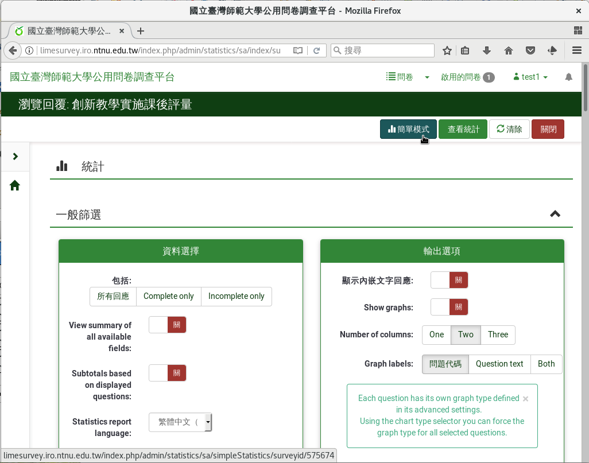
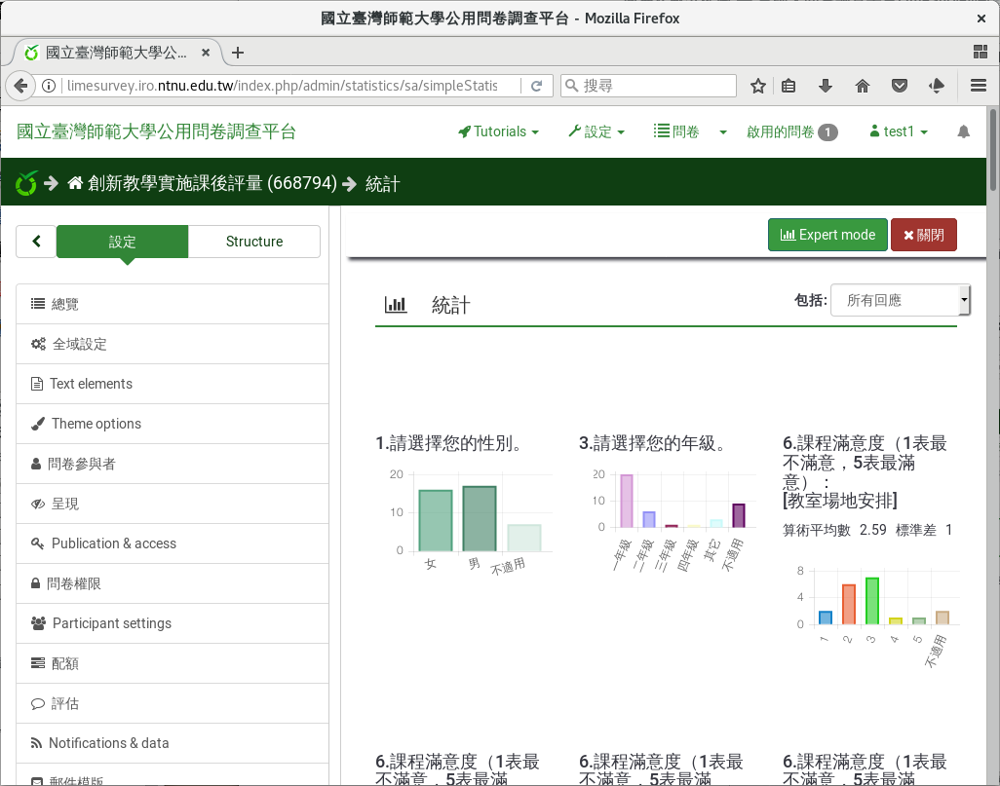

簡易次數分配圖
##############

LimeSurvey提供簡易的次數分配圖。次數分配圖只能繪製類別變項和李克特氏五
點量表。

從問卷頁面右上選單「回應」下的「回應&統計」點進去，然後點選上方選單的
「統計」。

    問卷頁面右上選單「回應」下的「回應&統計」

    回應與統計頁面選單上的「統計」

點選右上方的「簡單模式」，即可繪製簡易的次數分配圖。

    點選「簡單模式」

    簡易次數分配圖
