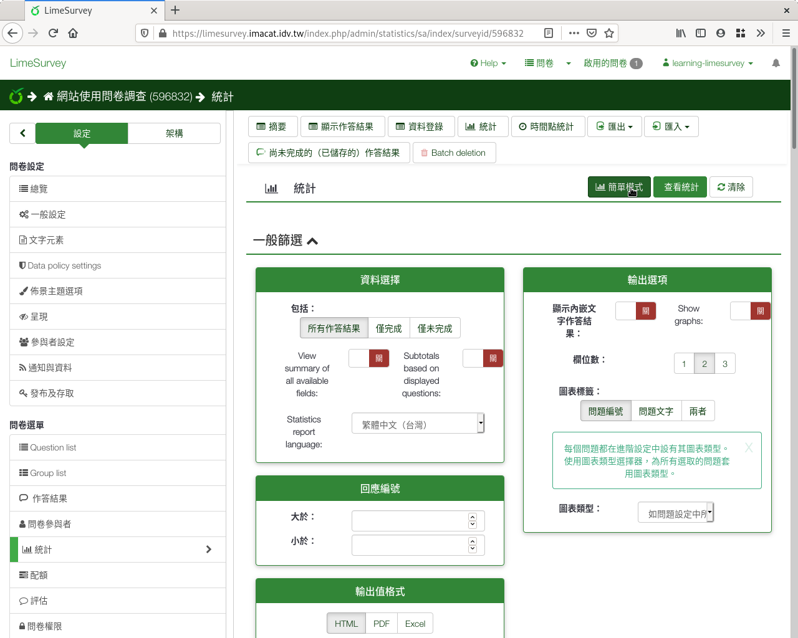
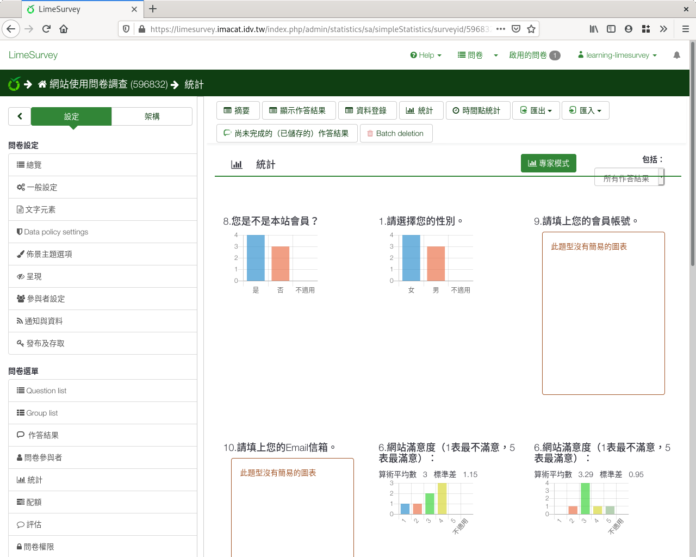

簡易次數分配圖
##############

LimeSurvey提供簡易的次數分配圖。次數分配圖只能繪製類別變項和李克特氏五
點量表。

從問卷頁面右上選單「回應」下的「回應&統計」點進去，然後點選上方選單的
「統計」。

.. figure:: images/05-01-01-simple-01.png
    :alt: 問卷頁面右上選單「回應」下的「回應&統計」
    :scale: 60%

    問卷頁面右上選單「回應」下的「回應&統計」

    回應與統計頁面選單上的「統計」

點選右上方的「簡單模式」，即可繪製簡易的次數分配圖。

    點選「簡單模式」

.. figure:: images/05-01-01-simple-04.png
    :alt: 簡易次數分配圖
    :scale: 60%

    簡易次數分配圖
