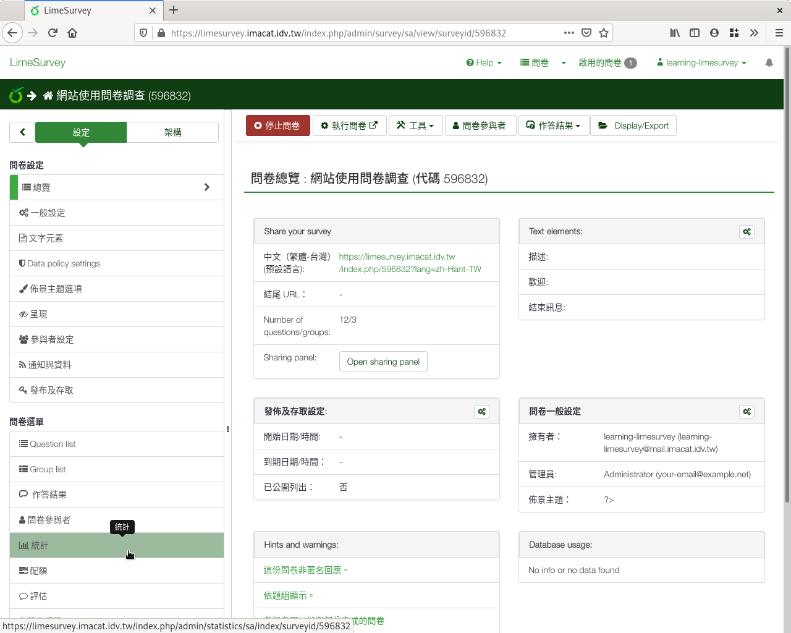
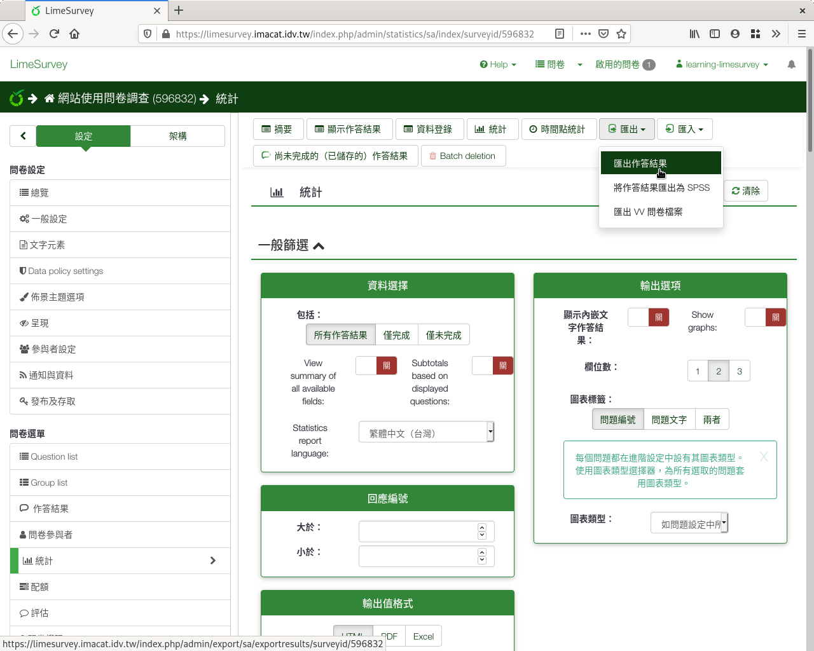
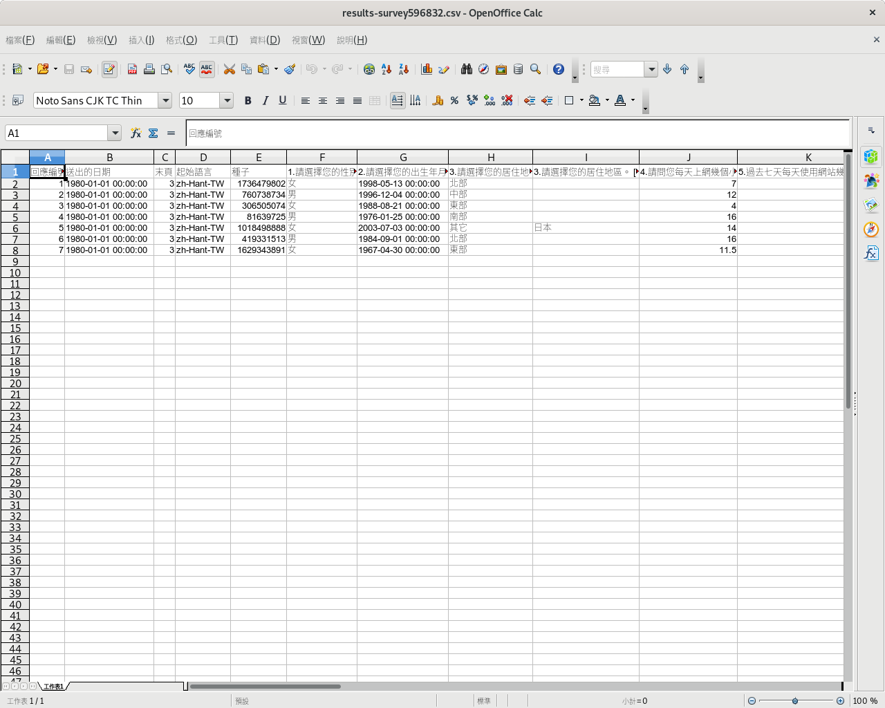
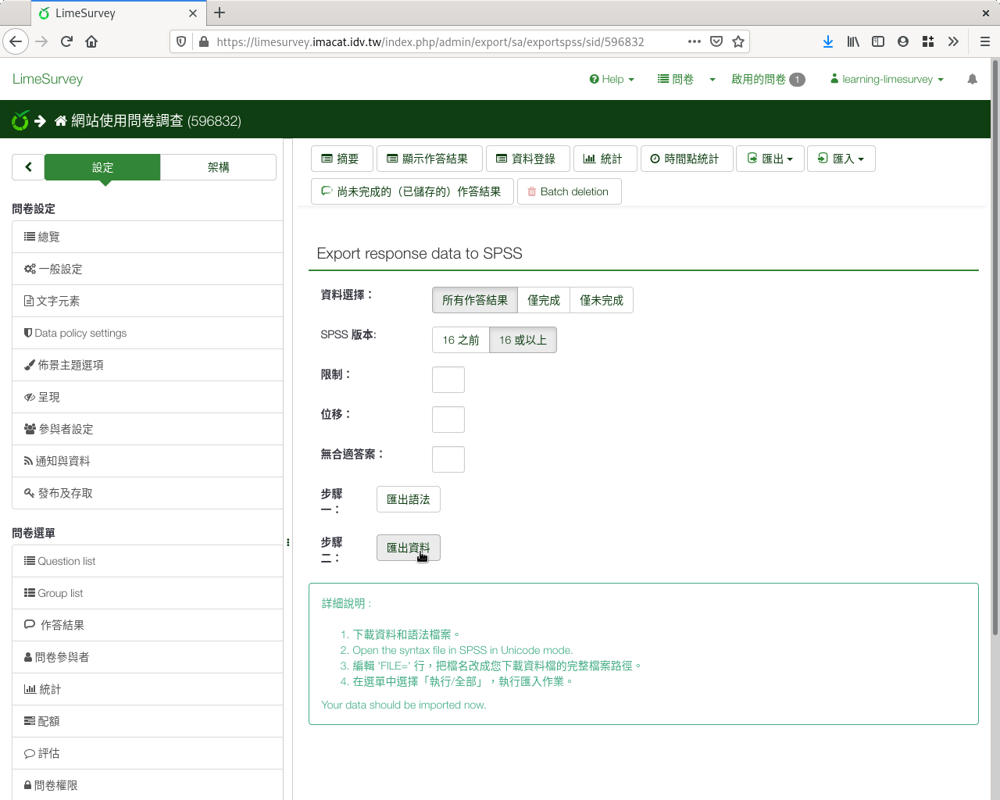

匯出填答結果
------------

問卷的填答結果，可以 :index:`匯出` 成檔案下載，供後續進階分析。

從問卷左側欄「設定」分頁下的「統計」進入，然後點選上方選單 「匯出」下的
「匯出作答結果」，即可匯出。。

    問卷左側欄「設定」分頁下的「統計」進入

    統計頁面上方選單「匯出」下的「匯出作答結果」

可以選R語法檔、R資料檔、STATA、CSV、Excel、PDF、HTML、PDF、Excel八種格式。
選定格式後，按右上角「匯出」即可匯出下載。

    選定匯出格式後匯出

    匯出後的CSV檔，以試算表軟體開啟

問卷資料亦可直接匯出成SPSS資料檔。

    回應與統計頁面選單上「匯出」下的「Export responses to SPSS」

    匯出SPSS格式資料檔
