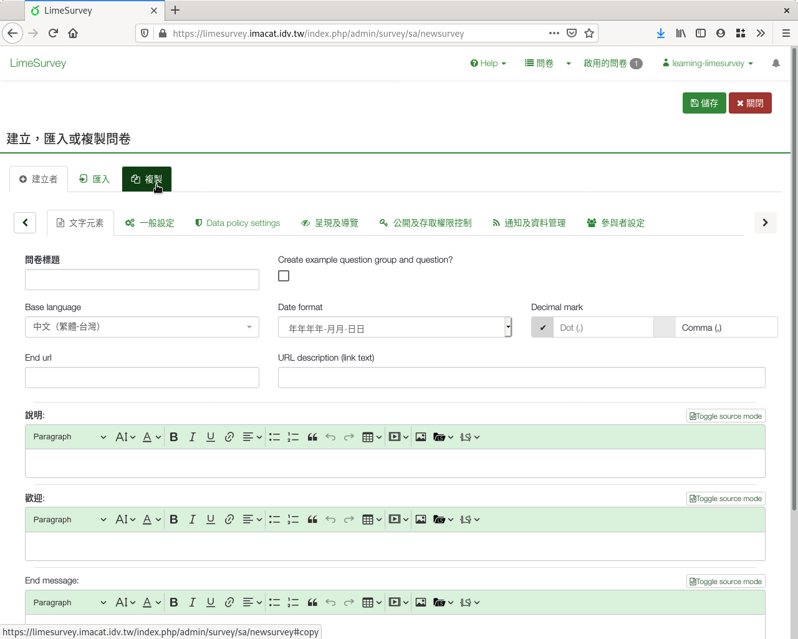
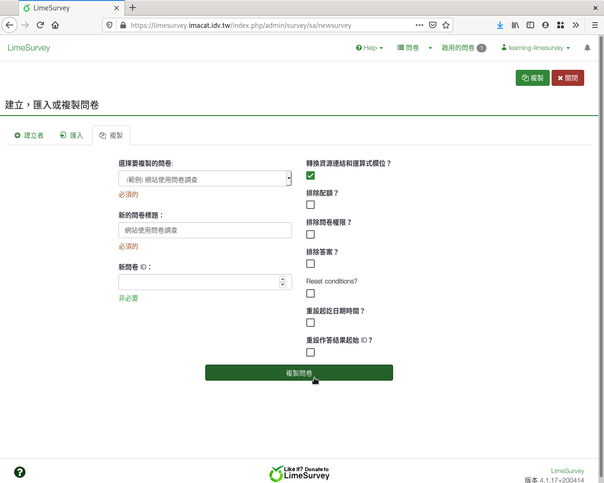

以現有問卷當範本複製問卷
========================

.. index:: 建立; 問卷從範本, 問卷; 從範本建立

若您已有一份現有的問卷，您可以用現有的問卷當範本，複製一份新問卷。

建立問卷時，點選上方的「複製」。

    建立問卷時點選「複製」

選擇想當成範本複製的問卷，填上新的問卷標題，按右上方「儲存」，即可複製
出一份新問卷。

    複製問卷的頁面
