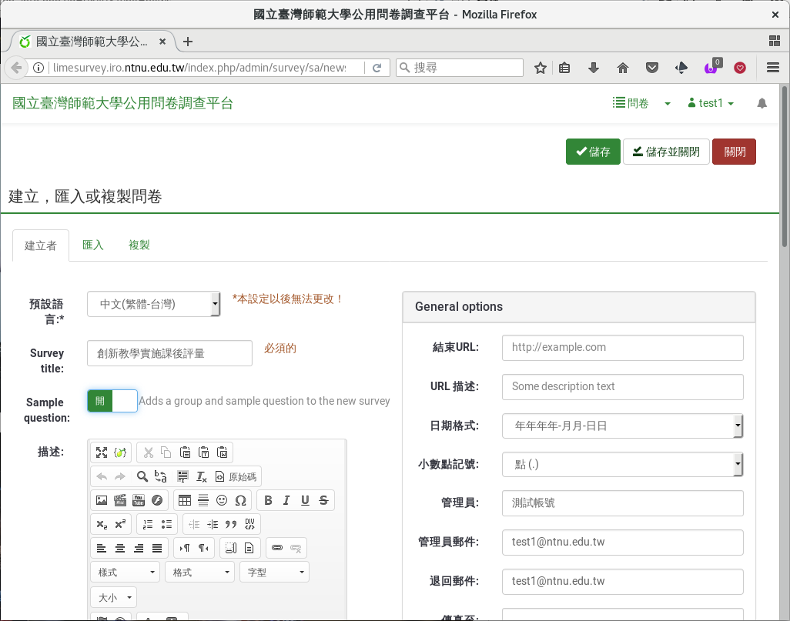
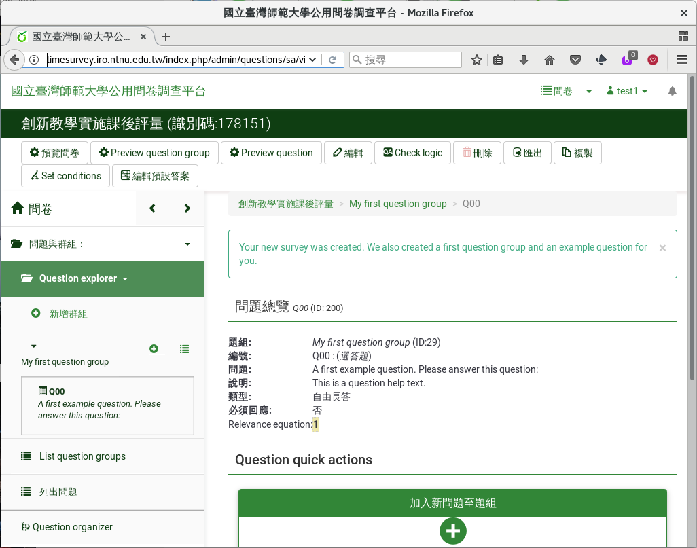

建立新問卷
----------

由登入後畫面「 :index:`建立一個新問卷 <pair: 問卷; 建立>` 」點進去後，
就進入建立問卷的畫面。

    建立問卷的畫面

在這裏我們填上問卷標題名稱（例如：「創新教學實施課後評量」），先點選
「Create example question group and question?」建立範例題，然後點按右
上角「儲存」。這樣就建好了一份簡單的問卷。

    建立好的新問卷

從左上角「 :index:`預覽問卷 <預覽; 問卷>` 」，可以看得到問卷長什麼樣
子。

.. figure:: images/03-01-new-survey-preview.png
    :alt: 新問卷的預覽
    :scale: 60%

    新問卷的預覽

可以看到現在問卷只有一題，就是剛才建立的範例題「A first example
question.  Please answer this question.」。問卷上方會以醒目提示「This
survey is currently not active. You will not be able to save your
responses.」，提醒你這只是預覽而已，答案不會存下來。
