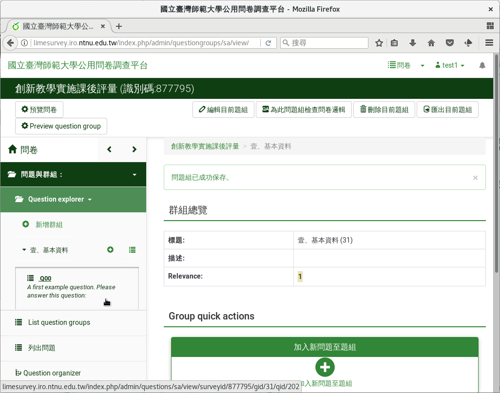
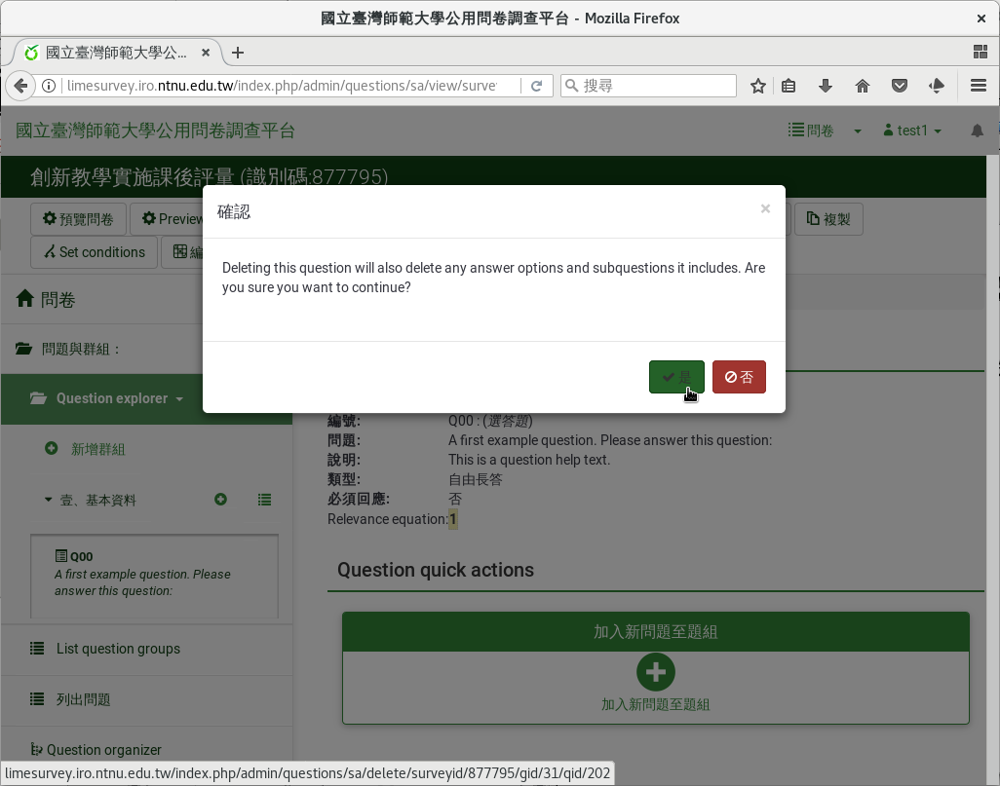

刪除範例問題
############

在建立自己的問題前，我們先 :index:`刪除範例問題 <pair: 問題; 刪除>` 。
在左側欄的問卷結構中，點選題組右邊向下三角形，展開這一組的問題。

    點選左側欄題組右邊向下三角形，展開題組的問題

點選要刪除的範例問題。

    點選要刪除的範例問題

在問題頁面上，點選上方的「刪除」刪除。

    在問題頁面上，點選上方的「刪除」刪除
