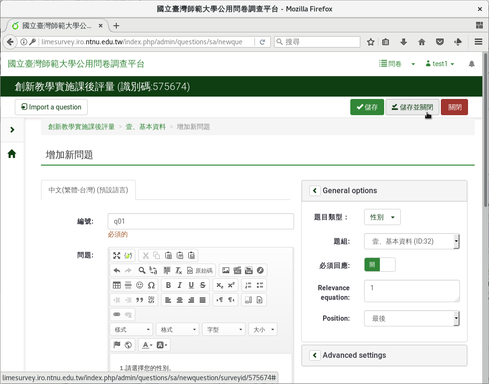
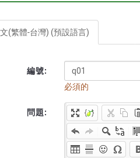
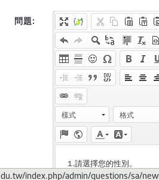
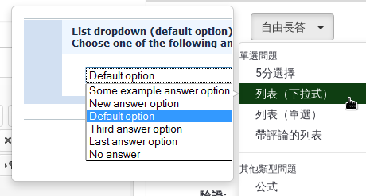
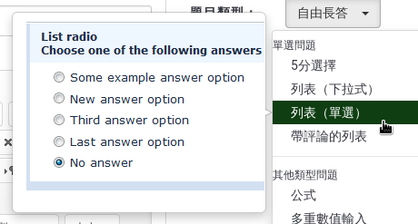
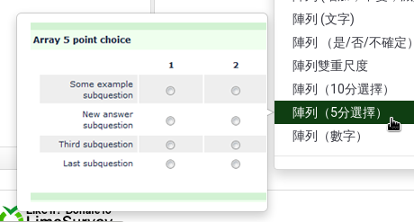
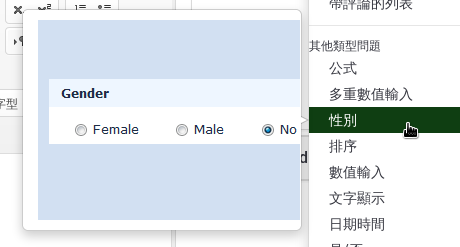
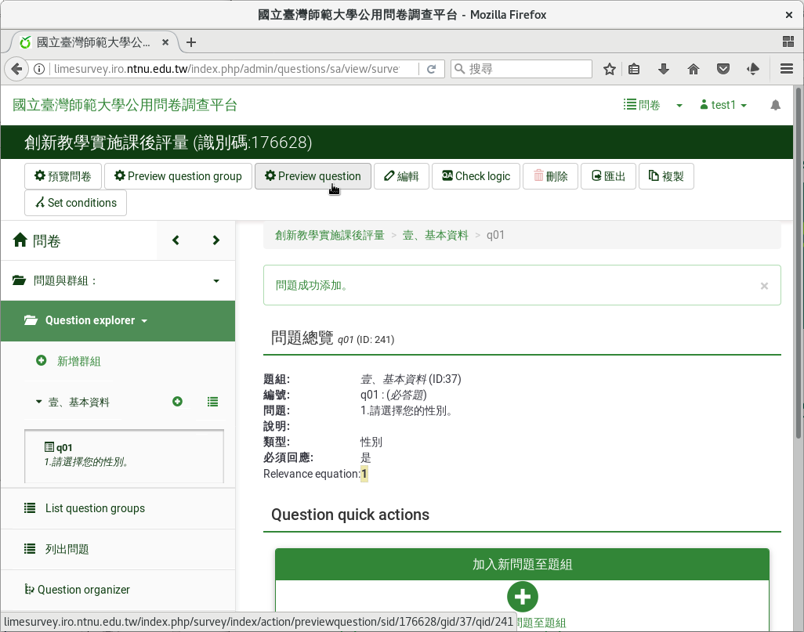

第一個問題：性別
################

從左邊點選「列出問題」後，從左上方的
「 :index:`增加新問題 <pair: 問題; 建立>` 」點進去，建立新問題，就會進
入問卷問題的編輯頁面。

.. figure:: images/03-02-03-gender-01.png
    :alt: 點選左邊的「列出問題」
    :scale: 60%

    點選左邊的「列出問題」

.. figure:: images/03-02-03-gender-02.png
    :alt: 點選左上方的「增加新問題」
    :scale: 60%

    點選左上方的「增加新問題」

    問卷問題編輯頁面

「編號」是題目的代號，須由A-Z英文字母開始，可以用A-Z英文字母或0-9數字
，不可重複。一般我們用q01代表第一題，q02代表第二題，依此類推。

    問題的編號

在「問題」欄位，填上實際的問卷題目。第一題我們先問填答者的性別，請填
上「1.請選擇您的性別。」。

    問題的內容

「題目類型」拉下來，會有各種題型可選擇。滑鼠移動到題型，還會有題型預
 覽。

    下拉式列表題型預覽

    單選題型預覽

    李克特氏五點量表題型預覽

這一題我們題型選「 :index:`性別 <題型; 性別>` 」。

    性別題型預覽

基本資料都是必答題，請點選開啟「必須回應」。按右上角「儲存並關閉」。

    問卷問題編輯頁面

建立好問題後，我們可以按上面的「Preview Question」，
:index:`預覽 <預覽; 問題>` 一下我們的問題長什麼樣子。

    點選「Preview Question」

.. figure:: images/03-02-03-gender-05.png
    :alt: 性別題型預覽
    :scale: 60%

    性別題型預覽
