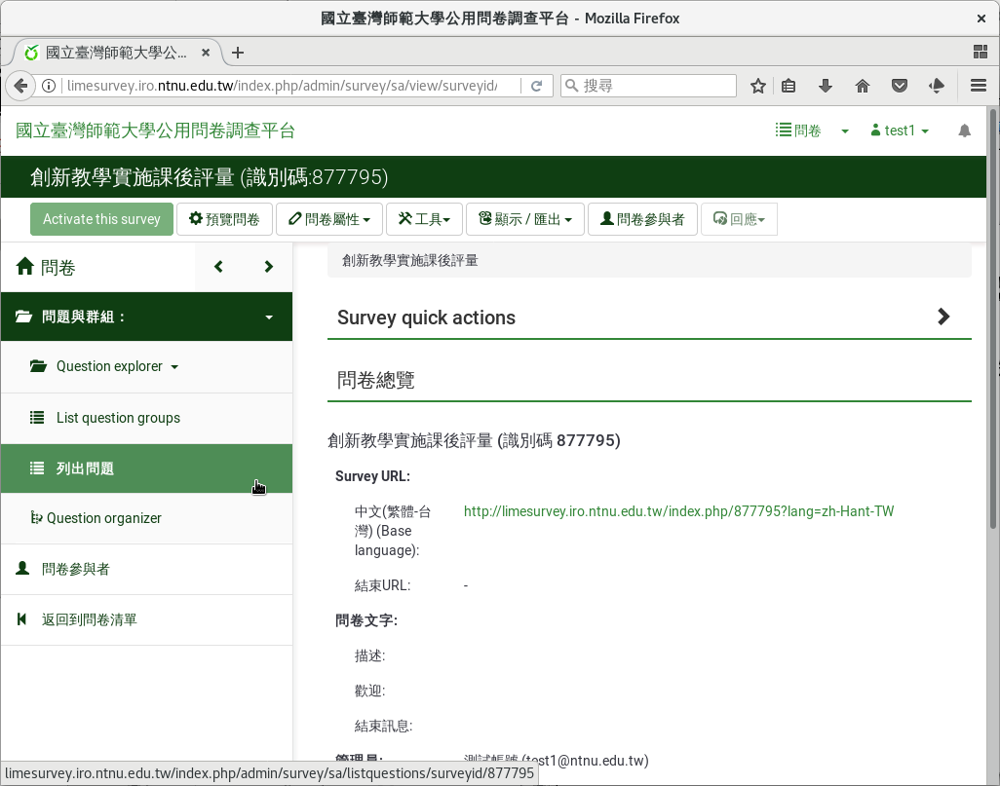
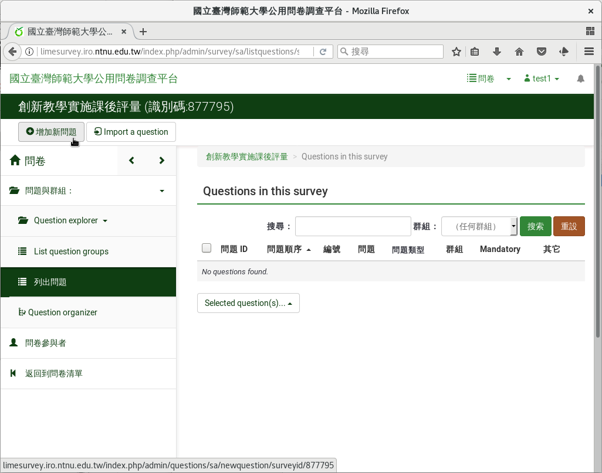
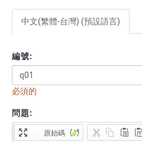
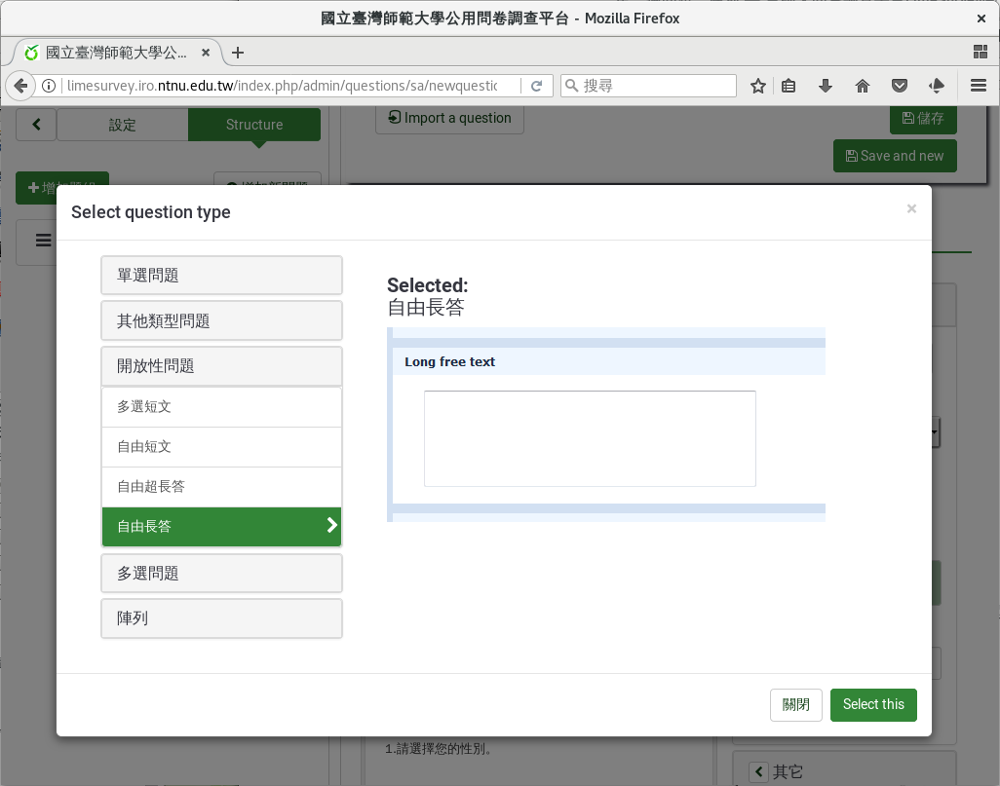
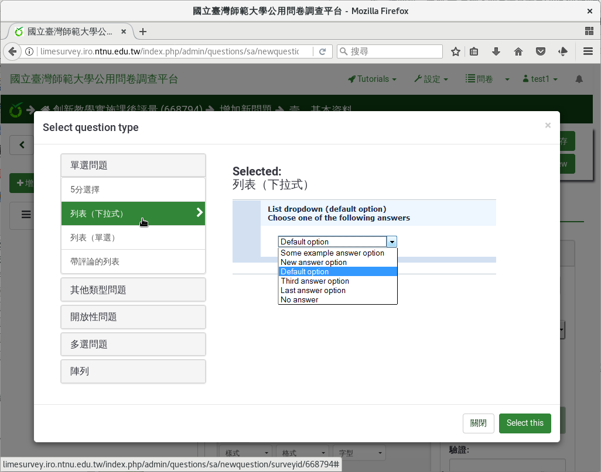
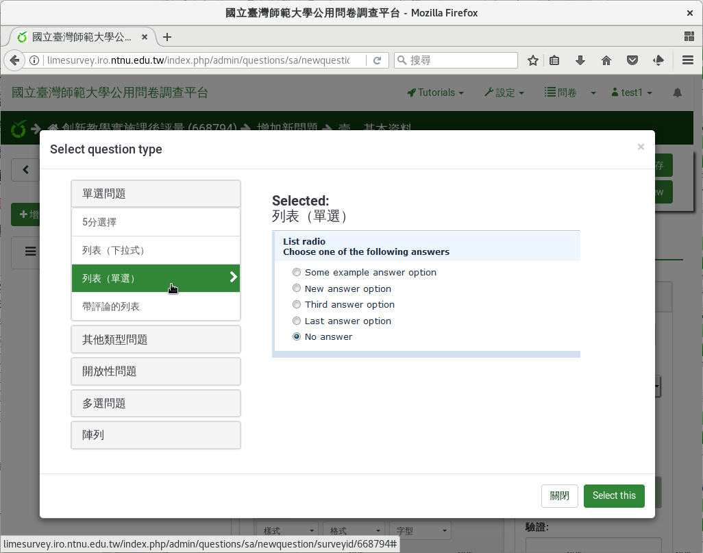
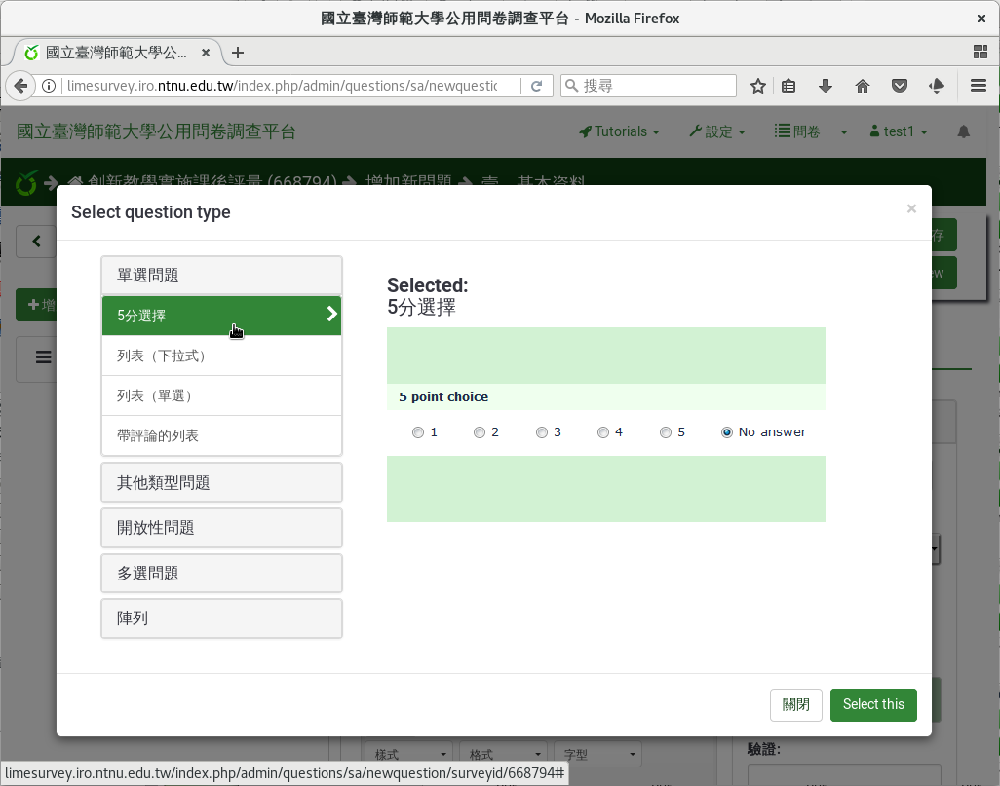
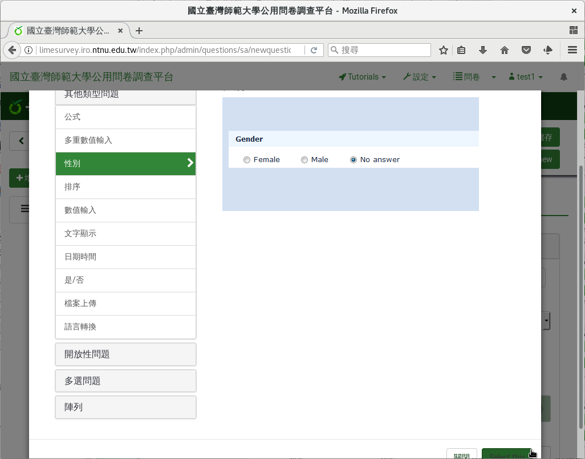

第一個問題：性別
################

在左側欄的問卷結構中，點選上方的
「 :index:`增加新問題 <pair: 問題; 建立>` 」，就會進入問題的編輯頁面。

    點選左側欄問卷結構上方的「增加新問題」

    問卷問題編輯頁面

「編號」是題目的代號，須由A-Z英文字母開始，可以用A-Z英文字母或0-9數字，
不可重複。我們用系統預設，就可以了。

    問題的編號

在「問題」欄位，填上實際的問卷題目。第一題我們先問參與者的性別，
請填上「1.請選擇您的性別。」。

.. figure:: images/03-02-03-gender-02-02.png
    :alt: 問題的主文
    :scale: 60%

    問題的主文

點按「題型」，會列出各種題型可選擇。點選題型，會有題型預覽。

    題型選擇

    下拉式列表題型

    單選題型

    李克特氏五點量表題型

這一題我們題型選「其他類型問題」裏的「 :index:`性別 <題型; 性別>` 」。
按右下方的「Select」確定題型。

    選擇性別題型

基本資料都是必答題，請點選開啟「必填」。按右上角「儲存」。

    問卷問題編輯頁面

建立好問題後，我們可以按上面的「Preview Question」，
:index:`預覽 <預覽; 問題>` 一下我們的問題長什麼樣子。

.. figure:: images/03-02-03-gender-03.png
    :alt: 點選「Preview Question」
    :scale: 48%

    點選「Preview Question」

.. figure:: images/03-02-03-gender-04.png
    :alt: 性別問題預覽
    :scale: 48%

    性別問題預覽
