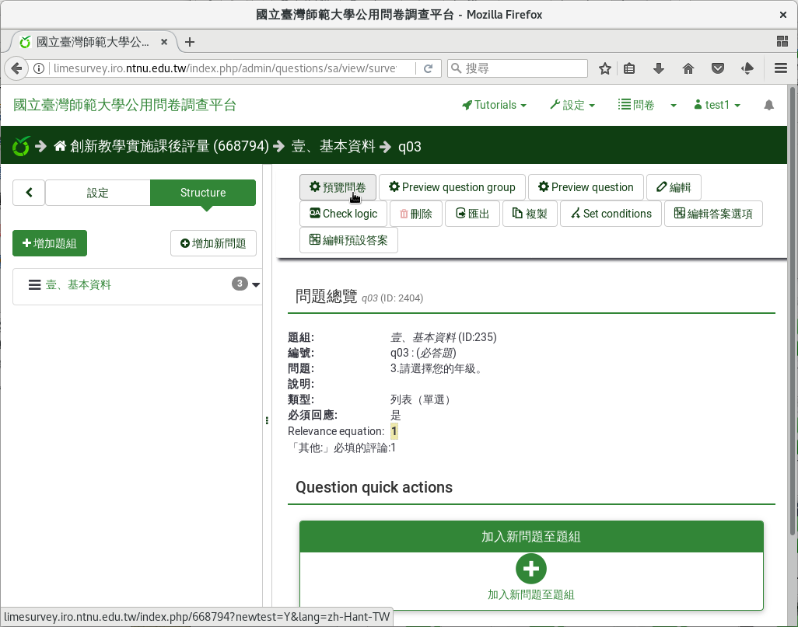
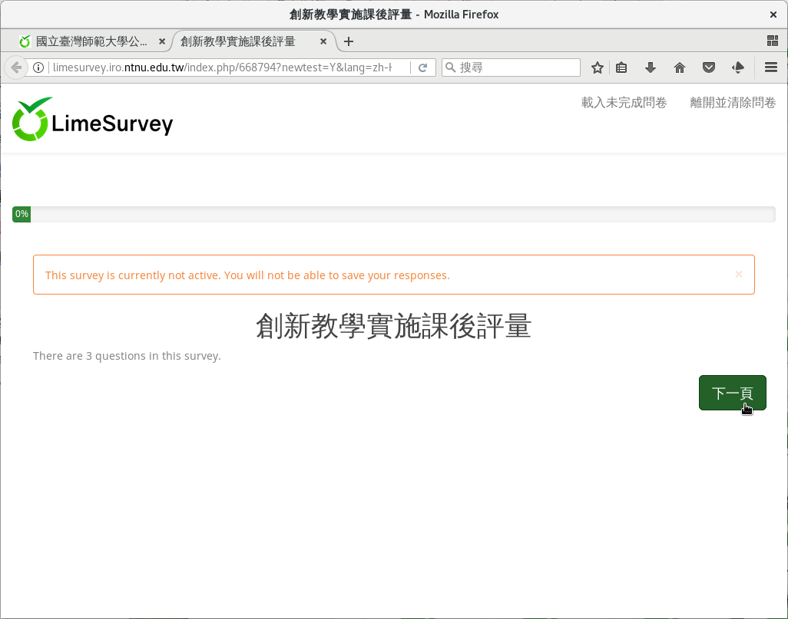
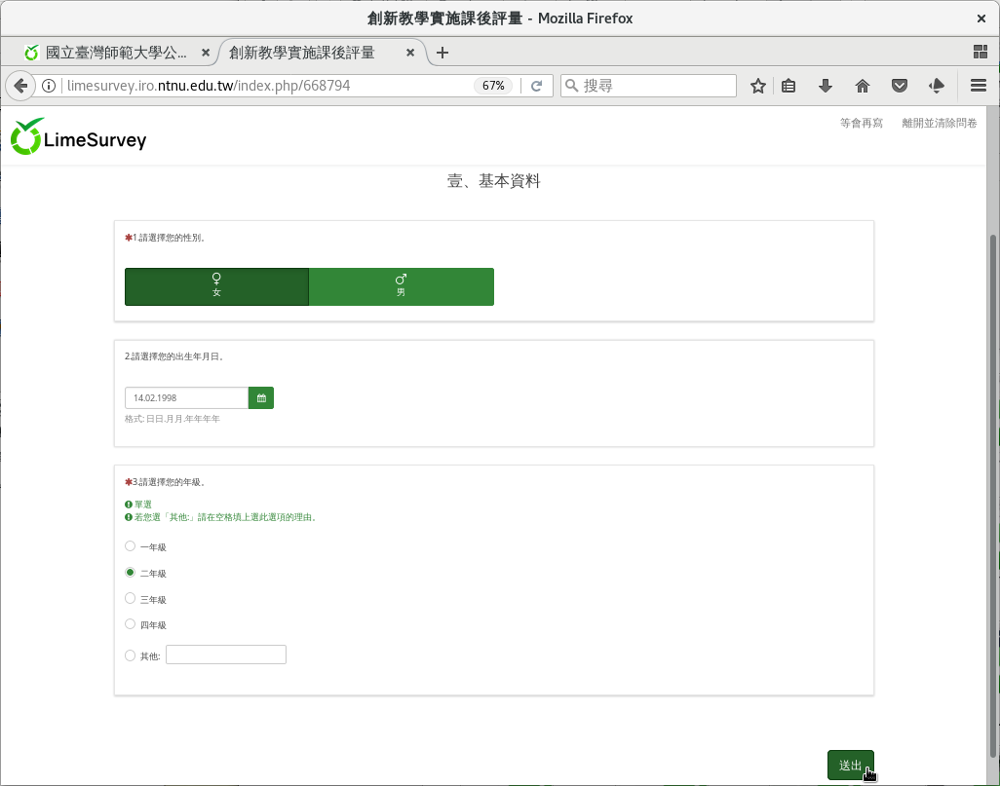
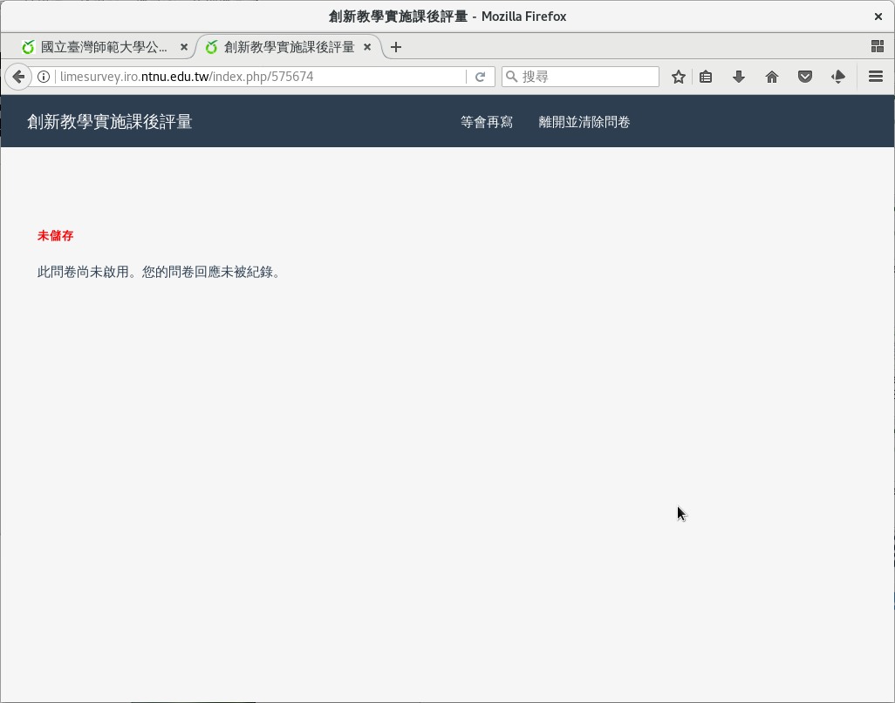

預覽問卷
########

到這裡我們完成了第一個題組「基本資料」，裡面有三題：性別、出生年月日和
年級。我們先預覽目前的成果。從上方按下
「 :index:`預覽問卷 <預覽; 問卷>` 」。

    點按預覽問卷

    問卷歡迎畫面

.. figure:: images/03-02-06-preview-03.png
    :alt: 問卷問題
    :scale: 60%

    問卷問題

性別、出生年月日和年級都是必答題，都要填答後才能送出。如果不是一到四年
級，還可以選擇「其他」，輸入自己的年級。答完後按「送出」。

    填寫問卷

因為是預覽，填答結果不會儲存下來。問卷正式啟用前一定要先預覽，檢查問卷
是不是正確，才可以啟用。

    預覽問卷填完不會儲存
