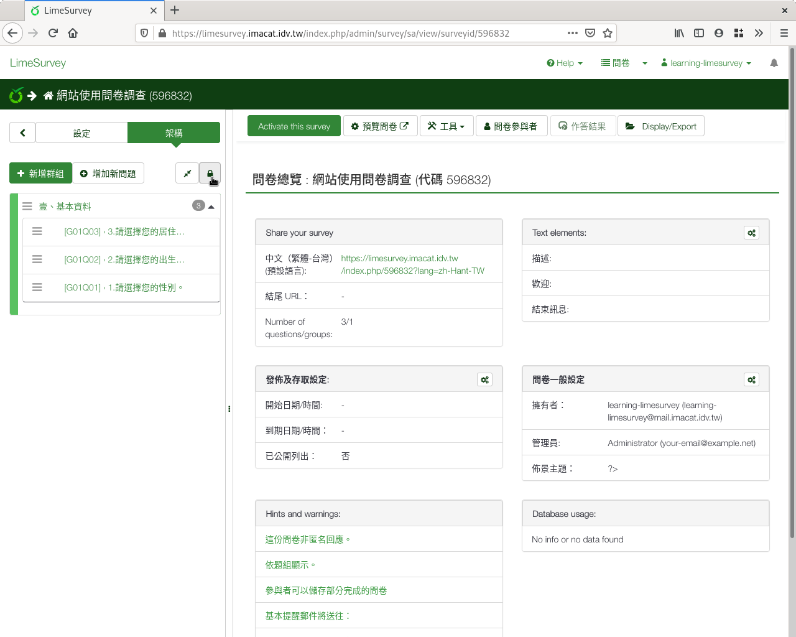
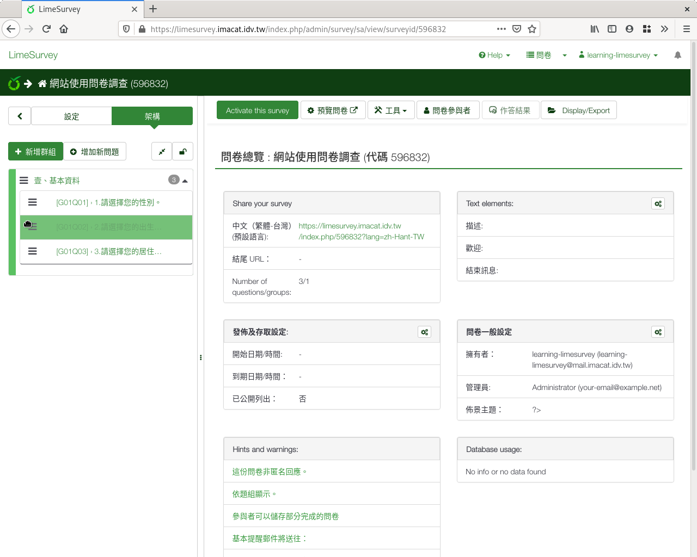
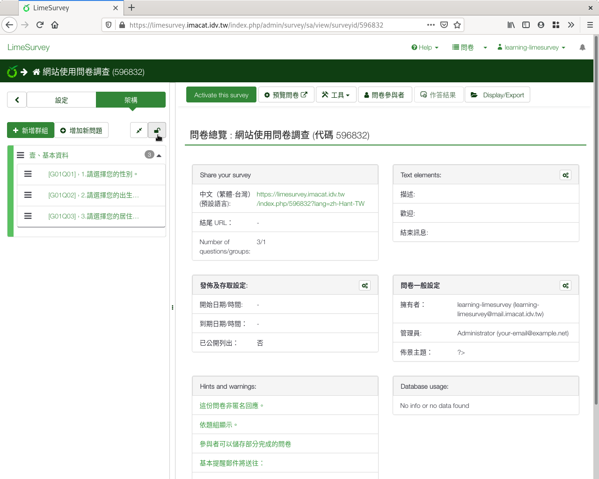

問題排序
########

到這裡我們完成了第一個題組「基本資料」，裡面有三題：性別、出生年月日和
居住地區。不過這三題的順序，好像亂掉了。我們需要重新
:index:`排序 <pair: 問題; 排序>` ，調整問題的順序。

問題左邊有一個三條線區域，是用來調整問題順序的排序按鈕。不過現在排序按鈕
都是灰色的，無法拖拉，因為問卷結構被鎖住了，避免不小心亂動。

先點選左欄的鎖頭按鈕，解鎖問卷結構調整。

    點按鎖頭按鈕，解鎖問卷結構調整

解鎖後，問題左邊的三條線排序按鈕變成黑色的，可以拖拉了。拖拉這些排序按鈕，
調整問題順序。

    拖拉問題左邊的三條線排序按鈕，調整問題順序

調整好順序後，再點選鎖頭按鈕，鎖住問卷結構，避免不小心亂動。

    再點選鎖頭按鈕，鎖住問卷結構

您也可以把問題從一個題組拉到另外一個題組，或拖拉調整題組順序。

調整順序後，系統會自動儲存，不用另外按儲存。
