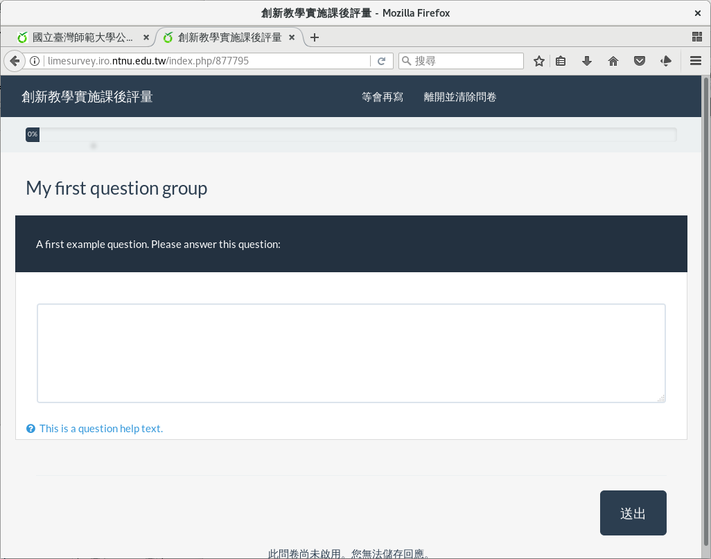

題組一：基本資料
----------------

問卷的問題，分屬各自的題組。通常題組像是：

- 壹、基本資料

    性別、年齡、縣市…等基本人口統計資料。

- 貳、學習滿意度
- 參、未來規劃
- 肆、…

    問卷要調查的目標問題。

新建的範例問卷，有一組範例題組：「My First Question Group」，內有一題
範例題：「A first example question. Please answer this question:」，答
題者可以自由填答。

.. figure:: images/03-01-new-survey-done.png
    :alt: 新問卷的範例題組與範例題
    :scale: 60%

    新問卷的範例題組與範例題

    新問卷的範例題組與範例題畫面

.. toctree::

    03-02-01-edit-group.rst
    03-02-02-del-question.rst
    03-02-03-gender.rst
    03-02-04-date.rst
    03-02-05-single.rst
    03-02-06-preview.rst
    03-02-07-review.rst
