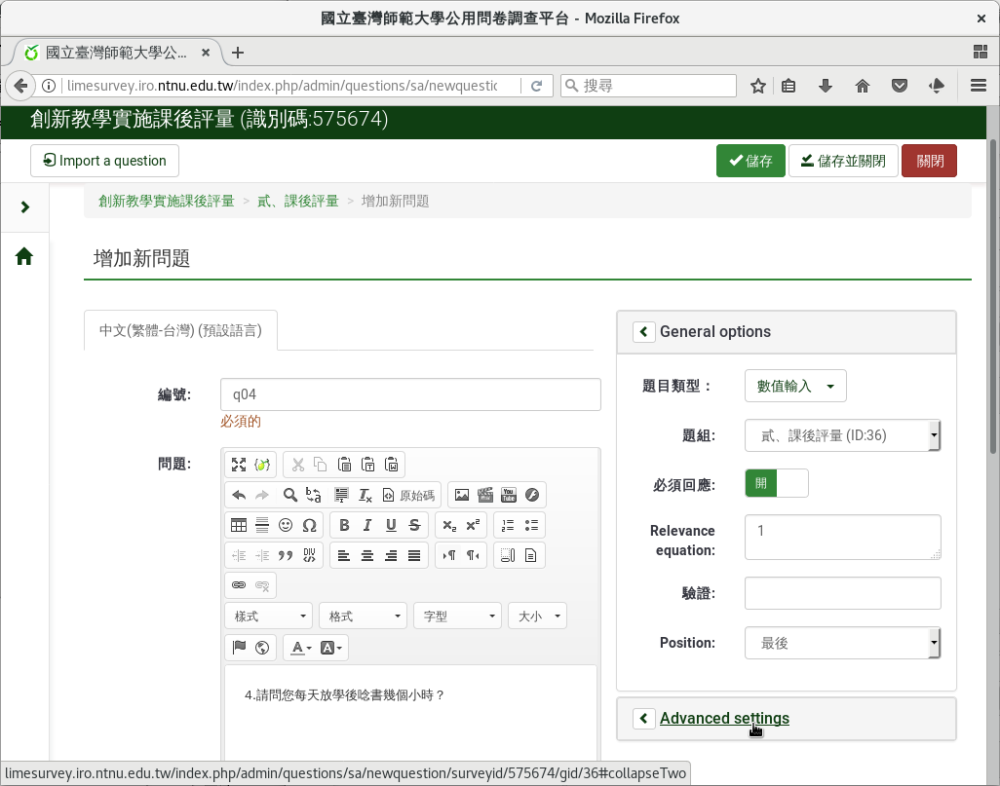
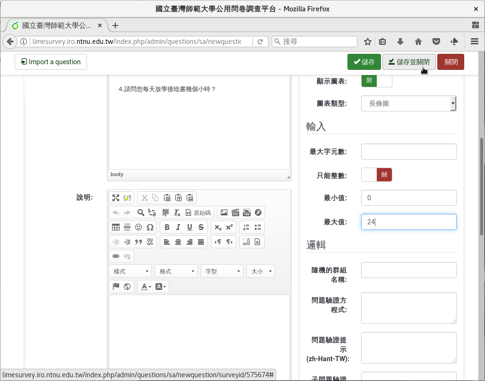
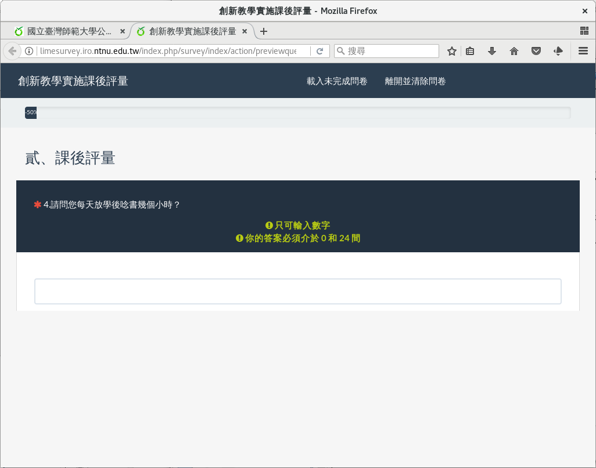
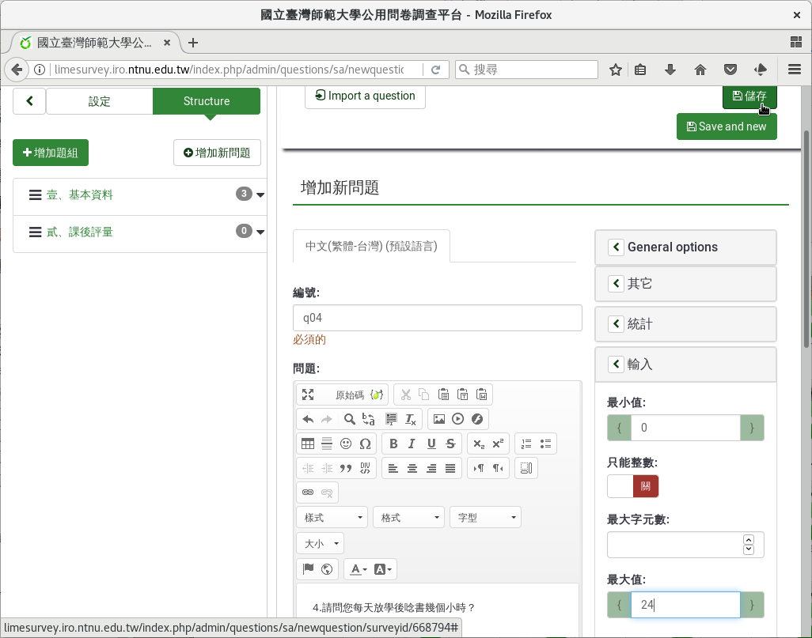

第四個問題：數值
################

接下來我們要問參與者每天上網多久。

:index:`數值 <題型; 數值>` 是另一種常見的題型，用在
:index:`連續變數 <變數; 連續>` 上。

上網時間最少0小時（沒上網），最多扣掉睡覺時間，只會有十幾個小時。
為方便起見，我們當作最多24小時。

我們也可以用0–24共25個選項的單選欄位。不過有人會有3.5、2.25小時等等非
整數，所以我們還是使用數值欄位。

在新增問卷問題的編輯頁面上，問題填上
「4.請問您每天上網幾個小時？」題型選擇「其他類型問題」裏的
「數值輸入」，題組選「貳、使用調查」，開啟「必填」。

    問題四：數值題目

    選擇數值題型

往下拉找到「Input」展開。每天最多24小時，最少0小時，為免填錯，可以限制
輸入值的範圍。請在Minimum value填上0，Maximum value填上24。
因為可能會有3.5小時，不開啟「Integer only」。

    展開「Input」設定

    限制數值填答範圍

拉回網頁最上方，按右上角「儲存」。

.. figure:: images/03-03-01-number-05.png
    :alt: 數值題目預覽
    :scale: 48%

    數值題目預覽
