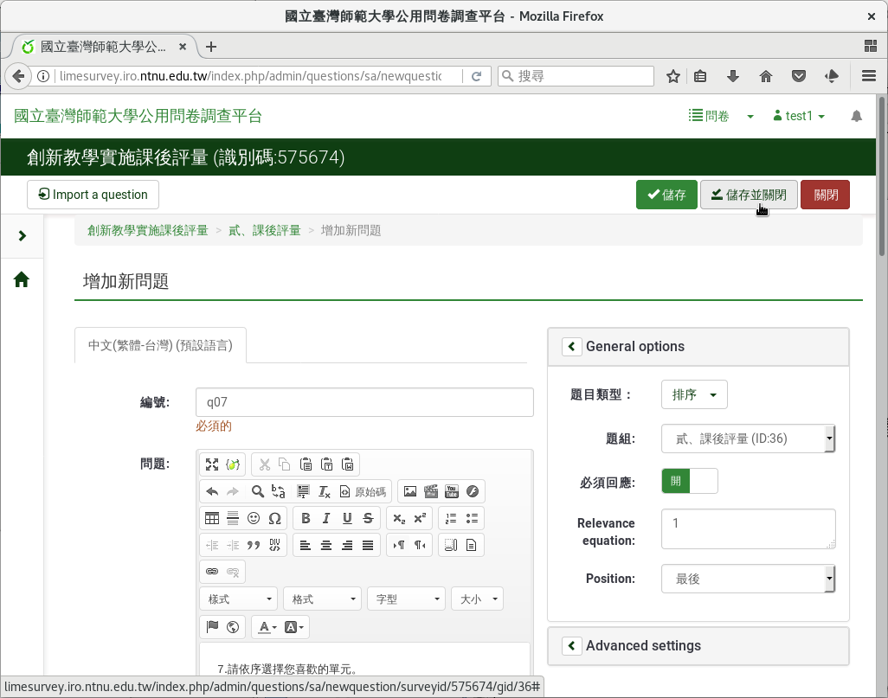
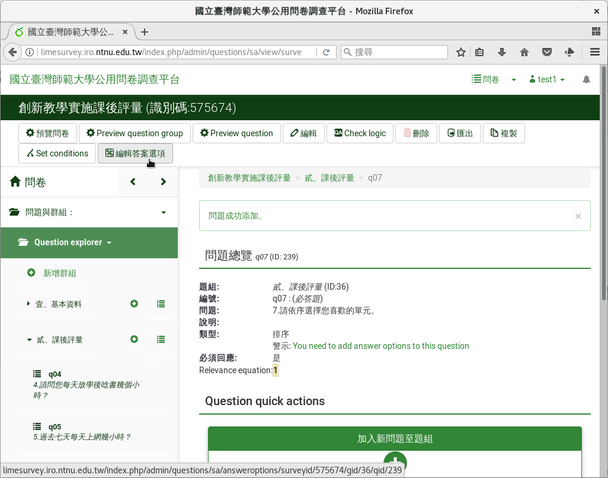
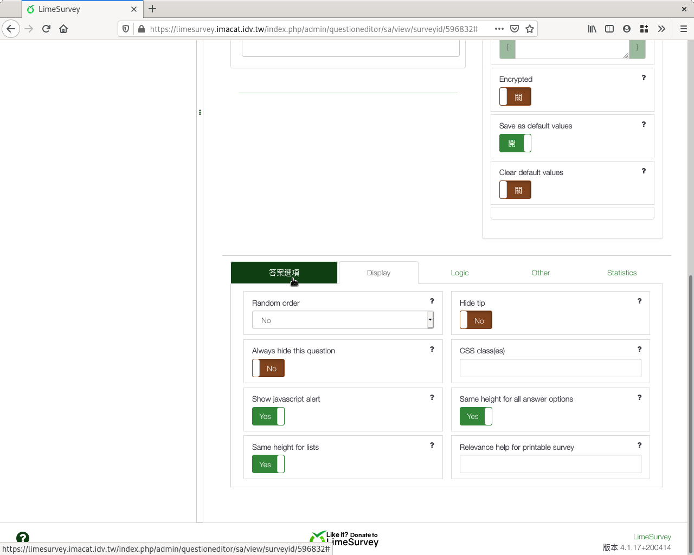
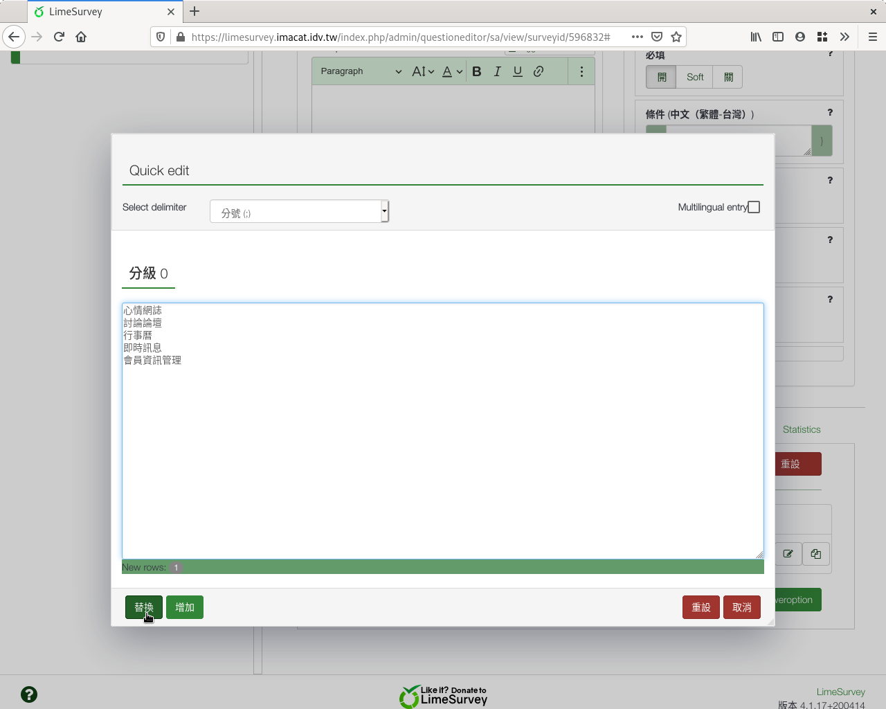
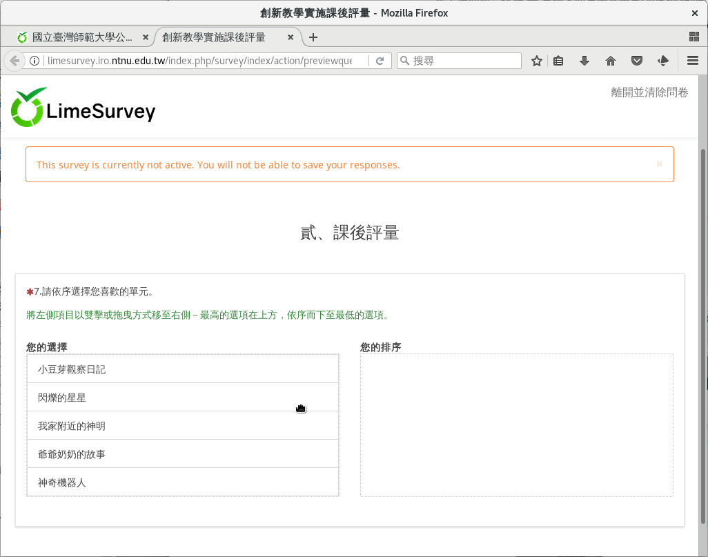
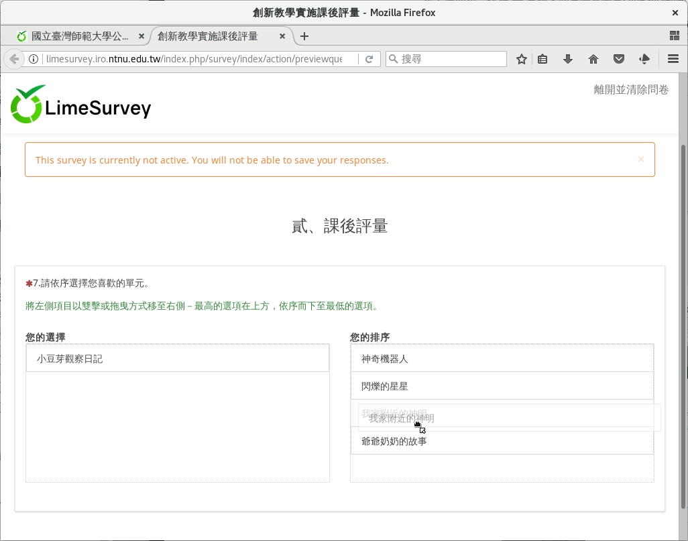

第七個問題：排序
################

我們想知道使用者對網站功能的喜好順序。

:index:`排序欄位 <題型; 排序>` 有很多種用途，可以用來詢問態度喜好的順
序，也可用在社會網路分析中，詢問人際親疏的順序。

在新增問卷問題的編輯頁面上，問題填上「7.請依序選擇您喜歡的功能。」
題型選擇「其他類型問題」裏的「排序」，題組選「貳、使用調查」，開啟「必填」。

    問題七：排序題目

    選擇排序題型

往下拉找到「答案選項」展開，輸入各個功能：

    建好排序題型後，輸入排序項目

加上下列功能::

    心情網誌
    討論論壇
    行事曆
    即時訊息
    會員資訊管理

    輸入所有排序項目

拉回網頁最上方，按右上角「儲存」。

    排序題目預覽

左邊是現有的項目，右邊是排序的結果。依偏好順序，用滑鼠在左邊的項目點兩下，
或用滑鼠拖拉到右邊，就可以加到右邊的排序結果中。也可以用滑鼠拖拉，
調整各個項目的順序。

    用滑鼠拖拉調整順序
