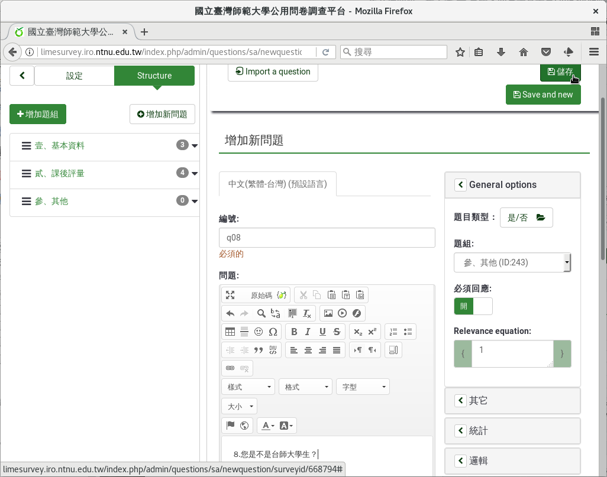
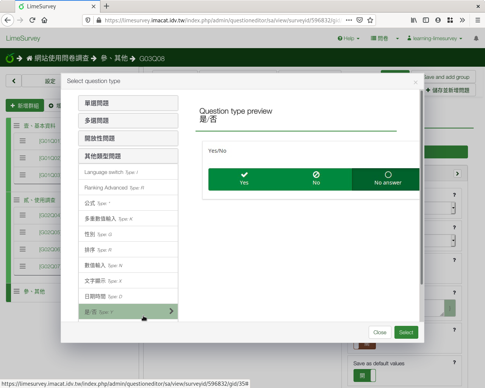
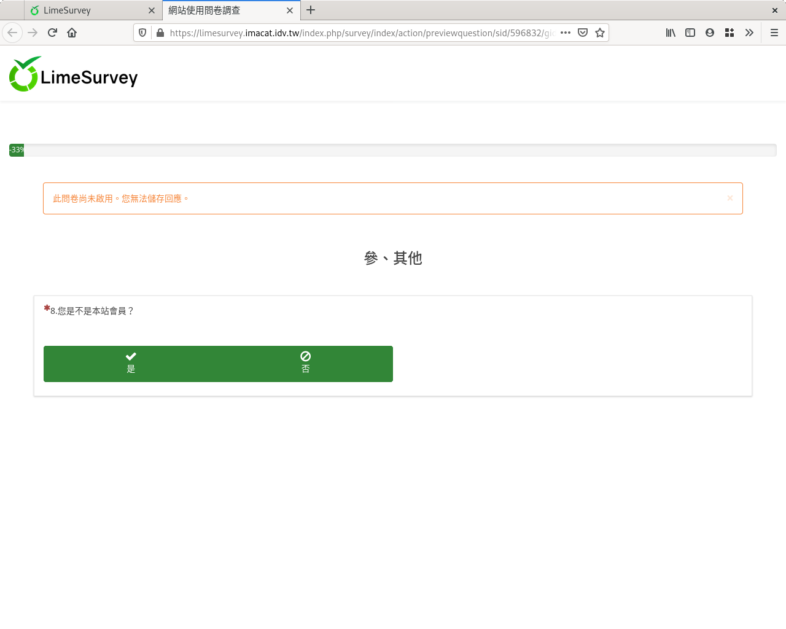

第八個問題：是／否
##################

第八個問題，要詢問答題者是否是本站會員。我們會用到
:index:`「是／否」題型 <題型; 是／否>`。

在新增問卷問題的編輯頁面上，問題填上「8.您是不是本站會員？」
題型選擇「其他類型問題」裏的「是／否」，題組選「參、其他」，開啟「必填」，
然後按「儲存」。

    問題八：是否題目

    選擇是否題型

    是否題目預覽
