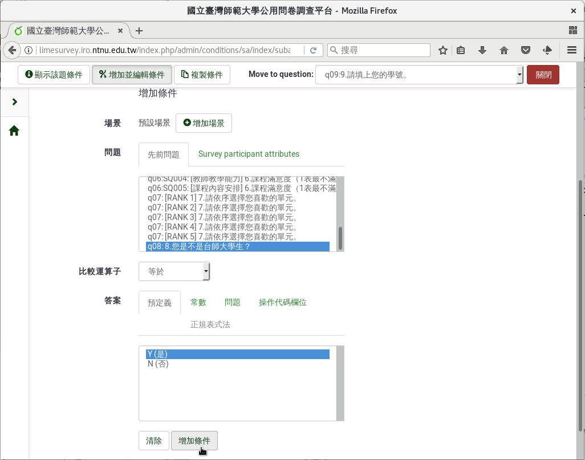

第九個問題：會員的帳號
########################

如果是本站的會員，請填上會員帳號。

在新增問卷問題的編輯頁面上，問題填上「9.請填上您的會員帳號。」
題型選擇「開放性問題」裏的「 :index:`自由短文 <題型; 單行文字>` 」，
題組選「參、其他」，開啟「必填」，然後按「儲存」。

.. figure:: images/03-04-02-id-01.png
    :alt: 問題九：會員的帳號
    :scale: 48%

    問題九：會員的帳號

.. figure:: images/03-04-02-id-02.png
    :alt: 選擇自由短文題型
    :scale: 48%

    選擇自由短文題型

點選右上方「Question Overview」回到問題瀏覽。 

    按右上方「Question Overview」回到問題瀏覽

從上方選單點選「Condition designer」設定問題的條件。

    按上方「Condition designer」設定問題條件。

條件設定器的頁面，下方「問題」處往下拉，找到剛剛的第八題
「8.您是不是本站會員？」，答案選「Y(是)」，然後按下「增加條件」。

（如果找不到剛剛的第八題，可能是您第九題和第八題的前後順序反了，
或是第九題存到前面的題組去了。請參閱 :doc:`03-02-06-sort` 的說明，
調整問題的位置和順序。）

    加上問題的條件

剛剛設的條件就加上去了：

    8.您是不是本站會員？ 等於 是(Y)

    設好的問題條件

回到問題的頁面，可以看到問題的條件已經設為：

    ((G03Q08.NAOK == \\"Y\\"))

（問題編號會依個人操作而異，範例中第八題的問題編號是G03Q08。）

    問題的條件
