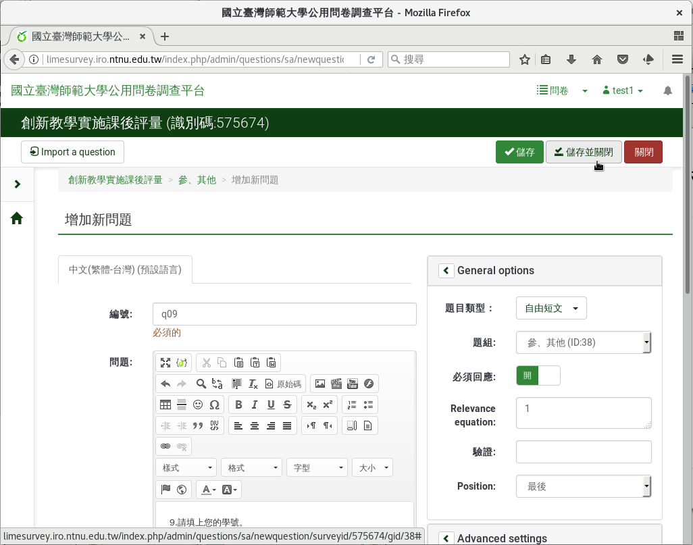
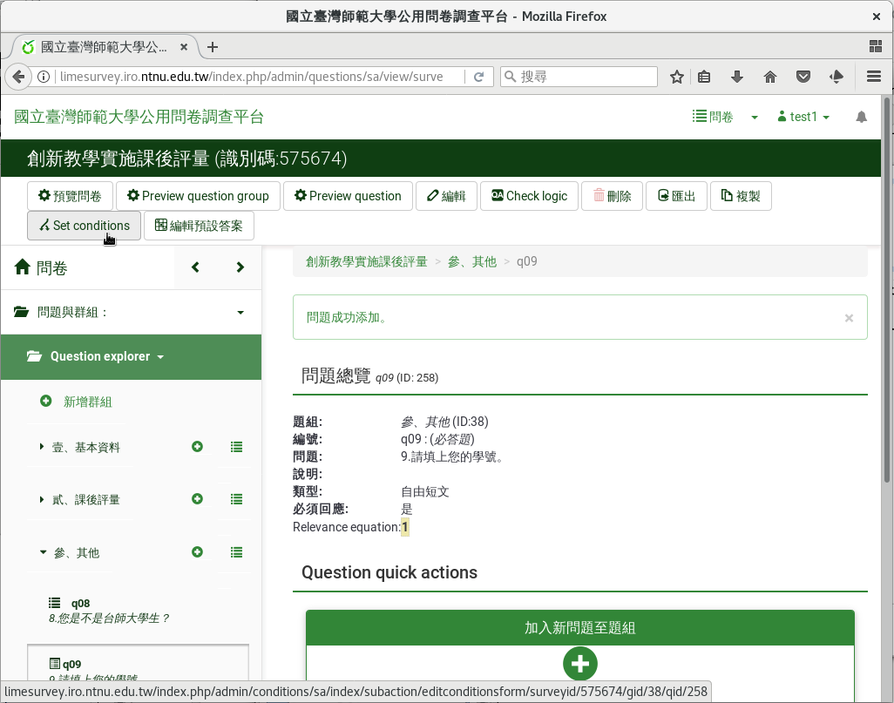

第九個問題：本校生的學號
########################

如果是台師大的學生，請同學填上學號。

在新增問卷問題的編輯頁面上，編號填上「q09」，問題填上
「9.請填上您的學號。」題型往下拉選
「 :index:`自由短文 <題型; 單行文字>` 」，題組選「參、其他」，開啟
「必須回應」，然後按「儲存並關閉」。

    問題九：本校生的學號

按上方「Set conditions」設定問題的條件。

    按上方「Set conditions」設定問題條件。

接著往下拉到頁面下方「增加條件」的地方，問題選剛剛的第八題
「q08: 8.您是不是台師大學生？」答案選「Y(是)」，然後按下「增加條件」。

.. figure:: images/03-04-02-id-03.png
    :alt: 加上問題的條件
    :scale: 60%

    加上問題的條件

回到頁面上方，剛剛設的條件已經加上去了：

    q08: 8.您是不是台師大學生 等於 是(Y)

我們按上方的「關閉」。

.. figure:: images/03-04-02-id-04.png
    :alt: 設好的問題條件
    :scale: 60%

    設好的問題條件

回到問題的頁面，可以看到問題的「Relevance equation:」已經設為：

    ((q08.NAOK == "Y"))

問題的條件設定好了。

.. figure:: images/03-04-02-id-05.png
    :alt: 問題的條件
    :scale: 60%

    問題的條件
