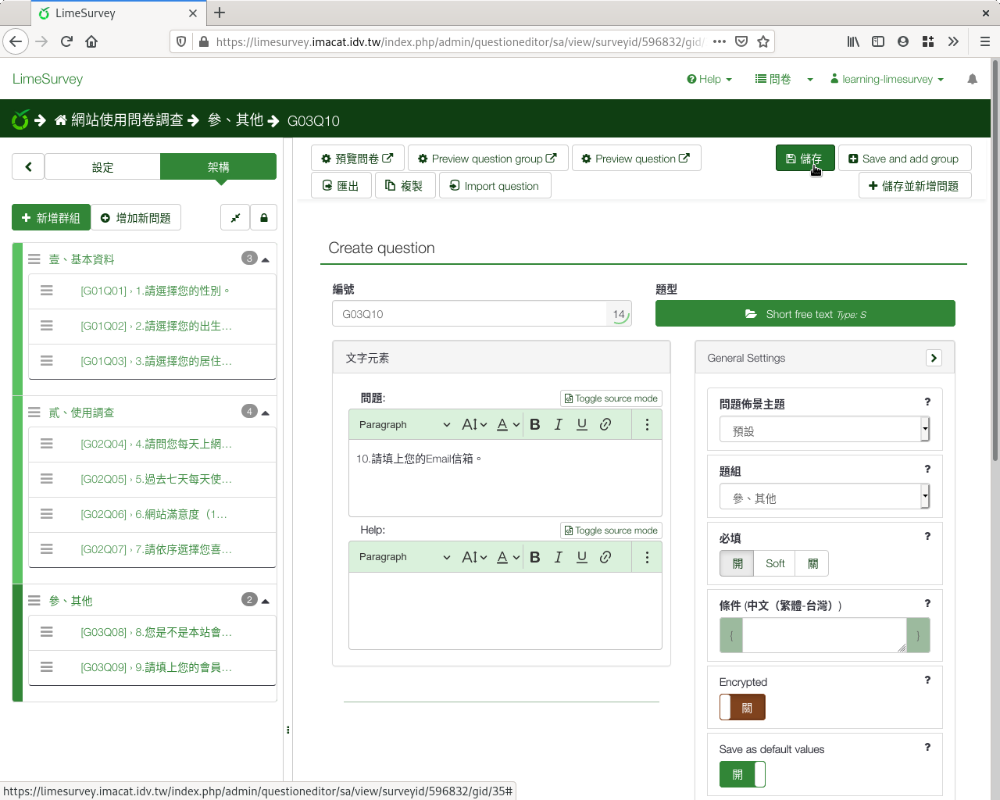
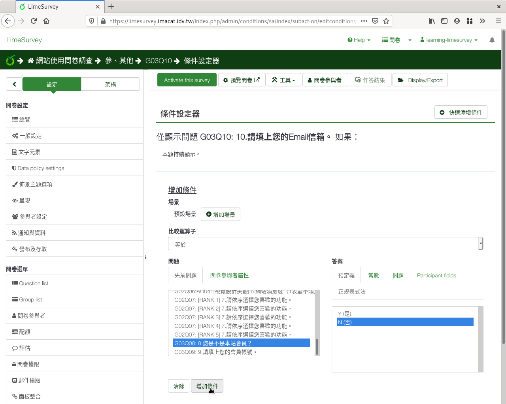
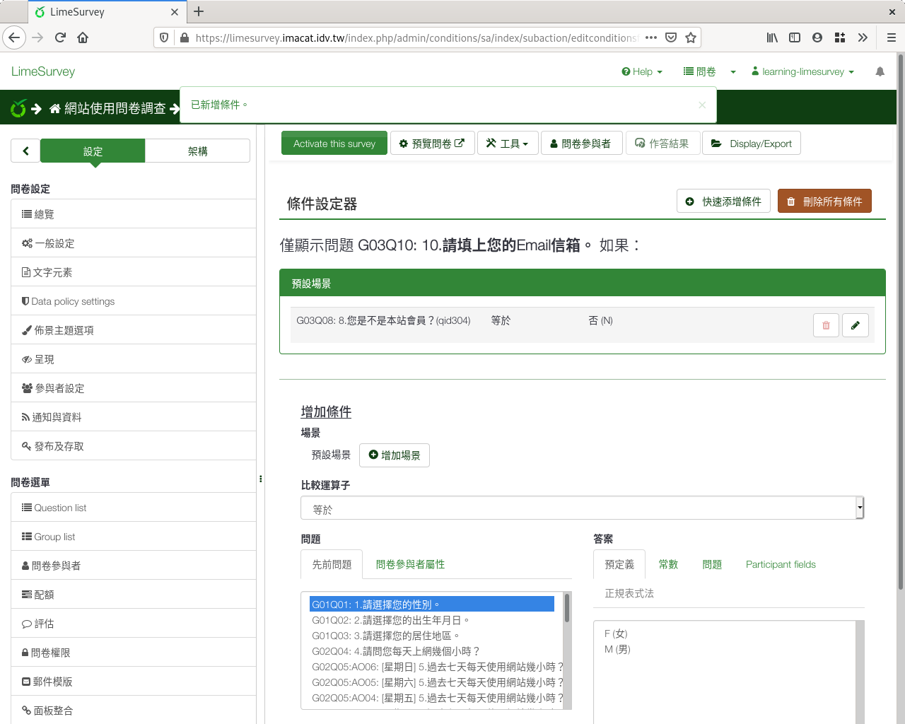
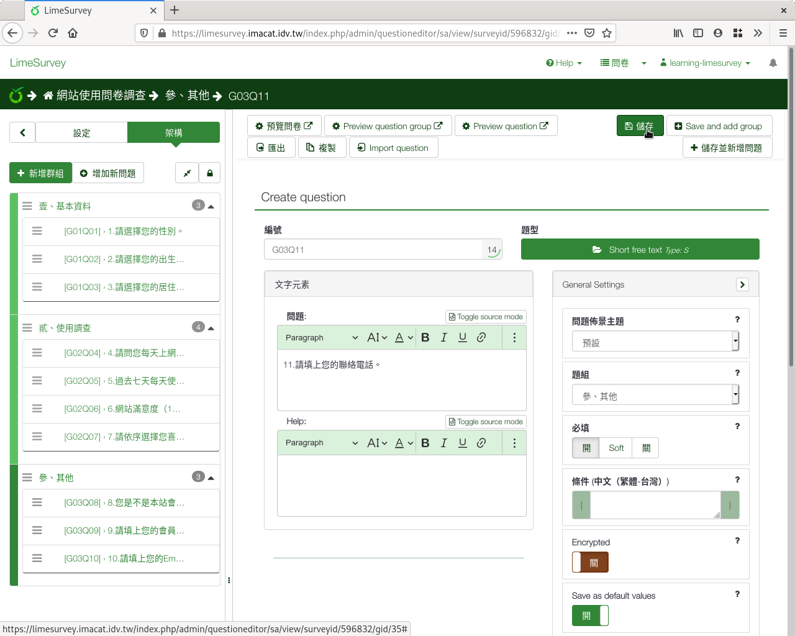
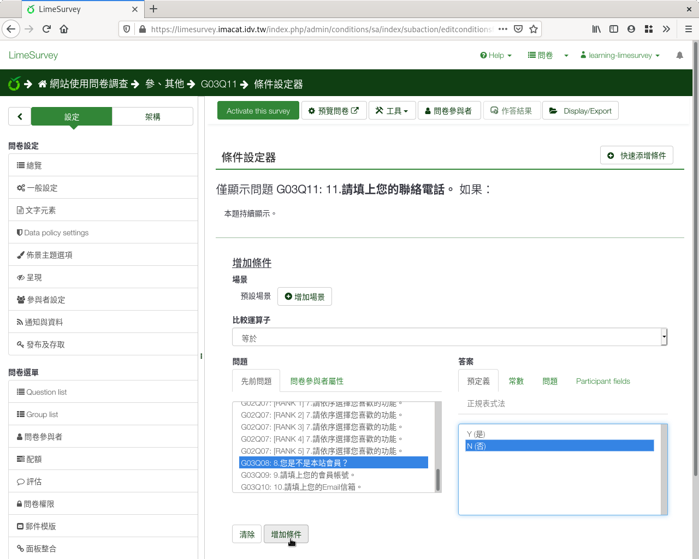

第十、十一個問題：非會員的Email和聯絡電話
#########################################

如果不是會員，請填上Email和聯絡電話。

在新增問卷問題的編輯頁面上，問題填上「10.請填上您的Email信箱。」
題型選擇「開放性問題」裏的「 :index:`自由短文 <題型; 單行文字>` 」，
題組選「參、其他」，開啟「必填」，然後按「儲存」。

    問題十：非會員的Email信箱

接著按上方「Condition designer」設定問題的條件。在條件設定器的頁面上，
下方「問題」處往下拉，找到剛剛的第八題「8.您是不是本站會員？」，
答案選「N(否)」，然後按下「增加條件」。

（如果找不到剛剛的第八題，可能是您第十題和第八題的前後順序反了，
或是第十題存到前面的題組去了。請參閱 :doc:`03-02-06-sort` 的說明，
調整問題的位置和順序。）

    加上非會員Email信箱問題的條件

剛剛設的條件就加上去了：

    8.您是不是本站會員？ 等於 否(N)

    設好的非會員Email信箱問題條件

再一次，在新增問卷問題的編輯頁面上，問題填上「11.請填上您的聯絡電話。」
題型選擇「開放性問題」裏的「 :index:`自由短文 <題型; 單行文字>` 」，
題組選「參、其他」，開啟「必填」，然後按「儲存」。

    問題十一：非會員的聯絡電話

接著按上方「Condition designer」設定問題的條件。在條件設定器的頁面上，
下方「問題」處往下拉，找到剛剛的第八題「8.您是不是本站會員？」，
答案選「N(否)」，然後按下「增加條件」。

（如果找不到剛剛的第八題，可能是您第十一題和第八題的前後順序反了，
或是第十一題存到前面的題組去了。請參閱 :doc:`03-02-06-sort` 的說明，
調整問題的位置和順序。）

    加上非會員聯絡電話問題的條件

剛剛設的條件就加上去了：

    8.您是不是本站會員？ 等於 否(N)

    設好的非會員聯絡電話問題條件
