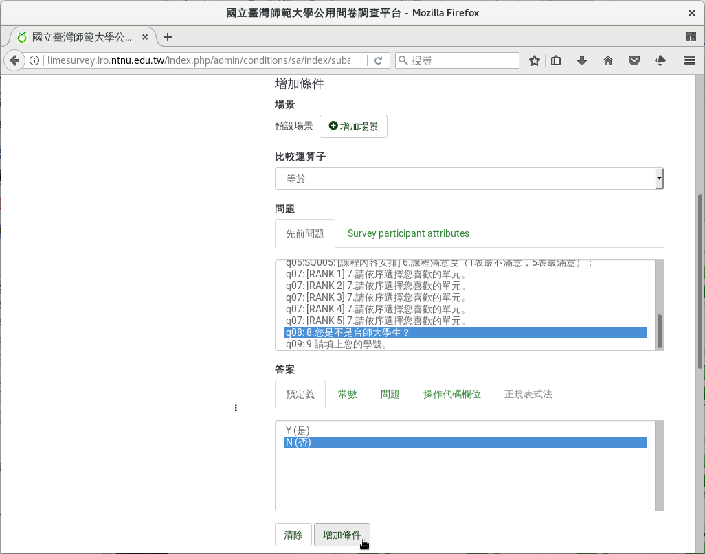
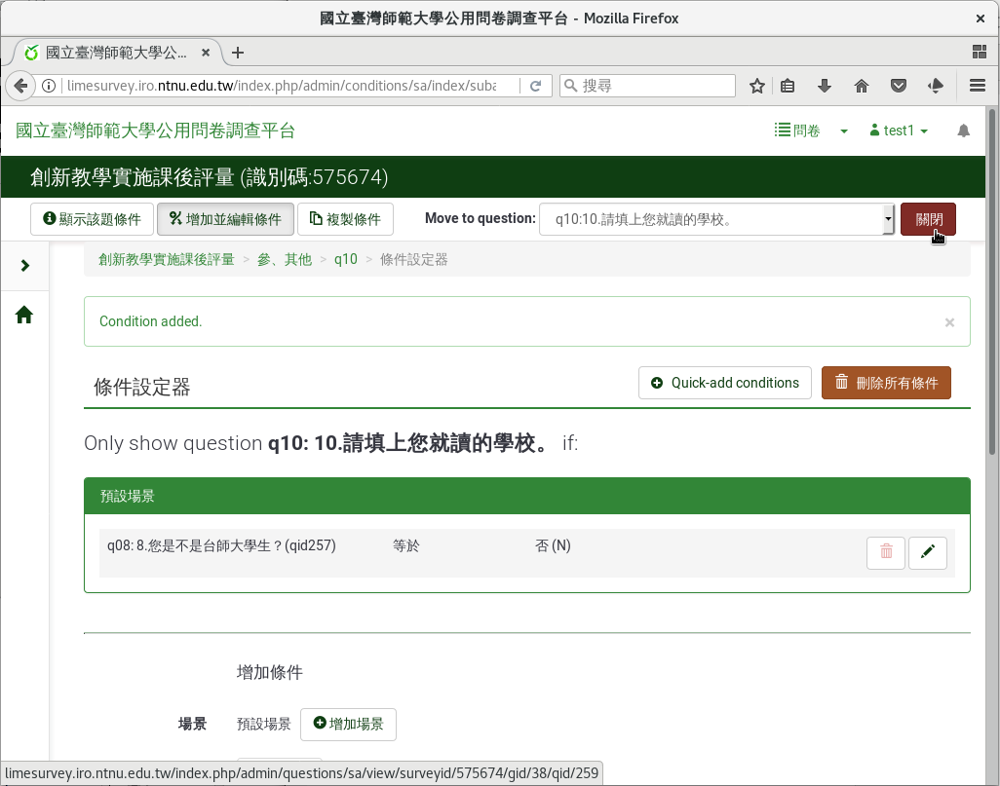
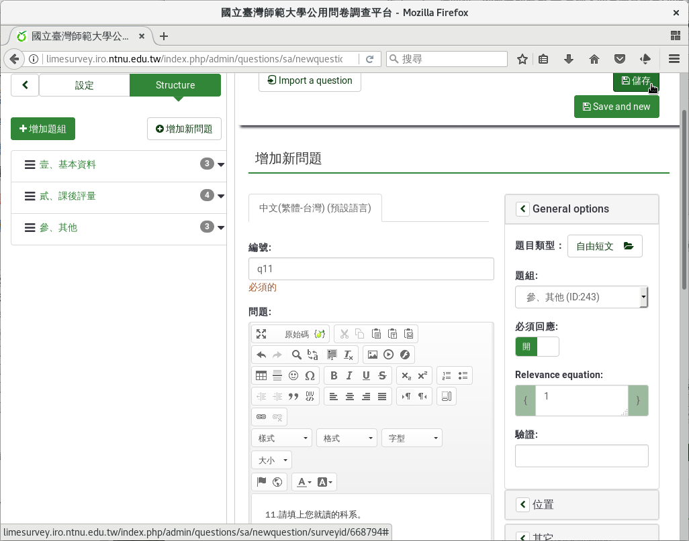
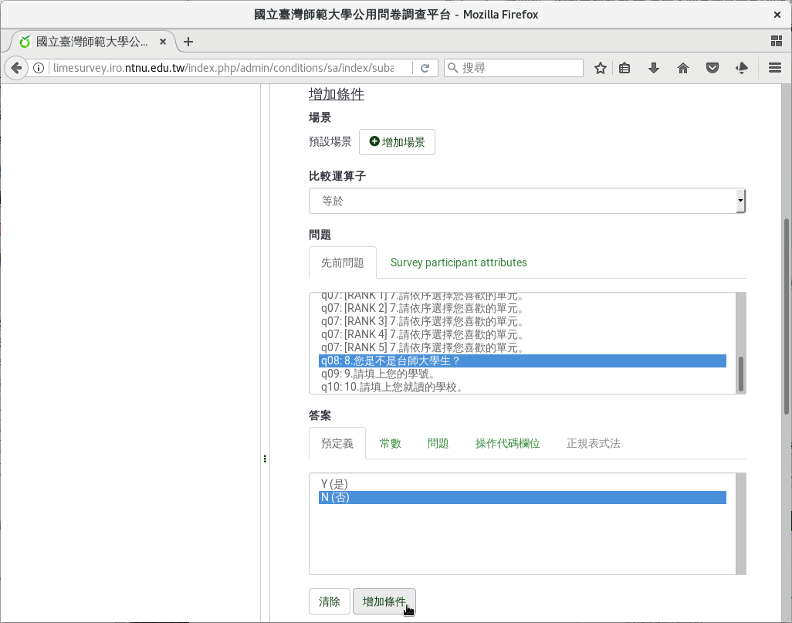
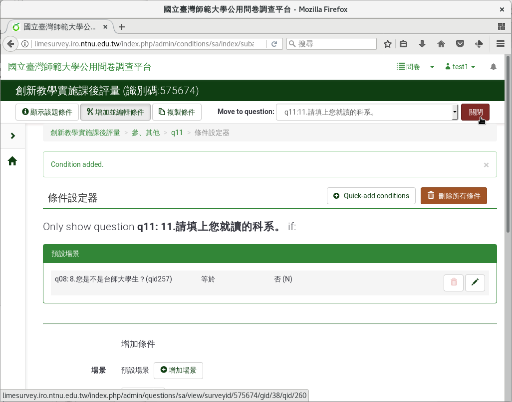

第十、十一個問題：外校生的校系
##############################

如果是外校生，請同學填上學校和科系。

在新增問卷問題的編輯頁面上，編號填上「q10」，問題填上
「10.請填上您就讀的學校。」題型選擇「開放性問題」裏的
「 :index:`自由短文 <題型; 單行文字>` 」，題組選「參、其他」，開啟
「必須回應」，然後按「儲存」。

    問題十：外校生的就讀學校

接著按上方「Set conditions」設定問題的條件。在設定問題條件的頁面上，往
下拉到頁面下方「增加條件」的地方，問題選剛剛的第八題
「q08: 8.您是不是台師大學生？」答案選「N(否)」，然後按下「增加條件」。

    加上外校生就讀學校問題的條件

回到頁面上方，剛剛設的條件已經加上去了：

    q08: 8.您是不是台師大學生 等於 否(N)

我們按上方的「關閉」。

    設好的外校生就讀學校問題條件

再一次，在新增問卷問題的編輯頁面上，編號填上「q11」，問題填上
「11.請填上您就讀的科系。」題型選擇「開放性問題」裏的
「 :index:`自由短文 <題型; 單行文字>` 」，題組選「參、其他」，開啟
「必須回應」，然後按「儲存」。

    問題十一：外校生的就讀科系

接著按上方「Set conditions」設定問題的條件。在設定問題條件的頁面上，往
下拉到頁面下方「增加條件」的地方，問題選剛剛的第八題
「q08: 8.您是不是台師大學生？」答案選「N(否)」，然後按下「增加條件」。

    加上外校生就讀科系問題的條件

回到頁面上方，剛剛設的條件已經加上去了：

    q08: 8.您是不是台師大學生 等於 否(N)

我們按上方的「關閉」。

    設好的外校生就讀科系問題條件
