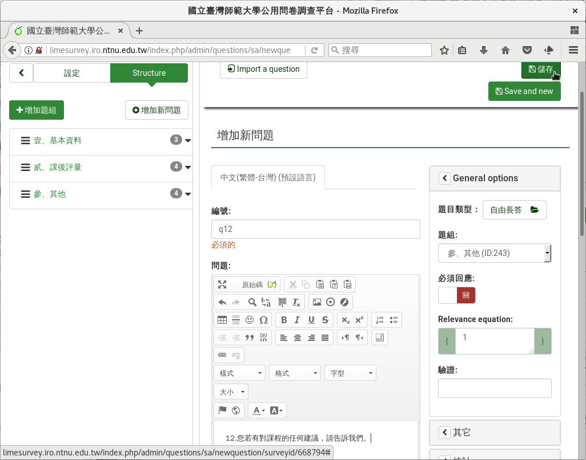
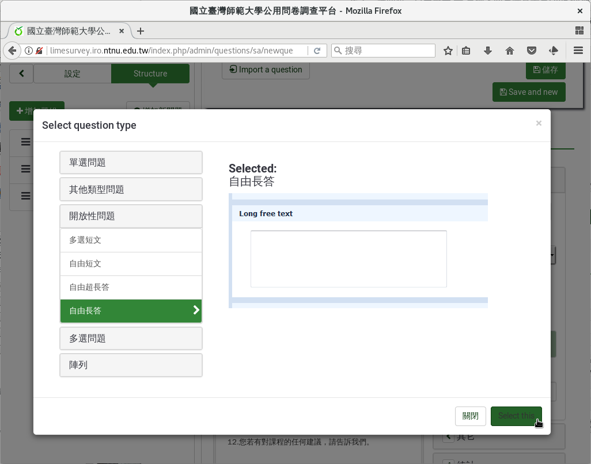

第十二個問題：自由長答
######################

問卷最後我們請參與者給我們網站建議，告訴我們問卷沒有問到的感想。

網站建議題型使用「 :index:`自由長答 <題型; 多行文字>` 」。參與者不一定
非給建議不可，不是必答。自由長答的內文可以做質性分析。

在新增問卷問題的編輯頁面上，問題填上
「12.您若有對網站的任何建議，請告訴我們。」題型選擇「開放性問題」裏的
「Long free text」，題組選「參、其他」，不要開啟「必填」，然後按「儲存」。

    問題十二：自由長答題

    選擇自由長答題型
