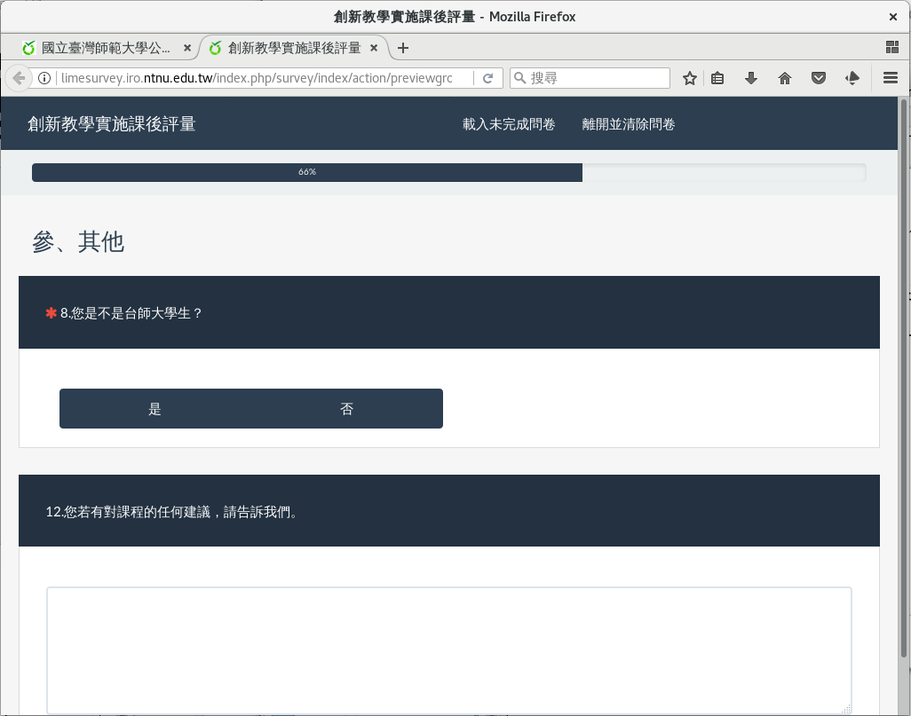

預覽問卷的條件邏輯
##################

題組三的跳題設定好了。我們 :index:`預覽一下題組三 <預覽; 題組>`，看問
卷有沒有正確跳題。

按一下上方的「Preview question group」預覽題組。

.. figure:: images/03-04-05-preview-01.png
    :alt: 按下「Preview question group」預覽題組
    :scale: 60%

    按下「Preview question group」預覽題組

    題組預覽

第八題選「是」（本校生），才會出現第九題詢問本校生的學號。

.. figure:: images/03-04-05-preview-03.png
    :alt: 第八題選「是」（本校生），接到第九題詢問本校生學號
    :scale: 60%

    第八題選「是」（本校生），接到第九題詢問本校生的學號

第八題選「否」（外校生），才會出現第十題、第十一題詢問外校生的校系。

.. figure:: images/03-04-05-preview-04.png
    :alt: 第八題選「否」（本校生），接到第十題、第十一題詢問外校生校系
    :scale: 60%

    第八題選「否」（本校生），接到第十題、第十一題詢問外校生校系
