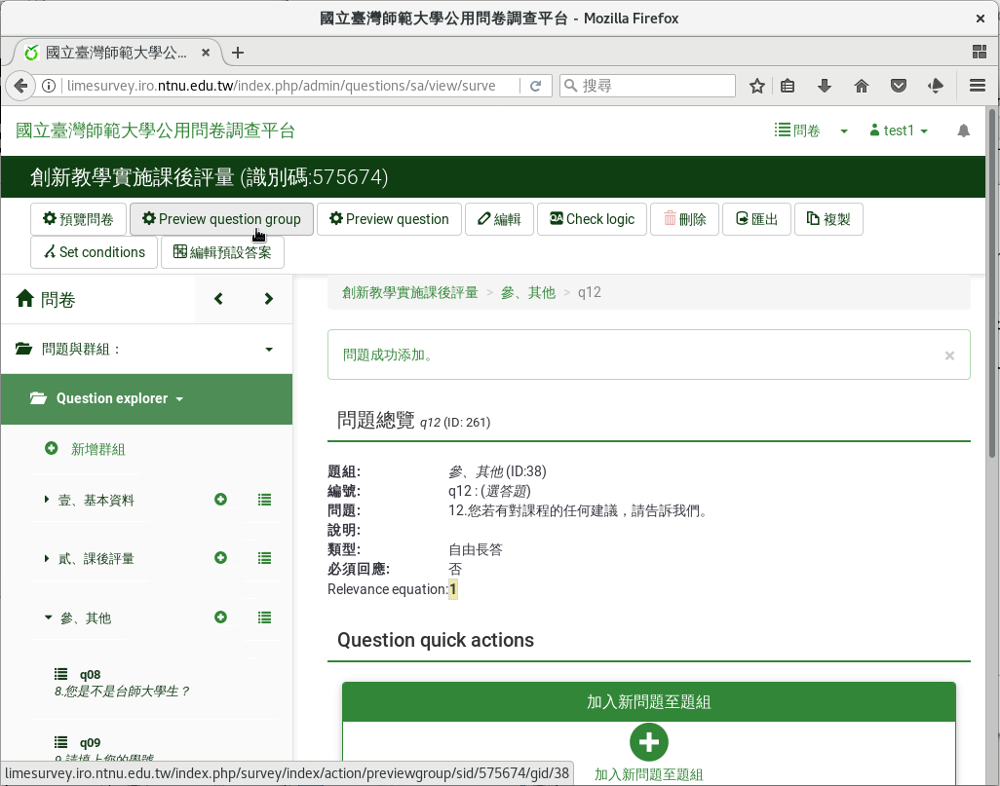
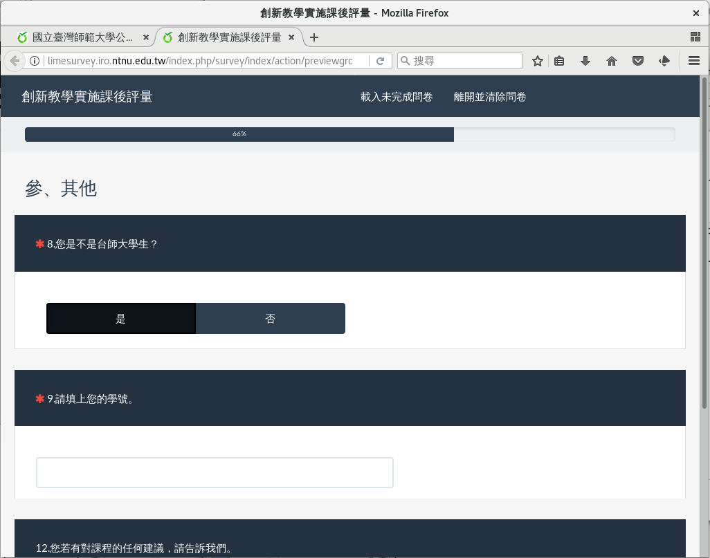
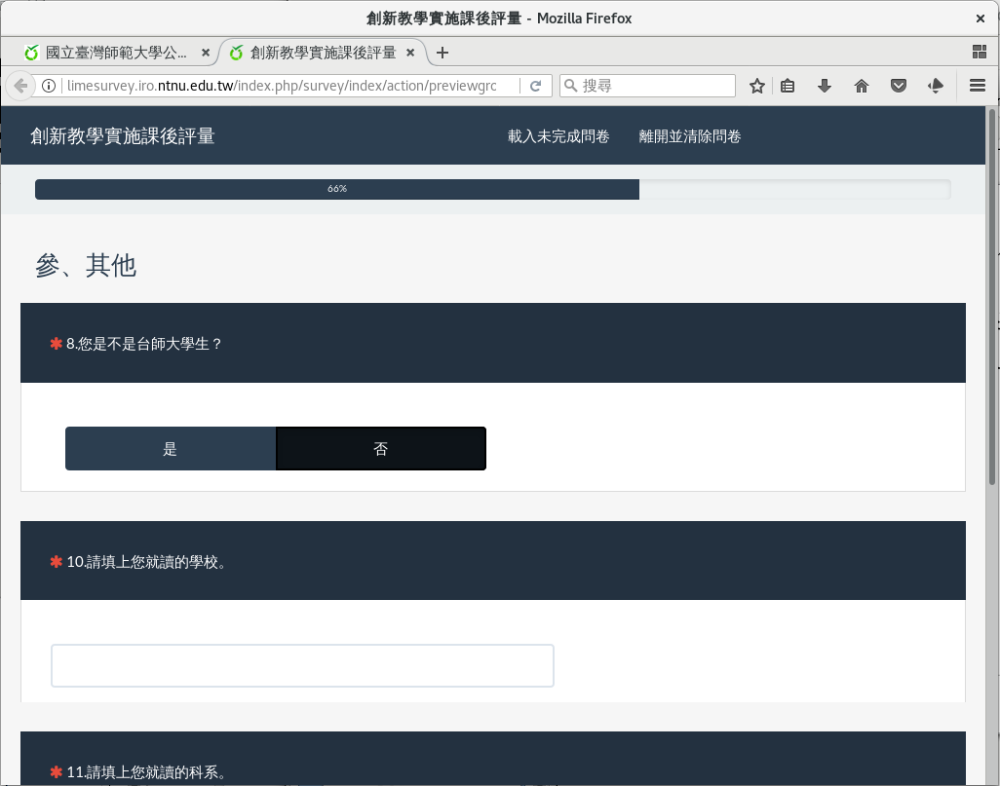

預覽問卷的條件邏輯
##################

題組三的跳題設定好了。您可以檢查題目順序。如果順序不對，請參閱
:doc:`03-02-06-sort` 的說明，調整順序。

我們 :index:`預覽一下題組三 <預覽; 題組>`，看問
卷有沒有正確跳題。

按一下上方的「Preview current group」預覽題組。

    按下「Preview current group」預覽題組

.. figure:: images/03-04-05-preview-02.png
    :alt: 題組預覽
    :scale: 48%

    題組預覽

第八題選「是」（會員），才會出現第九題詢問會員的帳號。

    第八題選「是」（會員），接到第九題詢問會員的學號

第八題選「否」（非會員），才會出現第十題、第十一題詢問非會員聯絡方式。

    第八題選「否」（非會員），接到第十題、第十一題詢問非會員聯絡方式
