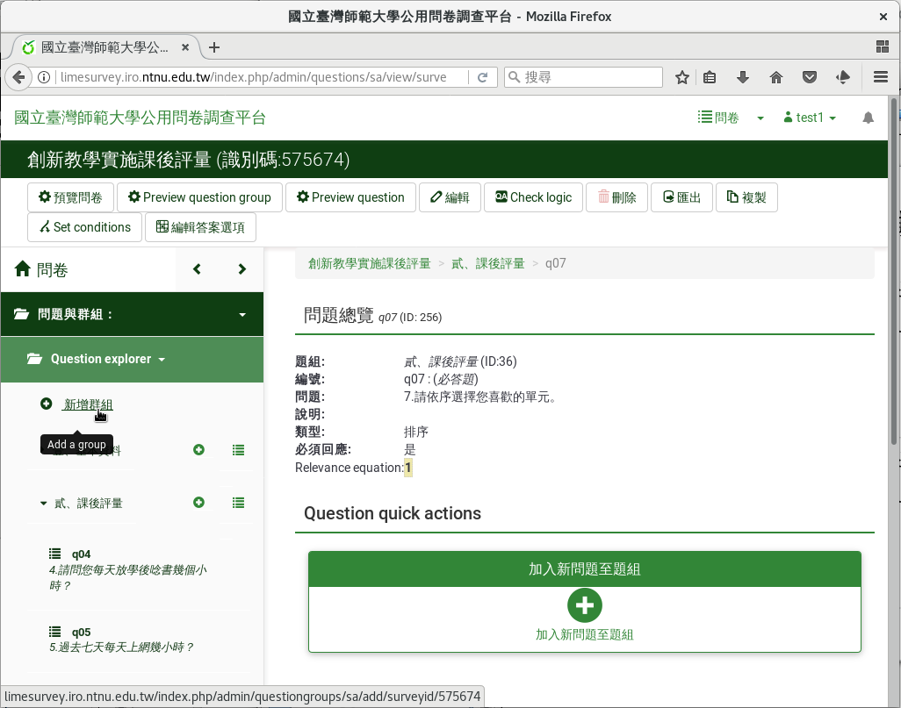
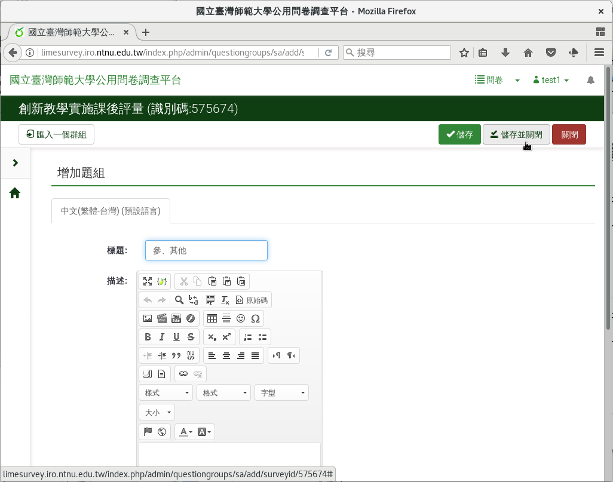

題組三：跳題邏輯
----------------

最後我們要問一些無法歸類的其他問題。

在第三個題組中，我們會介紹問卷問題邏輯關係的設計。我們要詢問學生是否為
本校學生。如果是本校生的話，請學生填上學號；如果是外校生，請學生填上學
校和系級。跳題邏輯如下：

    第八題：是否為本校學生？

    - 回答是者，接著回答第九題學號。
    - 回答否者，跳到第十題學校，和第十一題科系。回答是者不需回答。

在左側欄的問卷結構中，點選上方的
「 :index:`增加群組 <pair: 題組; 建立>` 」進入。標題填上「參、其他」
，然後按右上角「儲存並關閉」。

    點按增加群組

    新增群組頁面

.. toctree::

    03-04-01-yesno
    03-04-02-id
    03-04-03-school
    03-04-04-comment
    03-04-05-preview
    03-04-06-review
