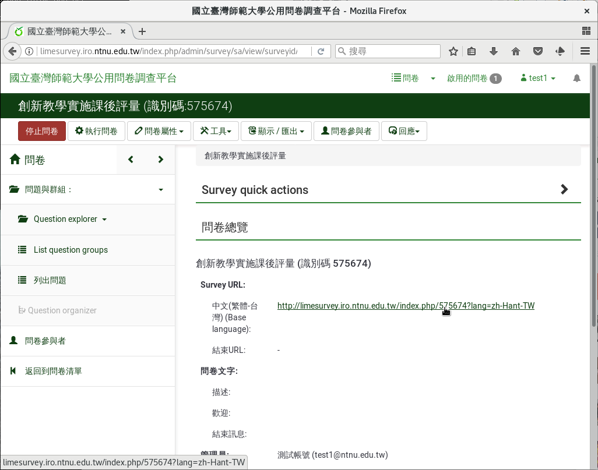

開放式問卷
----------

:index:`開放式問卷 <問卷; 開放式>` 比較簡單。若您沒有參與者名單，
參與者名單不確定，需要匿名，或不知道怎麼選擇時，請選開放式問卷。例如：

- 大專院校學生。
- 網站使用者。
- 20-30歲女性上班族。
- 18歲以上擁有投票權的人。
- 活動報名。
- …等等。

參與者只要連上問卷，即可填答，不需邀請碼。只要問卷啟用即可施測，設定簡單。

若施測者需要篩選參與者身份，可以依基本資料的問題，配合跳題邏輯，
來篩選有效問卷。例如：問卷針對大專院校學生時，跳題邏輯可設計如下：

    第一題：請問您目前的就學情形？

    1. 高中以下。（直接跳至問卷結束）

    2. 大專院校、研究所。（接後續問題）

    3. 已畢業或肄業。（直接跳至問卷結束）

啟用問卷後，詢問是否要封閉式問卷時，按右下角的「不，謝謝。」即可。

    選擇開放式問卷

問卷頁面中間的網址，即為問卷網址。將問卷網址複製下來散發
（Email、Facebook、LINE或紙本），連上網址的人，即可填答。

    開放式問卷的網址
