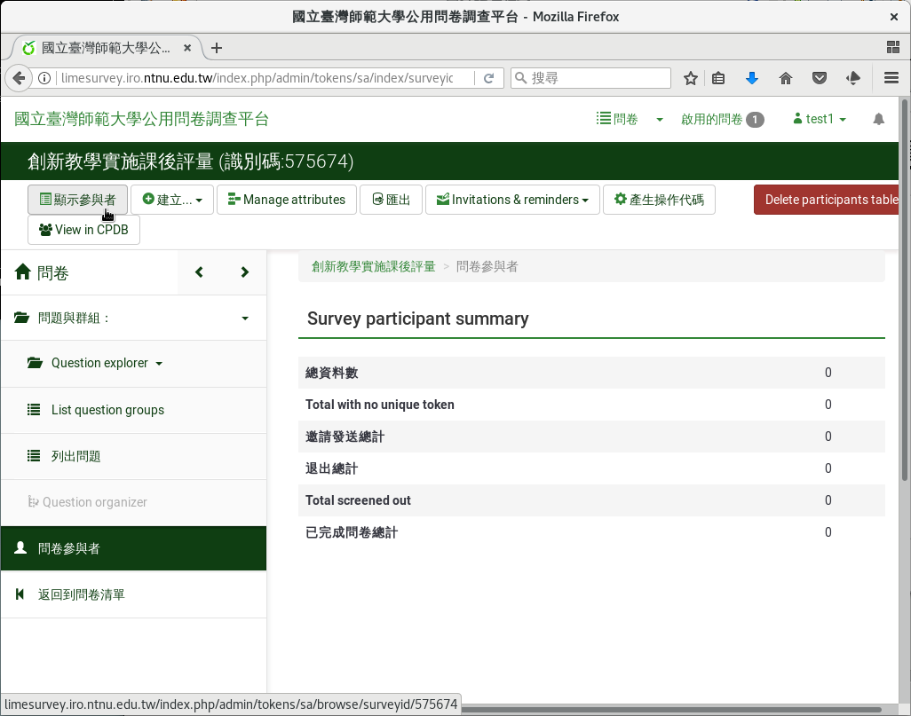
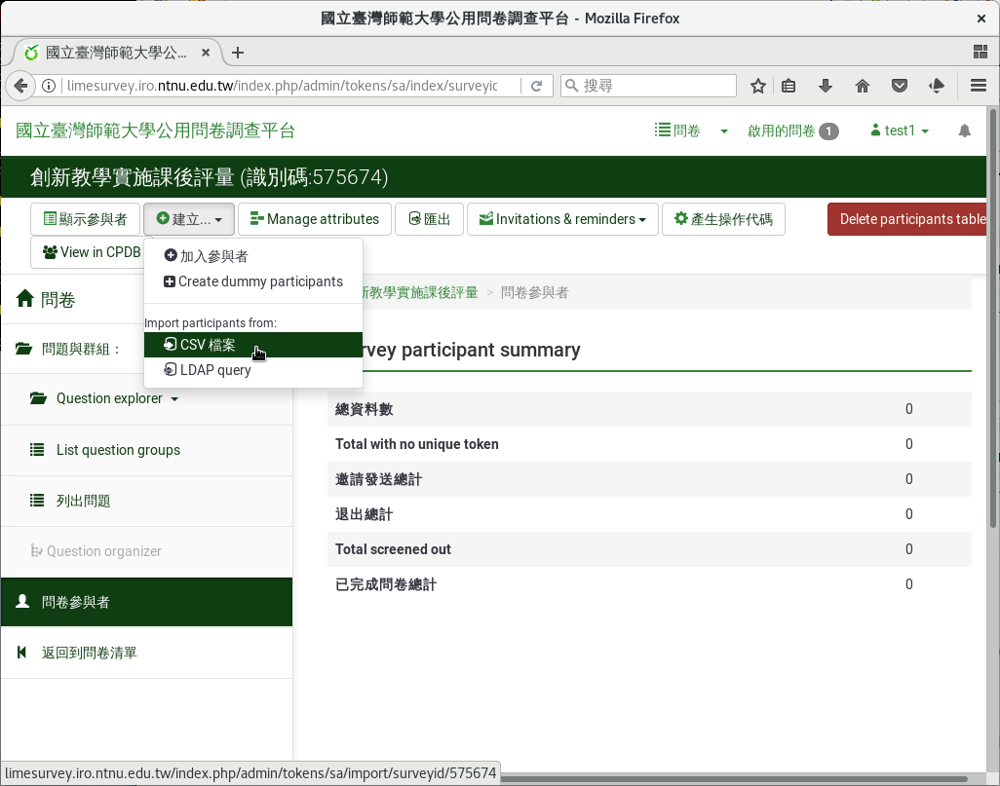
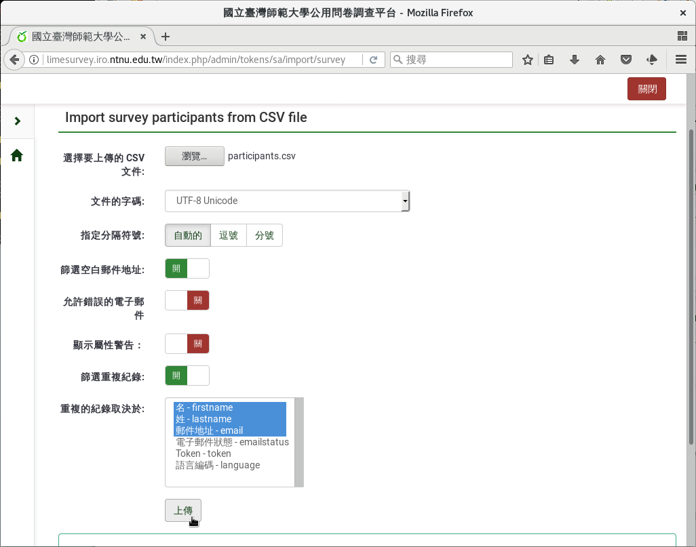
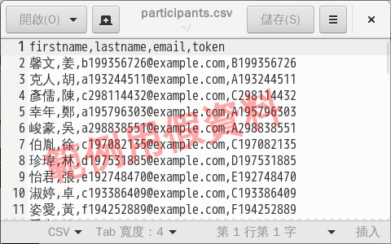

參與者名單
##########

建立封閉式問卷後，下一步要建立參與者名單。從問卷左側欄「設定」分頁下，
「問卷參與者」進入後，點選上方選單「顯示參與者」。

    左側欄「設定」裏的「問卷參與者」

    點選「顯示參與者」

目前名單還是空的。從上方選單按下「建立…」，可以新增參與者。

    點選「建立…」新增參與者

選按「新增參與者」，就可以一筆一筆輸入參與者資料。

    選「建立…」「新增參與者」輸入參與者資料

填上名、姓和郵件信箱，按右上角「儲存」即可。Access code
（ :index:`邀請碼 <邀請碼; 填寫>` ）可留白，系統自動產生亂數邀請碼。
也可以使用身份證字號、學號、帳號號等對方容易記憶的邀請碼，只要不重複即可。

    輸入參與者資料

選按「CSV檔案」，可從CSV檔整批匯入參與者名單。

    選「建立」「CSV檔案」從CSV檔匯入參與者名單

CSV檔欄位如下：

- firstname（名）
- lastname（姓）
- email（郵件信箱）
- （選填）token（邀請碼）

    選「建立」「CSV檔案」從CSV檔匯入參與者名單

可以參閱 `參與者CSV檔的範例`_ 。

    參與者CSV檔範例

.. _參與者CSV檔的範例: https://limesurvey.imacat.idv.tw/learning/participants-example.csv
