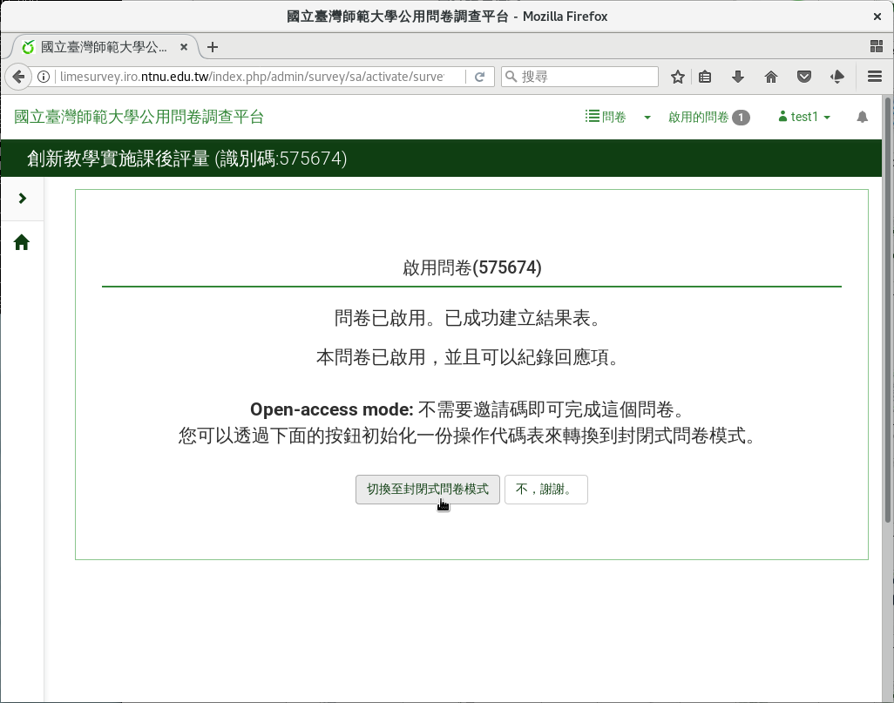
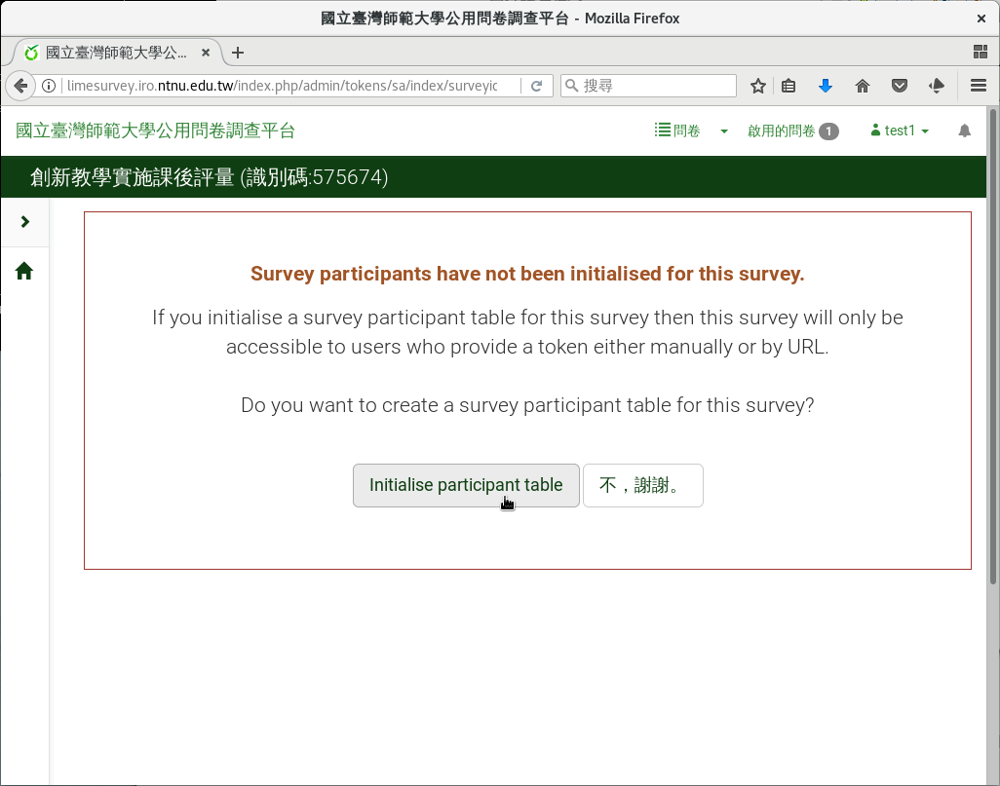

封閉式問卷
----------

:index:`封閉式問卷 <問卷; 封閉式>` ，需要有填答者名單，適用於施測者握
有特定填答者名單時。如：

- 教學實驗後，實驗組與對照組的學生。
- 由校友資料庫取得名單的畢業生。
- 管理學院所有專兼任教師。
- …等等。

封閉式問卷需要額外設定填答者名單。名單上的填答者，需有
:index:`邀請碼 <邀請碼>` 才可填答。每個填答者的邀請碼各自不同。

啟用問卷後，詢問是否要封閉式問卷時，按左下角的「切換至封閉問卷模式」
即可。

    選擇封閉式問卷

詢問是否要建立空白填答者名單表時，請點選左下角
「Initialise participant table」。

    建立空白填答者名單表

.. toctree::

    04-03-01-participants
    04-03-02-messages
