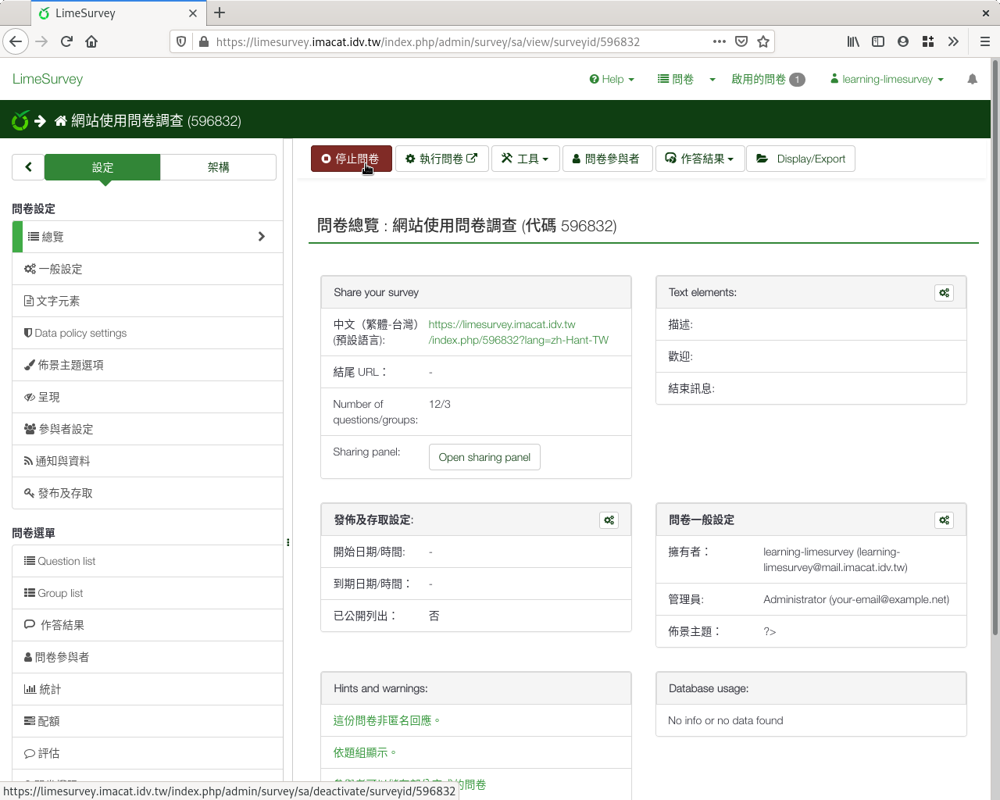

問卷結束
--------

為避免有人在施測時間外上來填答，破壞問卷的有效性，預定施測時間結束後，
我們會 :index:`停止問卷 <問卷; 停測>` 。

按左上方的「停止問卷」，即可結束問卷。

    點選「停止問卷」

結束有兩種方式：「問卷到期」和「關閉問卷」。若不知道該如何選擇，點左邊
的「到期問卷」即可。

.. figure:: images/04-04-stop-02.png
    :alt: 「問卷到期」和「關閉問卷」
    :scale: 60%

    「問卷到期」和「關閉問卷」

問卷到期
########

:index:`問卷到期 <問卷; 到期>` ，適用一般施測結束。到期後，即不可再填
答。施測者可以隨時匯出填答回應，作後續統計。

問卷到期後無法重開問卷，要重開前，要先關閉問卷（填答會另外封存，無法再
匯出。請詳閱「關閉問卷」的說明。）

關閉問卷
########

:index:`關閉問卷 <問卷; 關閉>` ，適用於發現問卷有錯誤，要重新改正重新
施測的施測中止。

關閉後，可以重新增刪題目，再重開問卷施測。

舊的問卷填答會另外封存，無法再匯出，需要系統管理員手動取回。若需要已填
答的結果，請先匯出後，再關閉問卷。
