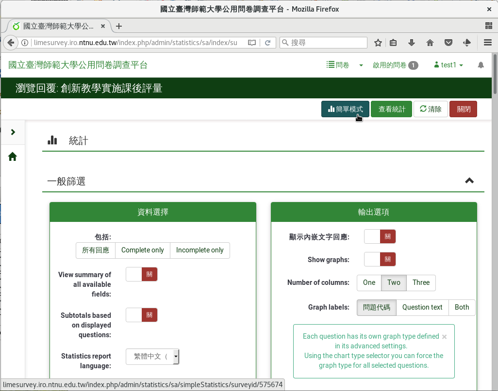

簡易次數分配圖
##############

LimeSurvey提供簡易的次數分配圖。次數分配圖只能繪製
:index:`類別變數 <變數; 類別>` 和
:index:`李克特氏五點量表 <題型; 李克特氏五點量表>` 。

從問卷左側欄「設定」分頁下的「統計」進入。

.. figure:: images/05-01-01-simple-01.png
    :alt: 問卷左側欄「設定」分頁下的「統計」進入
    :scale: 48%

    問卷左側欄「設定」分頁下的「統計」進入

點選右上方的「簡單模式」，即可繪製簡易的次數分配圖。

.. figure:: images/05-01-01-simple-02.png
    :alt: 點選「簡單模式」
    :scale: 48%

    點選「簡單模式」

    簡易次數分配圖
