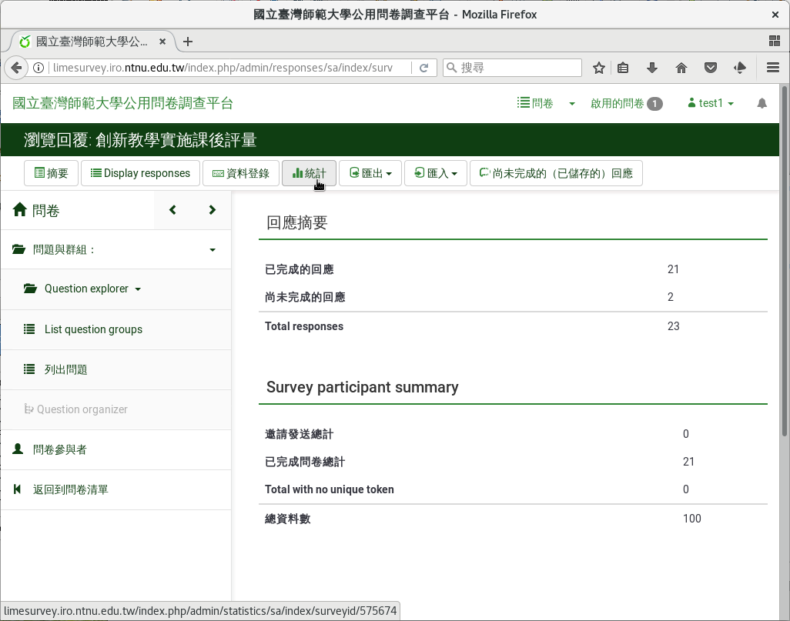
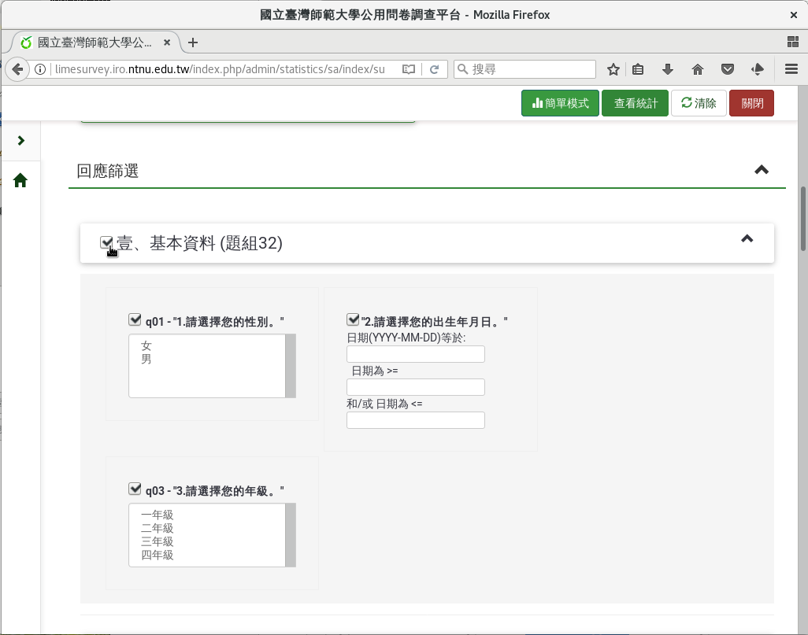
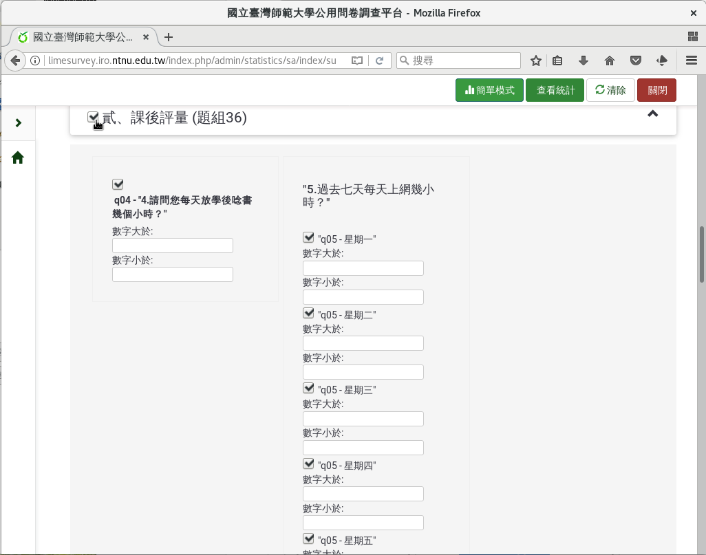
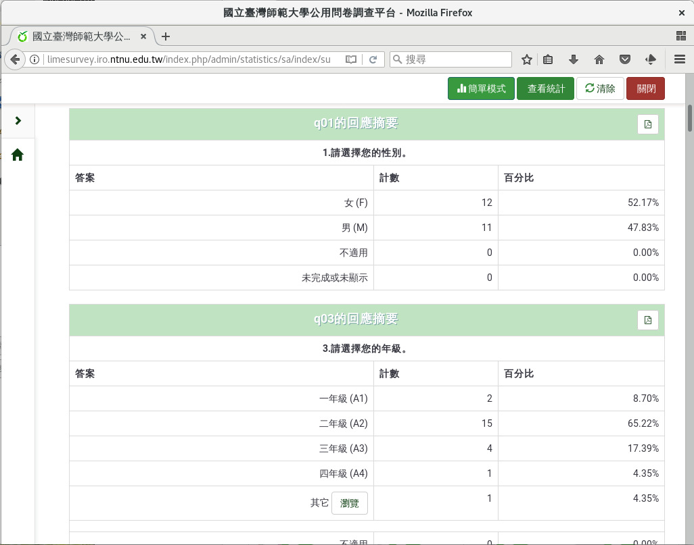
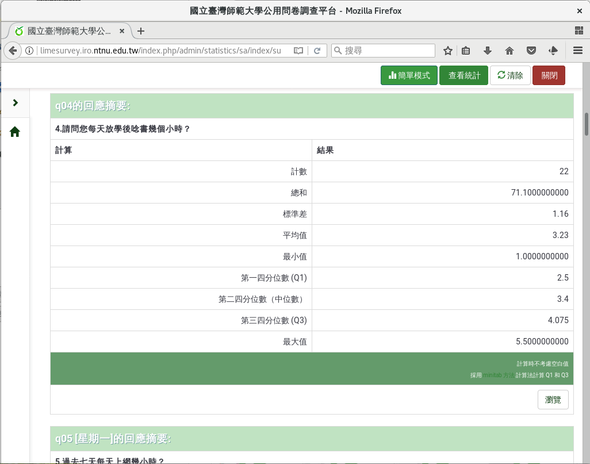
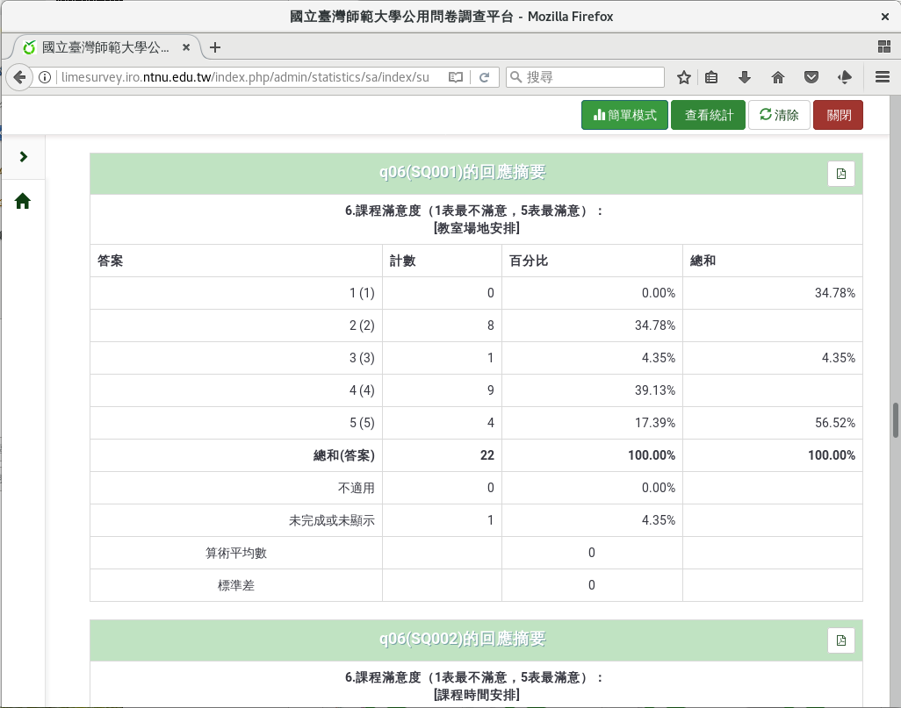
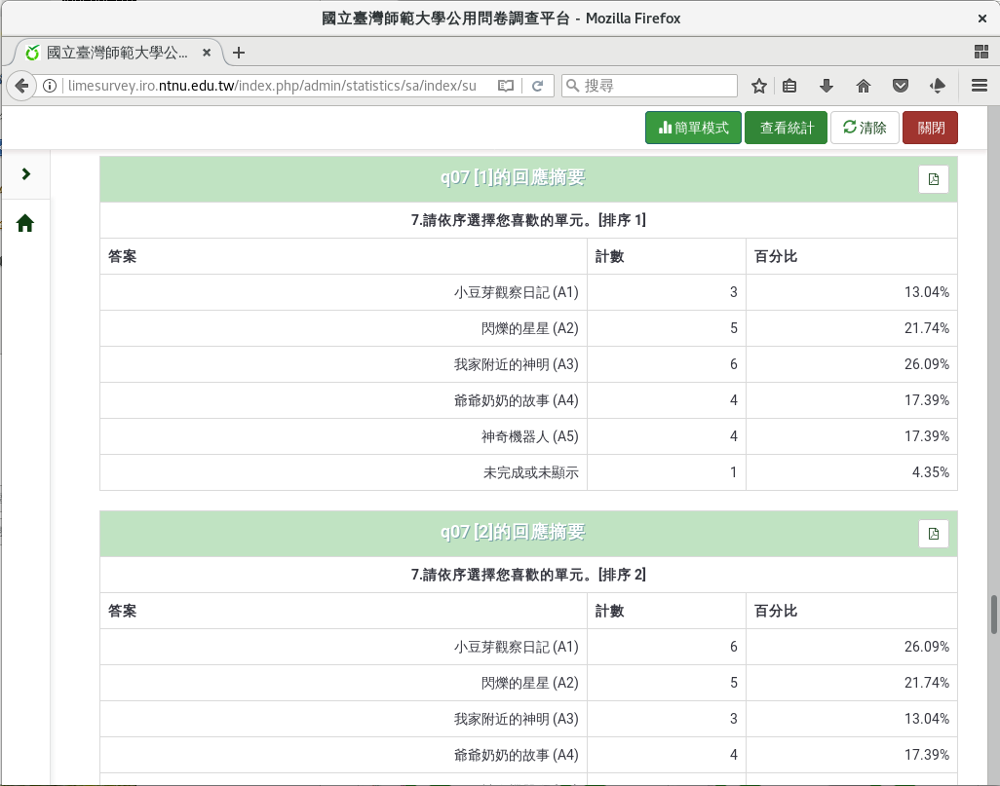
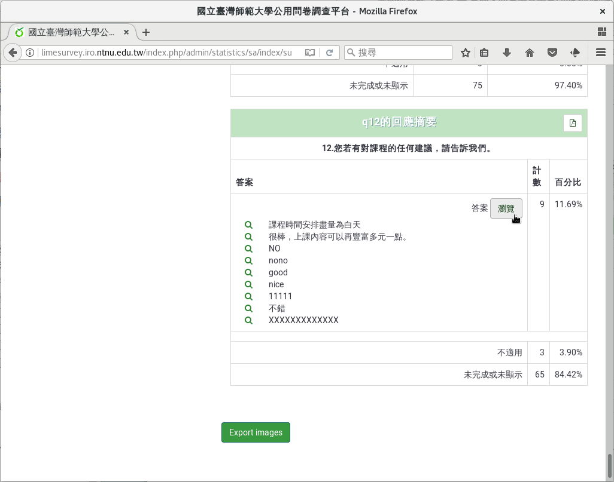

完整描述統計報表
################

LimeSurvey也提供完整的描述統計報表。

從問卷頁面上方選單「回應」下的「回應&統計」點進去，然後點選上方選單的
「統計」。

.. figure:: images/05-01-01-simple-01.png
    :alt: 問卷頁面上方選單「回應」下的「回應&統計」
    :scale: 60%

    問卷頁面上方選單「回應」下的「回應&統計」

    回應與統計頁面選單上的「統計」

往下找到「回應篩選」部份，勾選所有的問題（你也可以只勾選想統計的問題）
，然後按右上角的「查看統計」，即可產生描述統計報表。

    勾選題組一的所有問題

    勾選題組二的所有問題

    勾選題組三的所有問題

    點按最上方的「查看統計」

.. index:: 題型; 性別

.. index:: 題型; 單選

    描述統計報表：類別變數的次數分配表

.. index:: 題型; 數值

    描述統計報表：連續變數的描述統計

.. index:: 題型; 李克特氏五點量表

    描述統計報表：李克特氏五點量表

.. index:: 題型; 排序

    描述統計報表：排序題

.. index:: 題型; 多行文字

    描述統計報表：自由填答內容
