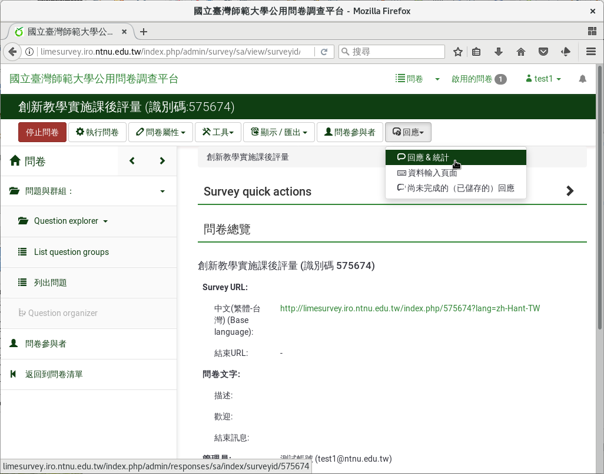
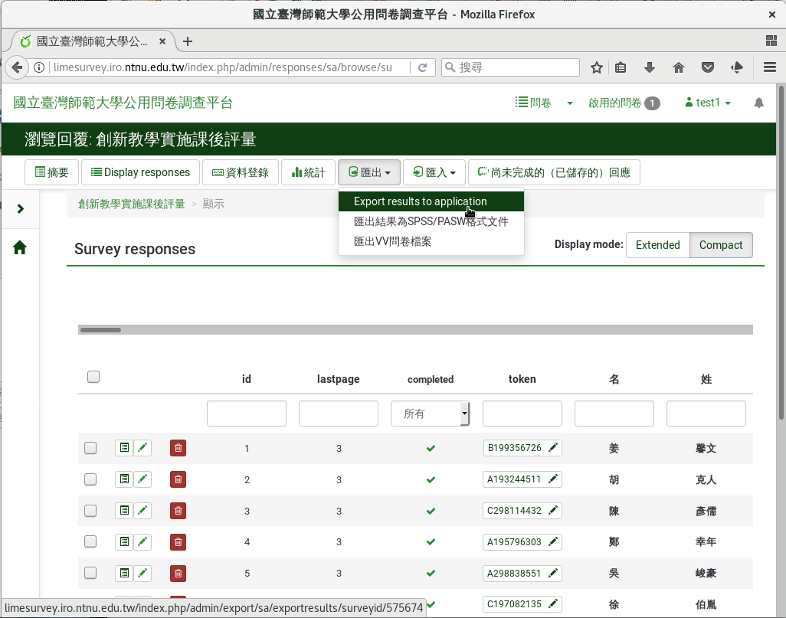
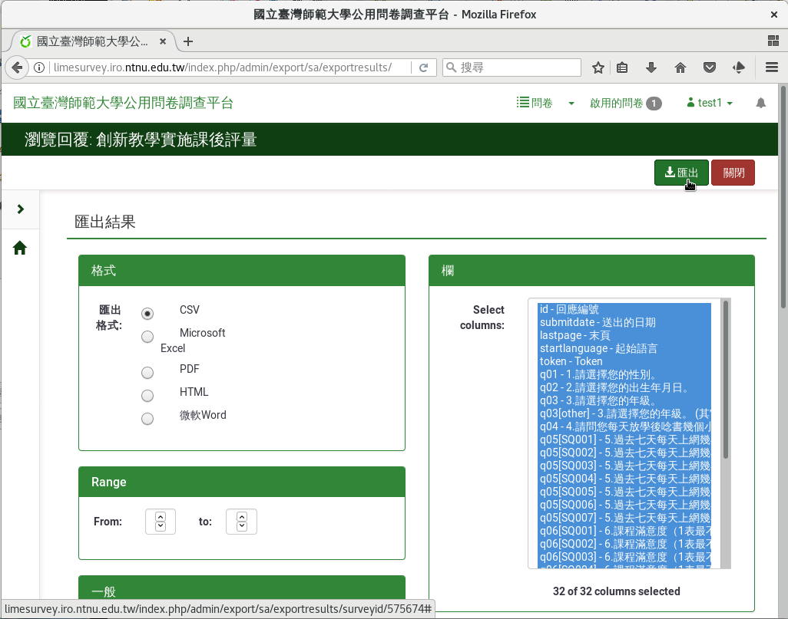
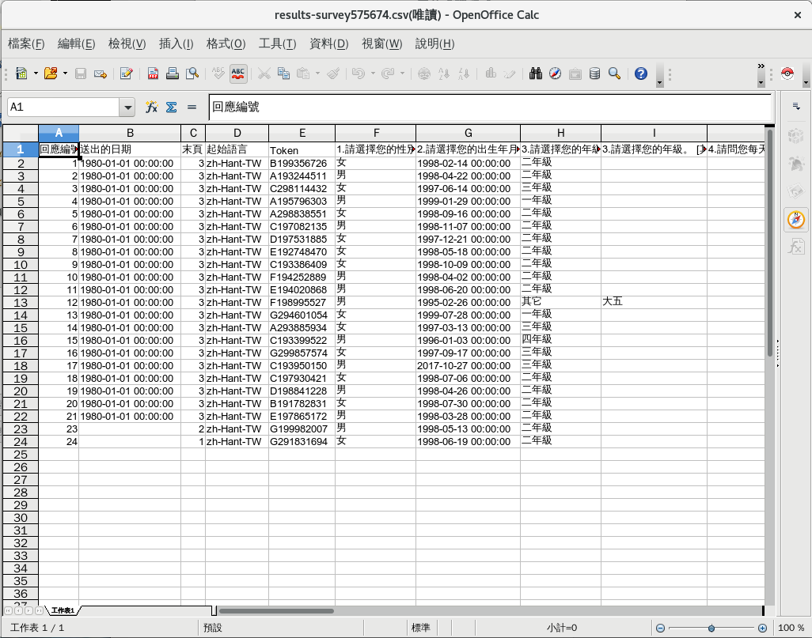
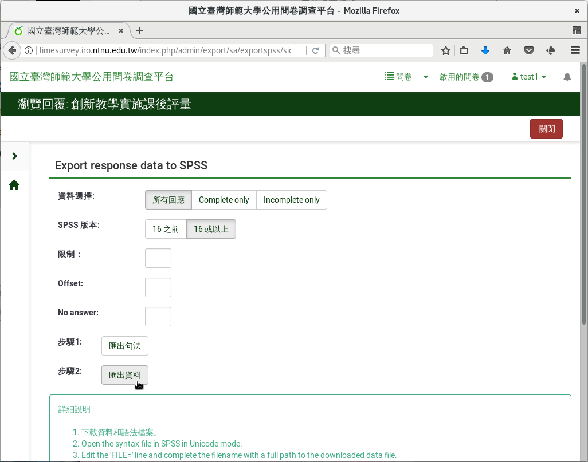

匯出填答結果
------------

問卷的填答結果，可以 :index:`匯出` 成檔案下載，供後續進階分析。

問卷頁面右上選單「回應」下的「回應&統計」點進去，然後點選上方選單
「匯出」下的「Export result to application」，即可匯出。

    問卷頁面右上選單「回應」下的「回應&統計」

    回應與統計頁面選單上「匯出」下的「Export result to application」

可以選CSV、Excel、PDF、HTML、Word五種格式。選定格式後，按右上角
「匯出」即可匯出下載。

    選定匯出格式後匯出

    匯出後的CSV檔，以試算表軟體開啟

問卷資料亦可直接匯出成SPSS資料檔。

    回應與統計頁面選單上「匯出」下的「匯出結果為SPSS/PASW格式文件」

    匯出SPSS格式資料檔
